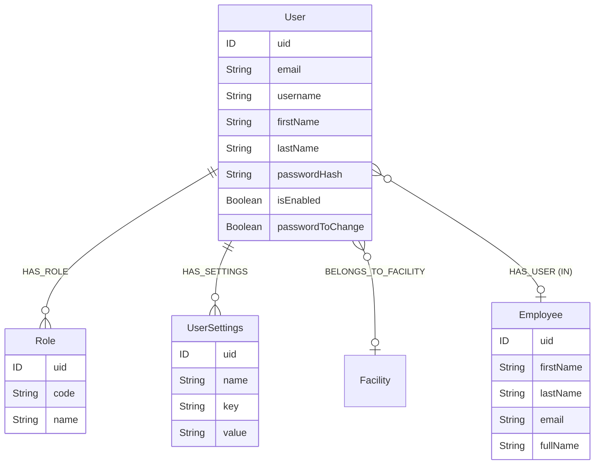
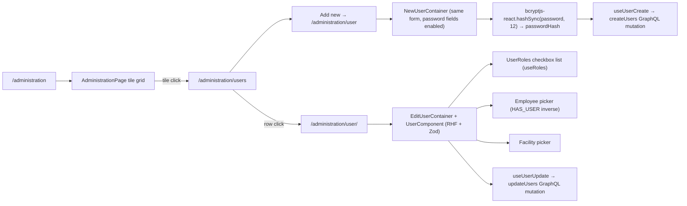

# Administration (Users & Roles)

The administration surface is where admins **create, edit, and revoke users**, assign roles, and link `User` accounts to `Employee` records. Everything else flows from it: a JWT minted at sign-in (see [Authentication](./authentication.md)) reflects the roles assigned here, and every per-route + per-entity gate consults those roles (see [Permissions model](./permissions-model.md)).

The module is also the **second of only two entities with schema-level `@authorization`** (alongside `System`).

## Module location

```
src/modules/administration/
├── users/
│   ├── Users.cont.tsx                       — /administration/users list
│   ├── components/
│   │   ├── User.columns.tsx                 — table columns
│   │   └── UserNameCell.tsx
│   └── hooks/
│       ├── useUsers.ts                      — GraphQL `users(where)` query
│       └── useUserDelete.ts                 — delete mutation
└── user/
    ├── NewUser.cont.tsx                     — /administration/user (create)
    ├── EditUser.cont.tsx                    — /administration/user/[uid] (edit)
    ├── components/
    │   ├── User.comp.tsx                    — shared form layout
    │   ├── UserRoles.tsx                    — role checkbox list
    │   └── form/
    │       ├── User.fields.ts
    │       ├── User.form.tsx
    │       └── User.schema.ts               — Zod (`userFormSchema`, `userUpdateFormSchema`)
    ├── hooks/
    │   ├── useUserDetail.tsx                — single read
    │   ├── useUserCreate.tsx                — `createUsers` GraphQL mutation
    │   ├── useUserUpdate.tsx                — `updateUsers` GraphQL mutation
    │   └── useRoles.tsx                     — list of `Role` nodes
    └── types/form.ts                        — Zod-inferred form types
```

Routes (`src/pages/`):

```
administration/index.tsx              — /administration (landing tile page)
administration/users/index.tsx        — /administration/users (list)
administration/user/index.tsx         — /administration/user (create)
administration/user/[uid].tsx         — /administration/user/<uid> (edit)
profile/general.tsx                   — /profile/general (current user's profile)
profile/security.tsx                  — /profile/security
profile/team.tsx                      — /profile/team
```

The `/profile/*` pages are not in this module — they live in `src/components/user-profile/` — but they edit **the same `User` node** as the admin surface, scoped to the session's own user via the `User` row-level `@authorization` rule.

## Data model

`User` and friends sit at the top of the schema (`src/server/apollo/schema.graphql:496-532`). Read with care — this is one of two entities with a row-level guard:

```graphql
type User
    @authorization(
        validate: [
            { operations: [UPDATE, READ], where: { node: { uid: "$jwt.sub" } } }
            {
                operations: [UPDATE, CREATE, READ, DELETE]
                where: { jwt: { roles_INCLUDES: "admin" } }
            }
        ]
    ) {
    email: String!
    firstName: String!
    roles: [Role!]! @relationship(type: "HAS_ROLE", direction: OUT)
    facility: Facility @relationship(type: "BELONGS_TO_FACILITY", direction: OUT)
    isEnabled: Boolean!
    lastName: String!
    passwordHash: String!
    passwordToChange: Boolean
    employee: Employee @relationship(type: "HAS_USER", direction: IN)
    uid: ID! @id
    username: String!
    userSettings: [UserSettings!]! @relationship(type: "HAS_SETTINGS", direction: OUT)
}
```



### Two-rule `@authorization`

The `User` directive carries **two `validate` rules combined by OR**:

1. **Self rule** — `{ operations: [UPDATE, READ], where: { node: { uid: "$jwt.sub" } } }` — a user can READ or UPDATE their own `User` node by JWT subject. Powers `/profile/*`.
2. **Admin rule** — `{ operations: [UPDATE, CREATE, READ, DELETE], where: { jwt: { roles_INCLUDES: "admin" } } }` — anyone holding the `admin` role can CRUD any user. Powers `/administration/users`.

A non-admin reading the list query (`users(where: {})`) gets a single row back — themselves. The admin surface relies on the second rule to surface everyone else.

This is **the only row-level guard** in the schema. The `System` directive (`schema.graphql:296-305`) is JWT-role-only — there is no equivalent "this row belongs to me" check for systems today. See [Permissions model → System](./permissions-model.md#system-role-gate).

### `Role` is a graph entity, not the `ROLE` enum

`Role` (`schema.graphql:527-532`) is `@authentication`-only and holds `{ uid, code, name }`. The `code` is what the JWT carries inside `roles: [String!]!` — the values match `src/types/constants/roles.ts` `ROLE` enum verbatim.

> The frontend `ROLE` enum (`ROLE.ADMIN = 'admin'`, …) and the Neo4j `Role.code` must stay synchronised. There is no auto-sync; a new role added to the schema-side codebook does nothing until the enum picks it up and consumers wire `usePermission([ROLE.NEW_ONE])` calls.

`HAS_ROLE` edges link `User` to `Role`. Role assignment is therefore a graph operation — assigning `admin` to a user adds a `(:User)-[:HAS_ROLE]->(:Role { code: 'admin' })` edge.

### `UserSettings` — per-user key/value bag

`UserSettings` is a flat `{ name, key, value }` triple keyed by `uid` and linked back to `User` via `HAS_SETTINGS`. No schema-level shape on the value — it's a free-text `String!`. The frontend uses it as a JSON-blob store for per-user UI preferences (table column widths, last-selected filters, etc.) that don't deserve a dedicated entity.

There is **no admin surface** for `UserSettings` today — it is written exclusively by the app itself.

## Pages



### `/administration` landing

`src/pages/administration/index.tsx` is a tile grid with one tile today (`Users → /administration/users`, requires `ROLE.ADMIN`). The page is set up to host more admin surfaces if any are added.

### `/administration/users` (list)

Container (`Users.cont.tsx`) — minimal `PandaTable` wrapper with:

- `useUsers()` driving the data.
- `SearchBarButtonsComponent` for *Add* / *Refresh*, both gated by `ROLE.ADMIN`.
- A `useEffect` that **prefetches the room-card page for every row** (`router.prefetch('${PATH.ROOM_CARD}/${roomCard.uid}')`). This is a copy-paste leftover from the room-cards module — see [Deprecated / legacy](#deprecated--legacy).

### `/administration/user/[uid]` (edit)

`EditUserContainer` wraps a shared `UserComponent` form in RHF + Zod. Notable details:

- Defaults come from an `EditUserContext` (defined in `pages/administration/user/[uid]`) — the page component fetches the user once and threads `userDetail` + `refetch` into the container.
- `selectedRoles` is local state (a copy of `userDetail.roles`) so the `UserRoles` checkbox list can update optimistically before the mutation lands.
- **Password change is optional** in `userUpdateFormSchema` — empty `password` / `confirmPassword` are valid, but if either is filled both must match (`.refine(...)`).
- Submit pre-hashes the password with **`bcryptjs-react`** (`bcrypt.hashSync(data.password, 12)`) before sending — the GraphQL mutation receives `passwordHash`, never the plaintext.

### `/administration/user` (create)

Same `UserComponent` form but `userFormSchema` requires the password fields:

```ts
password: z.string().min(1),
confirmPassword: z.string().min(1),
roles: z.array(z.custom<CodebookType>()).min(1, 'Missing selected role'),
```

`NewUserContainer` calls `useUserCreate` → `createUsers` GraphQL mutation. The router returns to the list (`router.back()`) on success.

### Profile (`/profile/*`)

Three pages — `general`, `security`, `team` — mounted under `/profile`. They use the same `User` mutation surface but constrained by the **self rule** of the `User.@authorization` block: a profile page can only see and update the session user.

The pages are physically separate from `src/modules/administration/` (they live in `src/components/user-profile/`). This is a structural choice — the admin module never assumes "this user is me", and the profile module never assumes admin permission.

## Fetcher style

Both `users` and `user` modules use **GraphQL exclusively** via `useGraphQL` / `useGraphQLMutation`. The relevant operations:

| Operation | Where | Notes |
|---|---|---|
| `UsersQuery($where: UserWhere)` | `useUsers.ts` | Filterable list; URL state via `useQueryState`. |
| `GetRoles` | `useRoles.tsx` | Flat list of `Role` nodes. |
| `CreateUser` (`createUsers`) | `useUserCreate.tsx` | Body is the `UserCreateInput!`; returns `{ uid }`. |
| `UpdateUsers` | `useUserUpdate.tsx` | `whereC` / `whereN` helpers (`src/utils/graphql/mutations`) build the `UserWhere` + `UserUpdateInput`. |

No REST endpoints are involved. This makes the admin module **the strictest GraphQL-first surface in the codebase** — every read and write is generated by `@neo4j/graphql` and gated by the schema directive.

The contrast with [Publications](./publications.md) (REST-only) is informative — the admin domain is mature enough to live in the schema, the publications domain is not yet.

## Password handling

`bcryptjs-react` runs **in the browser**:

```ts
// NewUser.cont.tsx:48
passwordHash: bcrypt.hashSync(data.password, 12),
```

```ts
// EditUser.cont.tsx:120
dataToSend.passwordHash = bcrypt.hashSync(data.password, 12)
```

Implications:

1. The plaintext password never crosses the wire — only the bcrypt hash with cost factor 12 reaches `/api/graphql`.
2. The server stores `passwordHash` verbatim; the schema field is `String!`.
3. **The CredentialsProvider** (see [Authentication](./authentication.md)) calls the API gateway's `/authenticate` endpoint with `{ username, password }`. That endpoint compares against the stored hash server-side.
4. Doing bcrypt in the browser keeps the GraphQL surface from ever seeing plaintext, but moves the CPU cost into the client. Cost factor 12 means roughly 100-300 ms on a modern laptop — acceptable for a manual user-create flow.

## Permissions

Route-level (`src/lib/navigation/config.ts`):

```ts
[PATH.ADMIN]:           [ROLE.ADMIN],
[PATH.ADMIN_USERS]:     [ROLE.ADMIN],
[PATH.ADMIN_USER]:      [ROLE.ADMIN],
[PATH.PROFILE_GENERAL]: [ROLE.BASICS],
[PATH.PROFILE_SECURITY]: [ROLE.BASICS],
[PATH.PROFILE_TEAM]:    [ROLE.BASICS],
```

Schema-level: the `User` directive above is the actual enforcement. Non-admins reading `/api/graphql` for users only see themselves; admins see everyone. **`Role` and `UserSettings` are `@authentication`-only** — see [Open questions](#open-questions).

UI-level: `usePermission([ROLE.ADMIN])` is implicit — the route gate refuses non-admins before the component mounts.

## Tests

The administration module ships with **no local `__tests__/` folders**. The closest coverage is:

- `src/hooks/__tests__/usePermission.spec.ts` — exercises the gate hook with the admin role.
- The `next-auth` JWT shape under `src/types/next-auth.d.ts` is exercised through every authenticated module.

Given that this surface controls who can do what across the entire application, adding contract tests for the role-assignment flow is the highest-value test gap in the repo.

## Cross-module integration

- **NextAuth** ([Authentication](./authentication.md)) — `neo4GetOrCreateUser` (`src/pages/api/auth/[...nextauth].js:170-219`) creates the user node on first Entra ID sign-in with the seed roles `basics`, `catalogue-view`, `systems-view`, `room-cards-view`, `orders-view`. Promotion to `admin` happens **only** from this module.
- **Permissions model** — `Role.code` is the source the JWT serialises. Renaming a role in the graph desyncs the client `ROLE` enum until the constant is updated. See [Permissions model → Role inventory](./permissions-model.md#role-inventory).
- **Employee module** — `User.employee: Employee` via `HAS_USER` (inbound) lets an admin associate a user account with an HR record. The picker in `User.form.tsx` consults the `EMPLOYEE` codebook.
- **Audit trail** — `User` is the *target* of every `WAS_UPDATED_BY` edge written elsewhere. See [Permissions model → Audit trail](./permissions-model.md#audit-trail).
- **Codebooks** — `USER` and `EMPLOYEE` appear in the `CODEBOOK` enum but are not editable from `/codebooks` (`useCodebookList` filters to `editable: true`). They are *query* surfaces. See [Codebooks](./codebooks.md).

## Deprecated / legacy

- **Room-card prefetch in `Users.cont.tsx`** — the list container loops over users and calls `router.prefetch('${PATH.ROOM_CARD}/${roomCard.uid}')`. The variable name (`roomCard`) and the path are unmistakable copy-paste from `RoomCards.cont.tsx`. The prefetches do not match the link the user will follow (`/administration/user/<uid>`), so they're effectively wasted requests. Delete.
- **Browser bcrypt** — `bcryptjs-react` is correct from a "plaintext never leaves the browser" angle, but it bundles a non-trivial amount of JS and pegs the CPU for a few hundred ms on submit. A server-side hash with the same JWT-`apiAccessToken`-protected channel would centralise the policy.
- **No `@authorization` on `Role`.** Roles are facility-wide reference data; today any authenticated user can CRUD a `Role` through GraphQL. The route gate at `/codebooks` does not cover this — `Role` is not in the editable-codebooks list. See [Open questions](#open-questions).
- **No `@authorization` on `UserSettings`.** Today anyone with a JWT can read or write any user's settings via GraphQL. The directive should mirror `User`'s self-rule (self-write, admin-everywhere).
- **`passwordHash: String!`** is a required field on `User` (`schema.graphql:512`). For Azure-AD-only deployments the value is meaningless — the field exists for the credentials-provider fallback. Document or relax the requirement.
- **`UserSettings` has no admin surface** — fine today (only the app writes there), but worth surfacing for debugging.
- **No `WAS_UPDATED_BY` writes** from the admin flows. Promoting a user to admin is the highest-stakes change in the system; today the schema does not record it.

## Maintenance recommendations

1. **Delete the room-card prefetch loop** in `Users.cont.tsx` (or replace with the correct `${PATH.ADMIN_USER}/${user.uid}` prefetch). Quick win.
2. **Add `@authorization` to `Role` and `UserSettings`.** Mirror the `User` directive for `UserSettings` (self-rule for read/update on rows where `user.uid: "$jwt.sub"`, admin for everything). `Role` should be admin-write-only.
3. **Write audit edges** when an admin updates a user (role change, isEnabled flip, password reset). Use the existing `updatedByResolver`; the contract is already there. See [Permissions model → Audit trail](./permissions-model.md#audit-trail).
4. **Cover the role-assignment flow with unit tests.** Today there is no test that asserts "admin can grant admin", "user with no `admin` role cannot list other users", or "renaming `Role.code` invalidates the route gate". Each is a one-shot Jest + msw test.
5. **Move the seed-role list out of the `[...nextauth].js` Cypher.** Today the default roles are hardcoded inline (`["basics", "catalogue-view", "systems-view", "room-cards-view", "orders-view"]`). A small `src/server/auth/defaultRoles.ts` would let it be re-used and tested.
6. **Document `Role.code` → `ROLE` enum sync requirement.** A README in `src/types/constants/roles.ts` (or this page) calling it out prevents the silent-drift failure mode.

## 🔮 Planned

- **Permissions Phase 1** — the level-based admin/editor split (`SYSTEM_DOMAIN` and `TECHNOLOGY_UNIT` admin-only, lower levels for `systems-edit`) needs schema directives but **also** an admin UI to assign the levels. Today the role granularity is flat.
- **Permissions Phase 2** — team-scoped writes. The data structure (`User`/`Employee` → `Team` membership edge) does not exist yet. This module is the natural place to surface it once it lands.
- **`Role` and `UserSettings` `@authorization`** — see Maintenance #2.

## Open questions

- Why does `Role` carry no `@authorization`? Today an authenticated user can `createRoles` / `updateRoles` / `deleteRoles` through GraphQL — only a small set of role codes is *consumed* by `usePermission`, but adding/removing rows is unconstrained.
- Should browser-side bcrypt move server-side? The plaintext-doesn't-leave-the-browser story is appealing; the CPU cost and bundle weight are not.
- Is `passwordToChange: Boolean` consulted anywhere? It is fetched in `UsersQuery` but not surfaced in the admin form.
- The room-card prefetch in `Users.cont.tsx` is a leftover. Verify nothing relies on the loop's side-effects (e.g. a hidden cache warm-up) before deleting.
- `UserSettings.value: String!` — what is the encoding convention? JSON? URL-encoded? Free-text? Today the writer (the app itself) and the reader (the same app) implicitly agree; an explicit codification would help.

---

## Data model reference

> 🔧 *Engineer-only; stripped from the wiki.*
>
> Schema: `User` (`src/server/apollo/schema.graphql:496-518`), `UserSettings` (`:519-525`), `Role` (`:527-532`), `Employee.user` (`:126`). JWT type: `JWT @jwt` at `schema.graphql:15-17`. GraphQL operations: `src/modules/administration/user/hooks/use{UserCreate,UserUpdate,Roles,UserDetail}.tsx`; `src/modules/administration/users/hooks/useUsers.ts`. Form schemas: `src/modules/administration/user/components/form/User.schema.ts`. Frontend role enum: `src/types/constants/roles.ts`. NextAuth user creation: `src/pages/api/auth/[...nextauth].js`.
