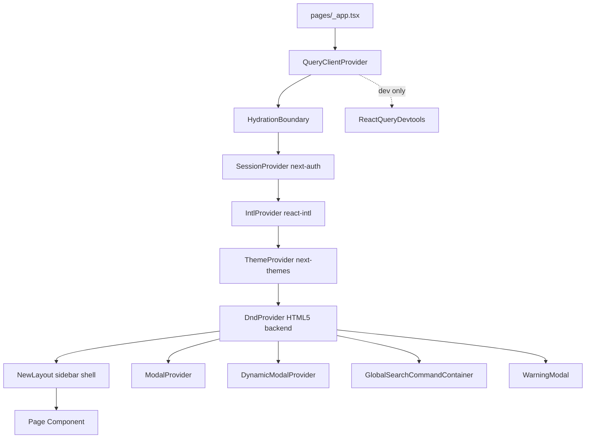
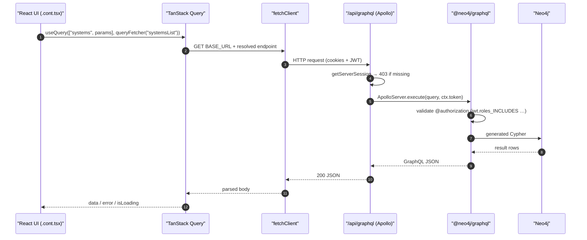
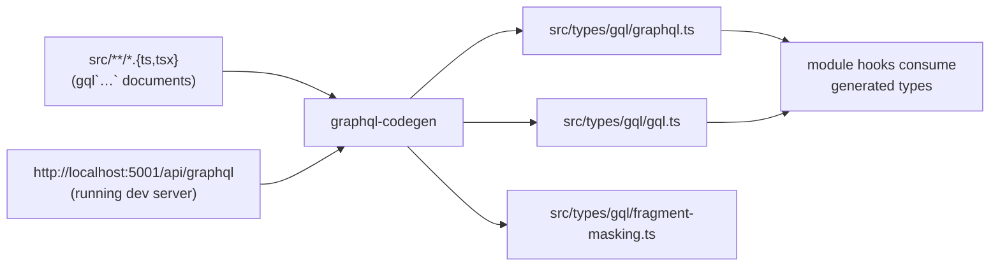

# App architecture

Foundation reference for engineers working on ELI PANDA. Other technical pages link back here for stack, module layout, and request-lifecycle context — read this first.

> 🔧 Source of truth is the code. File paths in backticks are clickable in the GitHub web UI and in IDEs; the GraphQL schema lives at `src/server/apollo/schema.graphql`.

## Overview

ELI PANDA is a Next.js 14 (pages router) frontend backed by a Neo4j graph database, fronted by an Apollo GraphQL endpoint that the app hosts itself as a Next.js API route. Per-request authorization is enforced by `@neo4j/graphql` directives against the JWT issued by NextAuth.

The same Next.js process also proxies legacy REST endpoints (the "PANDA API gateway") through a thin `fetchClient` wrapper. Almost all UI-facing data fetching goes through TanStack Query — either against the in-app `/api/graphql` endpoint or against the external REST gateway.

## Stack

| Layer | Choice | Notes |
|---|---|---|
| Framework | Next.js 14 / 15 (`next ~15.5`), React 19, pages router | App router (`src/app/`) holds only `globals.css` today. |
| Language | TypeScript 5, strict mode | No semicolons, single quotes, simple-import-sort ESLint plugin. |
| GraphQL | `@neo4j/graphql` + `@apollo/server` (`~4.13`) | Schema-first; resolvers are mostly autogenerated by Neo4j GraphQL. |
| Database | Neo4j (via `neo4j-driver`) | Auth/role data, all entity data. |
| Client data | TanStack Query v5 + `queryFetcher` / `queryMutate` (`src/utils/fetcher.ts`) | Single shared `QueryClient` from `src/utils/queryClient.ts`. |
| State | Zustand stores under `src/store/` | One store per cross-cutting concern (modals, table state, dark mode, …). |
| Forms | React Hook Form + Zod (`@hookform/resolvers`) | Field-level Zod schemas; see [Local development & conventions](./local-development.md) (planned). |
| UI | shadcn/ui (Radix primitives) + Tailwind CSS v4 | Migrating off `@headlessui/react`; see *Deprecated / legacy* below. |
| Auth | NextAuth v4 + Microsoft Entra ID (Azure AD) + JWT | See [Authentication](./authentication.md) (planned). |
| i18n | `react-intl`, EN-only today | Locale dictionary at `src/i18n/src/locale/en.ts`. |
| Tests | Jest (unit), Playwright (e2e) | `data-testid` for selectors. |
| Codegen | `@graphql-codegen/cli` 5 (`codegen.ts`) | Emits into `src/types/gql/`. |

The full pinned versions live in `package.json`.

## Module organization

Feature code lives under `src/modules/<feature>/`. Each module is largely self-contained — its own components, hooks, types, stores, and (where it owns server logic) custom resolver glue. The repo ships 26 such modules at the time of writing:

```
src/modules/
├── administration/      catalogue/            catalogueItem/
├── auth/                codebooks/            control-systems/
├── grants/              layout/               orderItem/
├── orders/              publication/          publications/
├── researchers/         roomCard/             roomCards/
├── services/            serviceTypeItem/      shared/
├── system-type-edit/    systemHierarchy/      systemItem/
├── systems/             systems-multi-move/   systemsMoving/
├── systemsRelations/    zones/
```

Inside a module the canonical layout is:

```
src/modules/<feature>/
├── <Feature>.cont.tsx          — container (data fetching, mutations, state wiring)
├── components/                 — pure UI (.comp.tsx) and small composite pieces
├── hooks/                      — custom hooks (one concern each)
├── queries/                    — GraphQL `gql` documents (consumed by codegen)
├── mutations/                  — GraphQL mutations
├── store/                      — Zustand stores scoped to this module
├── types/                      — module-local types and schemas
├── utils/                      — pure helpers
└── __tests__/                  — Jest unit tests next to the code
```

**Container vs. component split** is enforced by file suffix:

- `*.cont.tsx` — wires data, mutations, navigation, store. Imports the matching `.comp.tsx`.
- `*.comp.tsx` — pure presentation. No fetcher calls, no store reads beyond what the container passes in.

`src/modules/shared/` collects cross-module primitives (table, file/image manager, global search, RHF wrappers).

## App shell

The application entrypoint is `src/pages/_app.tsx`. Its provider tree drives every page:



The shell itself is `src/components/layout/NewLayout.tsx`. When authenticated, it mounts `AppSidebar` (`src/components/navigation/app-sidebar.tsx`) inside shadcn's `SidebarProvider`/`SidebarInset`. The sidebar items come from `src/lib/navigation/config.ts` (`NAV_ITEMS`, `OTHERS_NAV_ITEMS`) and are filtered against the session's roles by `useFilteredNavigation`.

Modal infrastructure has two parallel providers — `ModalProvider` (legacy, declarative) and `DynamicModalProvider` (current, store-driven via `useDynamicModalStore`). New code should use the dynamic system; see the [`modals` skill prompt](../../.claude/skills/modals/) for usage.

## Routing

The pages router under `src/pages/` maps URLs to feature pages:

```
src/pages/
├── _app.tsx, _document.tsx, 404.tsx, index.tsx, signout.tsx
├── api/
│   ├── auth/[...nextauth].js   — NextAuth handler
│   ├── graphql.ts              — Apollo server bound to neoSchema
│   ├── graphqlNative.ts        — alternate native handler (see legacy notes)
│   ├── [itemType]/[itemId]/[[...files]].ts  — file upload/download proxy
│   └── system/images/copy.ts
└── <feature>/...               — one folder per feature route
```

Public route paths are centralized in `src/types/constants/paths.ts` (`PATH.DASHBOARD`, `PATH.SYSTEMS`, …). Sidebar entries and `useRouter().push(...)` calls reference these constants — do not hardcode literal paths in pages or modules.

## Data layer

ELI PANDA reads and writes data through two channels:

1. **`/api/graphql` (in-process Apollo + `@neo4j/graphql`)** — the schema in `src/server/apollo/schema.graphql` defines every entity, relationship, and authorization rule. `src/server/apollo/schema.ts` wires `Neo4jGraphQL` with the driver, custom resolvers in `src/server/apollo/resolvers/`, and JWT validation keyed by `NEXTAUTH_SECRET`. The page handler `src/pages/api/graphql.ts` enforces `getServerSession` before serving the schema and threads the user's `apiAccessToken` onto the request context.
2. **External REST (PANDA API gateway)** — `BASE_URL` comes from `PANDA_API_GW_URL` (`src/types/constants/common.ts`). All endpoint paths are catalogued in `src/utils/getEndpoints.ts`; `queryFetcher` / `queryMutate` (`src/utils/fetcher.ts`) wrap those paths with `fetchClient` (`src/core/http/fetchClient.ts`) and surface them as TanStack Query primitives.



### `queryFetcher` and `queryMutate`

`queryFetcher` (`src/utils/fetcher.ts:100`) is a factory: pass an `EndpointKey` from `getEndpoints`, get a `QueryFunction` that resolves the endpoint at call time, abort-signal-aware, with dev-time `EndpointProps` validation (Zod). `queryMutate` (`src/utils/fetcher.ts:134`) is the mutation counterpart: pass endpoint key + HTTP verb, get a `MutateFunction` that returns an axios-shaped response (`AxiosResponse<T>`) for compatibility with existing call sites.

`uniFetcher` (`src/utils/fetcher.ts:90`) is a thin escape hatch for ad-hoc URL fetches.

### `QueryClient` defaults

```ts
// src/utils/queryClient.ts
new QueryClient({ defaultOptions: { queries: { staleTime: 60 * 1000 } } })
```

`getQueryClient()` returns a fresh client per SSR pass and a singleton in the browser; `_app.tsx` wraps it in a `useState` initializer to keep a stable reference across React renders.

## State

Cross-cutting state lives in `src/store/` as Zustand stores:

| Store | Purpose |
|---|---|
| `useDarkModeStore.ts` | Theme persistence; rehydrated on mount. |
| `useDynamicModalStore.ts` | Open/close stack for the current modal system (Dialog/Sheet). |
| `useModalStore.ts`, `useModalFormStateStore.ts`, `useModalGlobalStore.ts` | Legacy modal infrastructure. |
| `useWarningModalStore.tsx` | Confirm-style warnings used across modules. |
| `useEnvironmentWarningStore.ts` | Dev/test environment banner state. |
| `useFormControlStore.tsx` | Cross-RHF form coordination. |
| `useHoveringId.ts` | Hover-target sharing between sibling components. |
| `useMutateListStore.ts` | Optimistic-update queue helpers. |
| `useTableStateStore.ts` | Filter/sort/column-visibility persistence for tables. |

Module-scoped stores live under `src/modules/<feature>/store/` and follow the same pattern.

## Forms

React Hook Form is the only form library; Zod validates via `@hookform/resolvers/zod`. Reusable RHF-aware inputs live in `src/components/form/`. Wizards (multi-step flows) use Form Wizard V3 — see the [`wizard` skill prompt](../../.claude/skills/wizard/).

## UI

shadcn/ui components are vendored under `src/components/ui/`; theming is Tailwind v4 (no `tailwind.config.js` — utilities live in `src/app/globals.css`). The legacy HeadlessUI tree (`@headlessui/react`) is being phased out (see *Deprecated / legacy*).

Toast feedback uses `sonner` via the `toast.promise` pattern — see the [`toast` skill prompt](../../.claude/skills/toast/). Tables use `PandaTableV2` — see the [`tables` skill prompt](../../.claude/skills/tables/).

## Codegen pipeline

`yarn generate` runs `graphql-codegen --config codegen.ts`. It loads the GraphQL schema from `http://localhost:5001/api/graphql` (the running dev server), scans `src/**/*.{ts,tsx}` for `gql` tagged documents, and emits typed hooks into `src/types/gql/`.



Because codegen hits the live dev endpoint, the schema-in-DB and the schema file must agree at the moment of generation. `yarn generate:watch` keeps types in sync while iterating.

## Authentication & authorization

NextAuth (`src/pages/api/auth/[...nextauth].js`) supports two providers:

- **`AzureADProvider` (`id: 'azure-ad-beamlines'`)** — production sign-in. On first sign-in the JWT callback calls `neo4GetOrCreateUser` to upsert a `User` node in Neo4j and seed default roles (`basics`, `catalogue-view`, `systems-view`, `room-cards-view`, `orders-view`).
- **`CredentialsProvider`** — posts username/password to `PANDA_API_GW_URL + '/authenticate'`; used in local/test setups.

The JWT carries `roles: string[]` plus a signed `apiAccessToken` (JWT) the REST gateway accepts. Session callback projects those onto `session.user.roles` / `session.user.apiAccessToken`.

GraphQL authorization is enforced inside `@neo4j/graphql` via `@authorization` directives in the schema. The JWT type is declared explicitly:

```graphql
type JWT @jwt {
    roles: [String!]!
}
```

A representative directive (`schema.graphql:297`):

```graphql
@authorization(
    validate: [
        { operations: [READ], where: { jwt: { roles_INCLUDES: "systems-view" } } }
        {
            operations: [UPDATE, CREATE, DELETE, READ]
            where: { jwt: { roles_INCLUDES: "systems-edit" } }
            …
```

A "row-level" example (`schema.graphql:497`) for the `User` type:

```graphql
@authorization(
    validate: [
        { operations: [UPDATE, READ], where: { node: { uid: "$jwt.sub" } } }
        {
            operations: [UPDATE, CREATE, READ, DELETE]
            where: { jwt: { roles_INCLUDES: "admin" } }
            …
```

Full role inventory and the planned tightening live in [Permissions model](./permissions-model.md) (planned).

## Deployment

Azure environments (dev / test / prod) are driven by GitHub Actions workflows in `.github/workflows/`:

- `build-upload-run-azure-dev.yml`
- `compose-up-dev-on-push.yml`
- `compose-up-test-on-push.yml`
- `compose-up-production-on-push.yml`
- `compose-up-frontend-main-ui.yml` / `compose-down-frontend-main-ui.yml`

Wiki sync runs on every merge to `dev` via `.github/workflows/sync-wiki.yml`, which calls `scripts/sync-wiki.mjs`. The wiki push uses a PAT secret `WIKI_PUSH_TOKEN`; the default `GITHUB_TOKEN` cannot write to wikis.

`APP_BASE_URL` is selected at build time from `PANDA_ENV` (`src/types/constants/common.ts`): `localhost` → `http://localhost:5001`, `dev` → `https://dev.panda.eli-beams.eu`, `test` → `https://test.panda.eli-beams.eu`, otherwise `https://panda.eli-laser.eu`. Full deployment details belong in [Deployment & runbook](./deployment-runbook.md) (planned).

## Module map

```mermaid
flowchart LR
    subgraph Frontend["src/ (Next.js process)"]
        Pages["pages/<route>.tsx"]
        Modules["modules/<feature>/*.cont.tsx + *.comp.tsx"]
        Shared["components/, components/ui/, components/form/, components/layout/"]
        Stores["store/*"]
        Utils["utils/, core/, hooks/, lib/"]
    end
    subgraph Server["Server-side (same process)"]
        GQL["pages/api/graphql.ts\n+ server/apollo/*"]
        Auth["pages/api/auth/[...nextauth].js"]
        Files["pages/api/[itemType]/[itemId]/[[...files]].ts"]
    end
    subgraph External["External"]
        Neo4j[(Neo4j)]
        REST["PANDA API gateway (BASE_URL)"]
        Azure["Microsoft Entra ID"]
        Minio[(Minio S3)]
    end

    Pages --> Modules
    Modules --> Shared
    Modules --> Stores
    Modules --> Utils
    Utils -->|queryFetcher / queryMutate| GQL
    Utils -->|queryFetcher / queryMutate| REST
    GQL -->|@neo4j/graphql + Cypher| Neo4j
    Auth -->|OAuth| Azure
    Auth -->|upsert user| Neo4j
    Files --> Minio
```

## Key flows

### App boot

1. `pages/_app.tsx` initializes `QueryClient` and the provider tree above.
2. `SessionProvider` calls `/api/auth/session` to hydrate the JWT-backed session.
3. `NewLayout` decides shell vs. naked render based on `useSession()` status — unauthenticated users see the page directly (login screen lives at `pages/index.tsx`).
4. `AppSidebar` reads `NAV_ITEMS` / `OTHERS_NAV_ITEMS` and filters them through `useFilteredNavigation` against `session.user.roles`.

### Authenticated GraphQL request

See the sequence diagram in [Data layer](#data-layer). The notable points: `getServerSession` short-circuits unauthenticated requests with HTTP 403 outside `isLocalEnvironment()`, and `@neo4j/graphql` re-validates each directive on the resolved JWT — there is no second authorization pass in resolvers.

### REST fetch lifecycle

`useQuery(['endpointKey', params], queryFetcher('endpointKey'))` → `extractParams` lifts `params` off the query key → `resolveEndpoint` calls `getEndpoints(params)` to produce a relative URL → `buildUrl` prepends `BASE_URL` → `fetchRequest` performs the HTTP call with a 15 s default timeout, optional abort signal, optional `signOut` on a refresh-token failure (see `fetchClient`).

## Integration points

- **Other modules:** every per-module doc in `docs/technical/` references this page for the stack and request lifecycle.
- **`src/i18n/`:** `IntlProvider` is mounted in `_app.tsx`; modules import `useIntl` / `FormattedMessage` and reference keys from `src/i18n/src/messages.ts`. See the [`i18n` skill prompt](../../.claude/skills/i18n/).
- **`src/lib/navigation/`:** the single source of truth for what shows up in the sidebar and what each nav item requires from the JWT.
- **`scripts/sync-wiki.mjs`:** copies `docs/**` to the GitHub wiki, stripping the `## Data model reference` engineer-only sections. Don't write content under that heading you want users to see in the wiki.

## Deprecated / legacy

- `src/utils/fetcher.ts:4` — comment: *"axiosInstance is gradually being replaced by fetchRequest – kept temporarily for compatibility"*. `src/core/axios/axiosInstance.ts` still exists; new code should not import it.
- `src/utils/fetcher.ts:177` — `// TODO: After full migration remove axios dependency and related types (AxiosError, AxiosResponse)`. `queryMutate` still returns an axios-shaped response for caller compatibility.
- `src/pages/api/graphqlNative.ts` — alternate handler that bypasses the Apollo integration. Not referenced by sidebar or feature code; flag for deletion or documentation as an internal debugging surface.
- `@headlessui/react` — still used by `src/components/Disclosure.comp.tsx`, `src/components/form/ComboBoxControlled.tsx`, `src/components/form/components/Combobox{Button,Option,Input}.tsx`, `src/components/overlays/slideover/SlideOver.tsx`, and the legacy `src/modules/shared/imageManager/components/Image{TabList,TabPanels}.tsx`. The migration target is shadcn/ui + Radix.
- Modal duality: `ModalProvider` (legacy) and `DynamicModalProvider` (current) are both lazy-loaded in `_app.tsx`. Stores `useModalStore`, `useModalFormStateStore`, `useModalGlobalStore`, `useFormControlStore` belong to the legacy system.
- `src/components/layout/TableLayoutContainer.tsx:48` — `// REVIEW LAYOUT HEIGHT + 3  // TODO` — a long-standing layout hack left in place; verify before changing table layouts.

## Maintenance recommendations

1. **Finish the axios → `fetchClient` migration.** `queryMutate` still returns `AxiosResponse<T>`; refactoring it to a native shape removes the entire `axios` dependency, `src/core/axios/`, and the `toAxiosError` translator in `fetcher.ts`. Largest blast radius is mutation call sites that destructure `response.data`.
2. **Retire HeadlessUI.** Ten files remain. Migrate `ComboBoxControlled` and `Combobox*` first — they are imported broadly by forms and decide the upgrade ergonomics for everything else.
3. **Consolidate modal infrastructure.** Pick `DynamicModalProvider` as the only surface; delete `ModalProvider` and its three companion stores (`useModalStore`, `useModalFormStateStore`, `useModalGlobalStore`) once call sites are migrated. The two systems cost twice the lazy boundary in `_app.tsx`.
4. **Audit `pages/api/graphqlNative.ts`.** Either document why a non-Apollo handler is needed or delete it.
5. **Tighten `queryFetcher` typing.** `EndpointKey` resolves correctly at runtime but `endpointType` is currently typed `string` in `queryFetcher` — promoting the parameter to `EndpointKey` would surface stale endpoint references at compile time.
6. **Eliminate `any` casts in mutation glue** (`fetcher.ts:45`, `fetcher.ts:156`). The `axiosLike` adapter is the natural place to introduce a typed error union.
7. **Document the `lib/environment/utils` rules.** `isLocalEnvironment()` gates `getServerSession`'s 403 in `pages/api/graphql.ts`; a brief comment in the handler about *what* counts as local would prevent foot-guns.

## 🔮 Planned

- **Permissions Phase 1 & 2** (level-based admin/editor split, team-based scoping). The `@authorization` directives in the schema already accept `where: { node: ... }` fragments; the data structure for "responsible team" enforcement is still pending. Cross-reference [Permissions model](./permissions-model.md) (planned).
- **HeadlessUI removal** — see *Maintenance*.
- **App router migration** — `src/app/` is empty other than `globals.css`. No active proposal to migrate from pages router today.
- **Hungarian localisation** — planned for ELI ALPS; today the app ships EN only.

## Open questions

- Are `graphqlNative.ts` and `pages/api/system/images/copy.ts` actively used in production, or are they fallback paths? Neither is referenced from sidebar navigation.
- Is `useModalFormStateStore` slated for deletion alongside `useModalStore`, or kept as the cross-form coordination primitive? Today it is consumed by both legacy and current code.
- Is `signout.tsx` reachable from anywhere other than the NextAuth default flow? It is not in `NAV_ITEMS` or `OTHERS_NAV_ITEMS`.

---

## Data model reference

> 🔧 *This section is for engineers reading the docs in the repo. The wiki generator strips it.*
>
> Authoritative entity definitions live in `src/server/apollo/schema.graphql`. JWT shape is the `JWT @jwt` type at the top of that file; per-entity authorization directives are inlined on each type. Generated TS types are in `src/types/gql/graphql.ts`.
