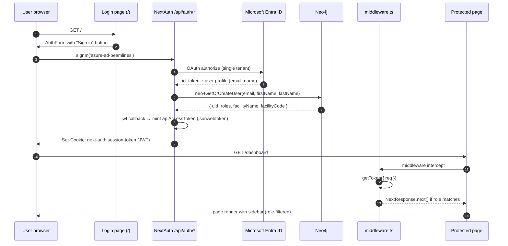

# Authentication

How ELI PANDA authenticates users, what the JWT carries, and how the session is enforced on every request. Cross-references [App architecture](./app-architecture.md) for the provider tree and the request lifecycle.

## Overview

The app uses NextAuth v4 in JWT-session mode. Two providers are wired:

- **`AzureADProvider`** (id `azure-ad-beamlines`) — the production sign-in. OAuth code flow against Microsoft Entra ID (Azure AD), single-tenant ELI Beamlines.
- **`CredentialsProvider`** — username/password fallback that posts to the PANDA API gateway `/authenticate` endpoint. Used in local/test setups and as a fail-safe surface.

On first sign-in the JWT callback upserts a `User` node in Neo4j with default read roles, mints a long-lived API access token, and projects everything into a compact JWT. Every API route, GraphQL request, and protected page revalidates that token.

## Stack

| Layer | Implementation |
|---|---|
| Library | `next-auth` (~4.24.13) — pages-router style |
| Strategy | `session: { jwt: true }` (no DB session table) |
| Token signer | `jsonwebtoken` with `process.env.NEXTAUTH_SECRET` |
| Providers | `next-auth/providers/azure-ad`, `next-auth/providers/credentials` |
| Identity store | Neo4j (`User`, `Employee`, `Role` nodes) via `neo4j-driver` |
| API gateway | `process.env.PANDA_API_GW_URL` — accepts the minted JWT as `Authorization: Bearer …` |

## Files

| Path | Role |
|---|---|
| `src/pages/api/auth/[...nextauth].js` | NextAuth handler. Defines `authOptions`, both providers, callbacks (`jwt`, `session`, `redirect`), and the Neo4j upsert. |
| `src/types/next-auth.d.ts` | Module augmentation. Adds `uid`, `roles`, `apiAccessToken`, `facility`, `facilityCode`, `fullName` to `Session.user` and `JWT`. |
| `src/middleware.ts` | Edge middleware. Re-validates the JWT with `getToken`, redirects unauthenticated requests on protected paths, enforces role gates from `PATH_ROLES_CONFIG`. |
| `src/lib/navigation/config.ts` | `PROTECTED_PATHS` and `PATH_ROLES_CONFIG` — the routing role gate. |
| `src/pages/index.tsx` | Login page (`/`). Wraps `AuthFormComponent`. |
| `src/modules/auth/auth-form.comp.tsx` | The single sign-in button — `signIn('azure-ad-beamlines')`. |
| `src/pages/signout.tsx` | Programmatic sign-out page that redirects to `/` afterwards. |
| `src/components/navigation/logout-button.tsx` | Sidebar dropdown menu entry that calls `signOut({ redirect: false })`. |
| `src/core/http/fetchClient.ts` | REST client. Attaches `Authorization: Bearer ${apiAccessToken}` to every outgoing request, reading the token from an in-memory cache (resolved once via `getSession()`, then reused) rather than calling `getSession()` per request. Clears the cache on a 401. |
| `src/components/auth/SessionSync.tsx` | Bridge mounted under `SessionProvider`. Mirrors the `useSession()` token into `fetchClient`'s cache on login / logout / user-switch so requests never need a per-call `getSession()`. |
| `src/pages/api/graphql.ts` | Server-side GraphQL handler. Re-validates with `getServerSession` and threads `token.apiAccessToken` onto the Apollo context. |
| `panda_entraid_app_registration.txt` | Repo-root checklist for registering the Entra ID app (no secrets). |

## Session lifecycle



### Sign-in (Azure AD)

`AuthFormComponent` (`src/modules/auth/auth-form.comp.tsx:31`) calls:

```ts
signIn('azure-ad-beamlines')
```

NextAuth performs the OAuth dance with Entra ID using the env vars:

```ts
clientId: process.env.AZURE_AD_BEAMLINES_CLIENT_ID
clientSecret: process.env.AZURE_AD_BEAMLINES_CLIENT_SECRET
tenantId: process.env.AZURE_AD_BEAMLINES_TENANT_ID
```

When the OAuth callback returns, the `jwt` callback runs. For the Azure path (`params.account.provider === 'azure-ad-beamlines'`) it:

1. Splits `params.user.name` into `firstName` / `lastName` with a small heuristic (1 → firstName, 2 → lastName comes first).
2. Calls `neo4GetOrCreateUser(email, firstName, lastName)` — see [User upsert](#user-upsert).
3. Mints `apiAccessToken = jwt.sign({ sub: user.uid, jti: user.email, exp: Date.now() + 1000*60*60*24*365, facilityName, facilityCode, roles }, NEXTAUTH_SECRET)`.

> The signed `exp` claim is in **milliseconds** (`Date.now() + …`) rather than seconds. JWT spec defines `exp` as a NumericDate in seconds; this means the token's nominal expiry is far beyond a year and the gateway-side validator likely ignores or compensates. See *Open questions*.

4. Returns a compact JWT via `toCompactToken(...)` — only `sub`, `iat`, `exp`, `jti`, `roles`, `apiAccessToken`, `facility`, `facilityCode`, `uid`, `fullName`, `email`. Extra Azure claims (groups, picture, etc.) are dropped to keep the cookie small.

### Sign-in (credentials fallback)

`CredentialsProvider.authorize(credentials)` posts to `PANDA_API_GW_URL + '/authenticate'` with `{ username, password }`. The gateway returns a user object with `accessToken`, `uid`, `facility`, `facilityCode`, `roles`. The `jwt` callback recognises this shape (`if (params.user?.roles)`) and projects it into the same compact JWT.

There is no login UI for credentials today — `AuthFormComponent` only renders the Azure button — but the provider stays wired for tooling and tests that POST directly to NextAuth.

### User upsert

The Cypher in `neo4GetOrCreateUser` (`src/pages/api/auth/[...nextauth].js:170-219`) does, in one transaction:

1. Match the facility `(f:Facility{code:"B"})` — **hardcoded to ELI Beamlines facility code `B`** (see *Open questions*).
2. Optionally find a `User` by case-insensitive email; `apoc.do.when` creates one if missing with `uid: apoc.create.uuid()`, `isEnabled: true`, `createdBy: "autocreated"`, and a `BELONGS_TO_FACILITY` edge to `f`.
3. Attempt to link an existing `Employee` with the same email via `HAS_USER`.
4. If the user has no `HAS_ROLE` edges yet, seed defaults: `basics`, `catalogue-view`, `systems-view`, `room-cards-view`, `orders-view`.
5. Return `{ uid, email, firstName, lastName, facilityName, facilityCode, roles }`.

Auto-created users land with read-only roles. Promotion to editor/admin is a separate operation in the Administration module.

### Session shape

`session.user` is augmented in `src/types/next-auth.d.ts`:

```ts
interface User {
    uid: string
    email: string
    fullName: string
    facility: string
    facilityCode: string
    roles: Array<ROLE>
    apiAccessToken: string
}
```

The `session` callback projects the JWT fields onto `session.user` so client code can read `useSession().data.user.roles`, etc. The session cookie name is the NextAuth default (`next-auth.session-token` in dev, `__Secure-next-auth.session-token` over HTTPS).

### Sign-out

Two surfaces:

- **Sidebar `LogoutButton`** (`src/components/navigation/logout-button.tsx`) — `signOut({ redirect: false })` then `router.push(PATH.ROOT)`. Used in normal flow.
- **`/signout` page** (`src/pages/signout.tsx`) — checks `useSession().status`; if authenticated, calls `signOut({ redirect: false })`; if already unauthenticated, redirects to `/`. Useful as a guard URL.

Client-side, the `SessionSync` bridge clears `fetchClient`'s cached token when `useSession().status` becomes `unauthenticated`, so no stale token can be attached to a request after sign-out. Neither flow tells the API gateway to invalidate the previously-issued `apiAccessToken`, however — that token remains valid until its `exp` regardless of the cookie being cleared. See *Open questions*.

## Authorization layers

Authorization is enforced in three independent places:

```mermaid
flowchart TD
    R[Incoming HTTP request] --> MW["middleware.ts\n(Edge)"]
    MW -->|protected path + no JWT| Login["redirect → /?callbackUrl=…"]
    MW -->|JWT, role match| Page["Next.js page render"]
    MW -->|JWT, role mismatch| NF["redirect → /404"]
    Page --> Sidebar["AppSidebar\nuseFilteredNavigation(NAV_ITEMS)"]
    Sidebar -->|role filter| UI[Visible nav items]
    Page -->|client query| GQL["pages/api/graphql.ts"]
    GQL -->|getServerSession| Reject["403 if missing"]
    GQL -->|forward ctx.token| Apollo["Apollo + @neo4j/graphql"]
    Apollo -->|@authorization directives\non each entity| DB[(Neo4j)]
```

### Layer 1 — middleware

`src/middleware.ts` runs on every non-static request via the matcher:

```ts
matcher: ['/((?!_next/static|_next/image|favicon.ico|.*\\.(?:svg|png|jpg|jpeg|gif|webp|ico|woff|woff2|ttf|eot)$).*)']
```

Logic:

1. `getToken({ req })` — read the JWT from the cookie.
2. If the path is in `PROTECTED_PATHS` and no token → redirect to `/` with `callbackUrl` set.
3. If the path has a `PATH_ROLES_CONFIG` entry → `hasRequiredRole(user.roles, currentPath)`; on mismatch, log `[Security] Unauthorized access attempt` and redirect to `/404`.
4. If the user is authenticated and lands on `/` → redirect to `PATH.DASHBOARD`.
5. Attach security headers: `Content-Security-Policy` (CSP), `X-Frame-Options: SAMEORIGIN`, `X-Content-Type-Options: nosniff`, `Referrer-Policy: strict-origin-when-cross-origin`.

The CSP `connect-src` is widened on `PANDA_ENV=localhost` to allow `http://localhost:*`; in every other env it is `'self' https:`.

E2E bypass: `process.env.PLAYWRIGHT_E2E === '1'` short-circuits the unauthenticated redirect so Playwright runs can skip the OAuth dance.

### Layer 2 — API route

`src/pages/api/graphql.ts:25` calls `getServerSession(req, res, authOptions)` and responds `403 Authentication required.` if there is no session **and** the env is not local (`!isLocalEnvironment()`). Local builds therefore allow unauthenticated GraphQL queries — useful for codegen against the dev server, dangerous to expose in production.

### Layer 3 — `@neo4j/graphql` directives

Every entity in `src/server/apollo/schema.graphql` either has `@authentication` (require *any* logged-in user) or `@authorization` directives that match against the JWT. The JWT type is declared explicitly:

```graphql
type JWT @jwt {
    roles: [String!]!
}
```

A representative directive (`schema.graphql:297`):

```graphql
@authorization(
    validate: [
        { operations: [READ], where: { jwt: { roles_INCLUDES: "systems-view" } } }
        {
            operations: [UPDATE, CREATE, DELETE, READ]
            where: { jwt: { roles_INCLUDES: "systems-edit" } }
            …
```

See [Permissions model](./permissions-model.md) (planned) for the role inventory and the planned tightening.

## Role inventory

`ROLE` enum (`src/types/constants/roles.ts`):

```
basics, catalogue-view, catalogue-edit, catalogue-category-edit,
systems-view, systems-edit, system-types-view, system-types-edit,
orders-view, orders-edit, orders-delivery-edit, supplier-edit,
room-cards-view, room-cards-edit,
codebooks-admin, dashboard-files-admin,
publications-view, publications-edit,
catalogue-service-view, catalogue-service-edit,
control-systems-view, control-systems-edit,
zones-view, zones-edit,
reports-view, admin
```

The middleware role map (`PATH_ROLES_CONFIG`, `src/lib/navigation/config.ts:160`) gates each route on a *set* of acceptable roles (OR). Sidebar filtering uses the same `ROLE` enum via `useFilteredNavigation` (`src/hooks/useFilteredNavigation.ts`).

## Token usage on outgoing REST

`src/core/http/fetchClient.ts` is the single attachment point. It does **not** call `getSession()` per request — that previously meant a ~270ms `/api/auth/session` round-trip on every call, and a request storm (one session fetch per concurrent query) that saturated the Next server. Instead the token lives in a module-level cache:

```ts
const token = await resolveAuthToken()
if (token) headers['authorization'] = `Bearer ${token}`
```

`resolveAuthToken` returns the cached token synchronously when present; on a cold start it falls back to a **single-flight** `getSession()` (concurrent first calls share one promise). The `SessionSync` bridge keeps the cache in lockstep with the live session, so in steady state there are **zero** `/api/auth/session` requests. This is safe because `apiAccessToken` is a stable, long-lived JWT that does not rotate mid-session (see [Sign-in](#sign-in-azure-ad)).

An `authEpoch` counter guards against a stale write: a `getSession()` that started before a logout / user-switch cannot resolve afterward and re-populate the cache. On the **server** the cache is bypassed entirely (resolved fresh per call) so a module-level token is never shared across users.

`queryFetcher` and `queryMutate` (`src/utils/fetcher.ts`) ultimately call `fetchRequest` / `fetchRequestDetailed`, so every TanStack Query and mutation inherits this header automatically.

The 15 s `DEFAULT_TIMEOUT` and abort-signal plumbing live in the same module. On a **401**, `fetchClient` clears the cached token (so the next request re-resolves a fresh session) but does no automatic re-auth or sign-out — failed requests still bubble up as `NormalizedHttpError` with `status: 401`.

## Entra ID app registration

The repo ships a step-by-step checklist for the Entra ID app at `panda_entraid_app_registration.txt`. Key points:

- Name: **ELI ERIC PANDA**
- Tenant: single (ELI Beamlines)
- Redirect URIs (web platform): one per environment, all pointing at `/api/auth/callback/azure-ad`:
  - `http://localhost:5001/api/auth/callback/azure-ad`
  - `https://dev.panda.eli-beams.eu/api/auth/callback/azure-ad`
  - `https://test.panda.eli-beams.eu/api/auth/callback/azure-ad`
  - `https://panda.eli-laser.eu/api/auth/callback/azure-ad`
- Token configuration: ID-token claims `email`, `upn`; optional groups claim `DNSDomain\sAMAccountName`.
- Client secret expiry: 730 days (rotate before).

> 🛈 The checklist file uses the placeholder `azure-ad` in the callback path. In the running app the provider id is `azure-ad-beamlines`, so the **real** callback paths are `/api/auth/callback/azure-ad-beamlines`. Update the app registration accordingly — see *Open questions*.

## Required environment variables

| Var | Purpose | Used by |
|---|---|---|
| `NEXTAUTH_SECRET` | Signs the session cookie *and* the minted `apiAccessToken` | NextAuth, `@neo4j/graphql` authorization, JWT signing |
| `NEXTAUTH_URL` | Public origin for OAuth callbacks | NextAuth (auto-detected in some hosts but required behind proxies) |
| `AZURE_AD_BEAMLINES_CLIENT_ID` | Entra ID app client | `AzureADProvider` |
| `AZURE_AD_BEAMLINES_CLIENT_SECRET` | Entra ID app secret | `AzureADProvider` |
| `AZURE_AD_BEAMLINES_TENANT_ID` | Single tenant GUID | `AzureADProvider` |
| `PANDA_API_GW_URL` | Base URL of the REST gateway | `CredentialsProvider`, `fetchClient`, `BASE_URL` |
| `PANDA_ENV` | `localhost` / `dev` / `test` / `production` — drives CSP and `APP_BASE_URL` | `middleware.ts`, `src/types/constants/common.ts` |
| `PLAYWRIGHT_E2E` | If `'1'`, middleware skips the unauthenticated redirect | `middleware.ts` |

Local-env reading of `getServerSession` (`pages/api/graphql.ts:30`) leans on the `PANDA_ENV === 'localhost'` check in `src/lib/environment/utils.ts`.

## Deprecated / legacy

- `src/pages/api/auth/[...nextauth].js` is JavaScript, not TypeScript. The rest of the auth surface is TS; converting this file would let TS type-check the callbacks against `src/types/next-auth.d.ts`.
- `console.log('🚀 ~ neo4GetOrCreateUser ~ e:', e)` at `src/pages/api/auth/[...nextauth].js:212` — leftover debug log that fires on any Cypher failure during sign-in.
- `var jwt = require('jsonwebtoken')` at `src/pages/api/auth/[...nextauth].js:6` — CommonJS `var require` inside a Next.js module. Works because the file is `.js`, but it stands out against ES-module style elsewhere in the repo.
- The Facility lookup `MATCH(f:Facility{code:"B"})` is **hardcoded** to ELI Beamlines. Any future ELI ALPS deployment will need a per-tenant facility code.

## Maintenance recommendations

1. **Convert `[...nextauth].js` to TypeScript.** The session/JWT shape is already declared in `src/types/next-auth.d.ts`; converting unlocks compile-time checks on the callbacks and the Cypher upsert wrapper.
2. **Fix the `exp` unit bug.** `Date.now() + 1000*60*60*24*365` produces milliseconds; JWT `exp` is seconds. Either divide by 1000 here or document explicitly that the gateway treats this value as ms.
3. **Decide whether `apiAccessToken` should rotate on sign-out.** Today the cookie is cleared but the API gateway still accepts the previously-minted token until `exp`. Either shorten `exp` and refresh on demand, or maintain a revocation list on the gateway. Note: `fetchClient` now caches the token in memory on the assumption that it is stable for the session (see [Token usage on outgoing REST](#token-usage-on-outgoing-rest)); if rotation is introduced, the cache would need to refresh on rotation (e.g. via `SessionProvider` re-fetch driving `SessionSync`), not just on login/logout.
4. **Centralise the 401 response.** `fetchClient` clears its cached token on a 401 but does not otherwise react — adding a single interceptor that triggers `signIn()` (or `signOut()`) on 401 would prevent the "silently stuck on stale token" failure mode.
5. **Document the facility-code seam.** The hardcoded `"B"` in `neo4GetOrCreateUser` is the only piece of multi-tenant code in auth; either turn it into an env var or codify the rule that one deployment = one facility.
6. **Reconcile `panda_entraid_app_registration.txt` with the real provider id.** The checklist shows `/api/auth/callback/azure-ad` but the provider is `azure-ad-beamlines`. Bring the doc and the registered redirect URIs in sync.
7. **Add per-callback structured logging.** `[Security]` warnings in middleware are good; adding parallel structured logs for `jwt` and `session` callbacks would make audit trails much cheaper to reconstruct.

## 🔮 Planned

- **Permissions Phase 1 & 2** — level-based admin/editor split and team-based scoping. The token shape already exposes `roles` and `uid`; the schema directives are where the policy lands. Tracked in [Permissions model](./permissions-model.md) (planned).
- **Hungarian localisation for ELI ALPS** would also require a second `AzureADProvider` (id `azure-ad-alps` or similar) and a per-facility `code` lookup in `neo4GetOrCreateUser`.

## Open questions

- Is the gateway's JWT validator tolerant of `exp` being in milliseconds, or is the token effectively non-expiring in production? (`src/pages/api/auth/[...nextauth].js:106`)
- Should sign-out invalidate `apiAccessToken` server-side, or is a long-lived gateway token acceptable for the audience?
- The `CredentialsProvider` is wired but has no UI surface. Is it still used by any test runner / SDK, or can it be removed?
- `pages/api/graphqlNative.ts` exists alongside `pages/api/graphql.ts` — does it share auth behaviour? (Already flagged in [App architecture](./app-architecture.md).)
- The `4GetOrCreateUser` Cypher uses `apoc.do.when` and `apoc.create.uuid()`; these are APOC-procedure dependencies. Are they guaranteed present in every Neo4j deployment?

---

## Data model reference

> 🔧 *This section is for engineers reading the docs in the repo. The wiki generator strips it.*
>
> Authoritative entity definitions live in `src/server/apollo/schema.graphql`. Auth-relevant types: `User`, `Role`, `Employee`, `Facility`, and the `JWT @jwt` declaration at the top of the file. Session/JWT TypeScript augmentation lives in `src/types/next-auth.d.ts`.
