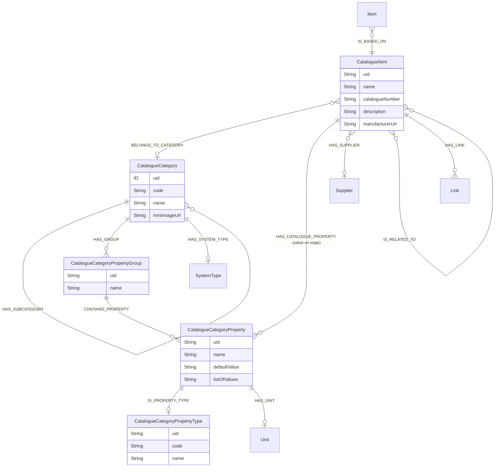
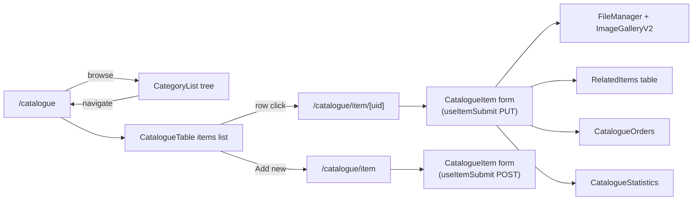
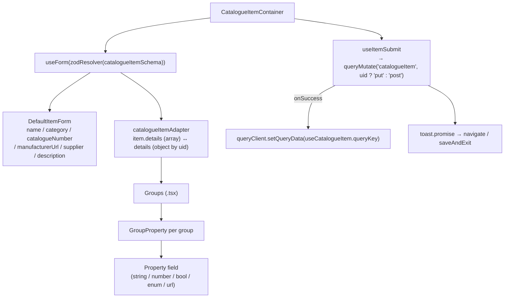
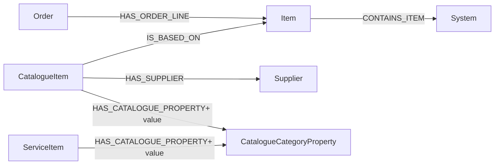

# Catalogue & Items

The catalogue is the abstract product model behind every physical `Item` in the facility. Categories carry property *schemas* (groups + properties + types); items are instances that fill those properties with values. The same property metadata feeds the dynamic columns and forms across [Systems family](./systems-family/README.md), Orders, and Services.

Two modules: `src/modules/catalogue/` (category browser + items list) and `src/modules/catalogueItem/` (single-item detail + edit).

## Module locations

```
src/modules/catalogue/
├── Catalogue.cont.tsx                      — /catalogue page: category list + items table
├── components/
│   ├── breadcrump/                         — CatalogueBreadcrumbs (parent path)
│   ├── categoryList/                       — CategoryList tree
│   ├── categoryEdit/                       — CategoryEdit dialog (form + components)
│   ├── filters/                            — filter sheet, footer, hooks
│   └── SearchBarButtons.tsx
├── hooks/
│   ├── useCategory.ts                      — single category by uid (REST)
│   ├── useCategoryDetail.ts                — full category with properties (REST)
│   ├── useCategoryList.ts                  — flat list of categories
│   ├── useCategoryUid.ts                   — URL-state helper
│   └── useCatalogueItems.ts                — items list with filter integration
├── types/filter.ts
└── utils/index.ts

src/modules/catalogueItem/
├── CatalogueItem.cont.tsx                  — /catalogue/item/[uid] page
├── components/
│   ├── form/                               — Zod schema + RHF + dynamic Groups → Properties
│   ├── related-items/                      — RelatedItems table + add modal
│   ├── orders/                             — Orders that include this item
│   └── statistics/                         — Usage statistics widget (3 variants)
├── hooks/
│   ├── useItem.ts                          — read CatalogueItem
│   ├── useItemSubmit.tsx                   — create/update mutation
│   ├── useItemCreate.tsx                   — create-only entry point
│   ├── useCatalogueNumberUnique.ts         — async unique-check on `catalogueNumber`
│   ├── useRelatedItems.ts                  — `IS_RELATED_TO` (forward)
│   ├── useRelatedItemsFor.ts               — `IS_RELATED_TO` (inverse)
│   ├── useCreateRelatedItem.ts             — connect items
│   ├── useDisconnectRelatedItem.ts         — disconnect
│   ├── useGroupDetails.tsx                 — property-group hydration
│   └── useItemsAggregate.ts                — count rollups for statistics
├── types/responses.tsx
└── utils/catalogueItemAdapter.ts           — API ↔ form shape adapter
```

Routes:

```
src/pages/catalogue/
├── index.tsx                — /catalogue → CatalogueContainer
└── item/
    ├── index.tsx            — /catalogue/item → create
    └── [uid].tsx            — /catalogue/item/<uid> → edit
```

## Data model



### Three-layer property model

The property schema is **defined on the category** and **valued on each item**:

1. **`CatalogueCategoryPropertyType`** — primitive type code (`STRING`, `NUMBER`, `BOOLEAN`, `ENUM`, `URL` …) backed by codebooks.
2. **`CatalogueCategoryProperty`** — a single property definition: `name`, `defaultValue`, optional `listOfValues` (for enums), an optional `unit`, and a `type`.
3. **`CatalogueCategoryPropertyGroup`** — a named bag of properties displayed together (e.g. "Electrical", "Optical").
4. **`HAS_CATALOGUE_PROPERTY` edge** — links a `CatalogueItem` to each property it sets. The actual value lives on the edge via `interface hasCatalogueProperty { value: String }` (`schema.graphql:221-223`).

This means a single `CatalogueCategoryProperty` row can serve many items, each with its own value-on-the-edge. The same shape is reused by `ServiceItem.details` (`schema.graphql:421-426`) — services define their own per-line property values against the catalogue's property catalogue.

### `parentPath` cypher resolver

`CatalogueCategory.parentPath` mirrors the `System.parentPath` pattern (`schema.graphql:161-171`): walks `HAS_SUBCATEGORY` up to 50 levels, returns reversed `ParentPathItem` list. Powers the breadcrumb in the catalogue browser. The 50-level cap is identical to `System`'s.

## Pages



`Catalogue.cont.tsx` hosts a category browser on the left (`CategoryList`), a filter sheet, and a shared `CatalogueTable` for items. The selected category is held in the URL via `?category=...` (`useQueryState('category', …)` from `next-usequerystate`); `useCatalogueItems(tableId, undefined, true)` honours that filter alongside the rest of the table state.

`CatalogueItem.cont.tsx` is the detail / edit page. It mounts:

- A `usePermission([ROLE.CATALOGUE_EDIT])` gate that flips the entire form to read-only when missing.
- An `ImageGalleryV2` for catalogue-item images (see [Image manager v2](#image-manager-v2)).
- A `FileManager` for arbitrary attachments (MinIO).
- `Groups → GroupProperty → Property` — the dynamic form built from the category's property schema.
- `RelatedItems`, `CatalogueOrders`, and `CatalogueStatistics` containers stacked below the form.

## Fetcher surface

All catalogue reads and writes go through REST endpoints from `src/utils/getEndpoints.ts` — there are **no** GraphQL queries in either module today. The endpoint inventory:

| Endpoint key | Path | Used by |
|---|---|---|
| `catalogueCategories` | `/catalogue/categories${path}` | Category list |
| `catalogueCategoryEdit` | `/catalogue/category{uid?}` | Category create/edit |
| `catalogueCategoryImage` | `/catalogue/category/{uid}/image` | Category image |
| `catalogueCategoryProperties` | `/catalogue/category/{uid}/properties${query}` | Property schema hydration |
| `cataloguePhysicalItemProperties` | `/catalogue/category/{uid}/physical-item-properties` | Physical-item form fields |
| `catalogueCategoryCopy` | `/catalogue/category/{uid}/copy` | Category copy |
| `catalogueItems` | `/catalogue/items${query}` | Items list (filterable, paginated) |
| `catalogueItem` | `/catalogue/item{uid?}` | Item create / read / update |
| `catalogueItemImage` | `/catalogue/item/{uid}/image` | Item image |
| `catalogueItemStatistics` | `/catalogue/item/{uid}/statistics` | Usage statistics |
| `catalogueItemsStatistics` | `/catalogue/items/statistics` | List-wide stats |
| `catalogueOrders` | `/catalogue/{uid}/orders` | Orders that reference this item |
| `catalogueNumberUniqueCheck` | `/catalogue/item/catalogue-number/unique${query}` | Async uniqueness validator |

All of them go through `queryFetcher` / `queryMutate`, so they inherit the `Authorization: Bearer ${apiAccessToken}` header from `fetchClient`.

## Form architecture

`CatalogueItem.cont.tsx` is a strict React Hook Form container:



Key conventions:

- **Adapter pattern.** The API returns `details: PropertyDetail[]` (one entry per property). The form needs `details: Record<propertyUid, PropertyDetail>` for O(1) writes. `catalogueItemAdapter` converts both ways; the in-component `useMemo` (see `CatalogueItem.cont.tsx:46`) recomputes when `item` changes.
- **`catalogueItemSchema`** (Zod) lives in `components/form/ItemForm.schema.ts` and is composed dynamically — `useCatalogueFormFields` reads the category's `properties` and extends the base schema accordingly.
- **`useCatalogueNumberUnique`** issues a debounced async check against `catalogueNumberUniqueCheck` while typing.
- **Save-and-exit** mode flips `useItemSubmit`'s post-success navigation (`navigateBack()` instead of staying on the page).

## Related items

`IS_RELATED_TO` is a bi-directional edge between two `CatalogueItem`s. Both directions are exposed in the schema (`relatedCatalogueItems` / `relatedCatalogueItemsFor`) so the UI can show "items related to this one" without needing two passes.

Module surface:

- `useRelatedItems` — outbound edges.
- `useRelatedItemsFor` — inbound edges.
- `useCreateRelatedItem` + `useDisconnectRelatedItem` — write operations.
- `SelectRelatedItems.modal.tsx` — picker dialog backed by a paginated `CatalogueItems` query.

The relationship is **symmetric in meaning** but **directional in storage** — the schema does not enforce an inverse edge on creation. Today UIs treat the two queries as the same logical thing.

## Image manager v2

`src/modules/shared/imageManager/v2/` is the canonical image attachment surface for `CatalogueItem`. It supersedes the v1 implementation at `src/modules/shared/imageManager/` — v1 still ships (its `ImageTabPanels.tsx` and `ImageTabList.tsx` use HeadlessUI) and is consumed by older surfaces.

The README under `src/modules/shared/imageManager/v2/README.md` documents the v2 component contract; the v2 module also ships a `REFACTOR_PLAN.md` and `IMPLEMENTATION_SUMMARY.md` that should eventually graduate into this technical-docs tree.

`CatalogueItem.cont.tsx:30` memoises `ImageGalleryV2` because its render-cost dominates on items with many photos:

```tsx
const MemoizedGalleryV2 = memo(ImageGalleryV2)
```

## Statistics

`components/statistics/` exposes three rendering variants (`.simple.tsx`, `.redesign.tsx`, `.cont.tsx`). The container chooses which to mount; the simple variant is a popover button (`CatalogueStatistics.button.tsx`), the redesigned variant is an in-page expanded card. `useItemsAggregate` is the count helper used by both.

Three variants for the same data is a smell — see [Deprecated / legacy](#deprecated--legacy).

## Cross-module integration



The catalogue is the join point for almost every "physical thing" surface:

- **Systems family** — `Item.system` resolves to the `System` that holds the physical item via `CONTAINS_ITEM`. The system-detail form shows the catalogue item's identity but routes edits of the *catalogue* record back to `/catalogue/item/<uid>`.
- **Orders** — `Item` participates in `HAS_ORDER_LINE` (`schema.graphql:402`); per-order line metadata lives on the relationship interface `hasOrderLine`.
- **Services** — `ServiceItem.details` re-uses the same `HAS_CATALOGUE_PROPERTY` edge with the same `hasCatalogueProperty.value` interface, so the property model is shared.
- **System types** — `CatalogueCategory.systemType` points at the `SystemType` codebook (`schema.graphql:156`). This is the seam that lets a category pre-fill `System.systemType` when items based on it land in a system.

## Permissions

Both `CatalogueCategory` and `CatalogueItem` are `@authentication`-only — no `@authorization` directive at the schema level. Real enforcement comes from:

- `PATH_ROLES_CONFIG`:
  ```ts
  [PATH.CATALOGUE]:      [ROLE.CATALOGUE_CATEGORY_EDIT, ROLE.CATALOGUE_EDIT, ROLE.CATALOGUE_VIEW],
  [PATH.CATALOGUE_ITEM]: [ROLE.CATALOGUE_CATEGORY_EDIT, ROLE.CATALOGUE_EDIT, ROLE.CATALOGUE_VIEW],
  ```
- `usePermission([ROLE.CATALOGUE_EDIT])` at `CatalogueItem.cont.tsx:38` and on the related-items table (`RelatedItems.cont.tsx:21`).

`CATALOGUE_CATEGORY_EDIT` gates category mutations; `CATALOGUE_EDIT` gates item mutations. Note the schema does not enforce this split — see [Permissions model → Maintenance](./permissions-model.md#maintenance-recommendations).

## Tests

Coverage hotspots under `__tests__/`:

- `src/modules/catalogue/hooks/__tests__/` — `useCategory.spec.ts`, `useCategoryUid.spec.ts`, `useCategoryDetail.spec.ts`, `useCategoryList.spec.ts`, `useCatalogueItems.spec.ts`.
- `src/modules/catalogue/utils/__tests__/index.spec.ts`.
- `src/modules/catalogue/components/breadcrump/__tests__/` and `components/categoryList/__tests__/`.

`catalogueItem` has no local `__tests__` folders today — only the catalogue module is well-covered.

## Deprecated / legacy

- **Three statistics variants** (`.simple.tsx`, `.redesign.tsx`, `.cont.tsx`) — pick one and delete the others.
- **Image manager v1** (`src/modules/shared/imageManager/`) is HeadlessUI-based and superseded by `v2/`. New consumers go to v2; v1 lingers behind older surfaces.
- **`v2/REFACTOR_PLAN.md` and `IMPLEMENTATION_SUMMARY.md`** are planning artifacts under `src/`. They should move into `docs/` and out of the bundled source tree once v2 is stable.
- **API ↔ form shape mismatch** is paved over by `catalogueItemAdapter` — every read/write round-trips through it. Either align the API (return an object keyed by `propertyUid`) or codify the adapter as the canonical access layer.
- **Symmetric `IS_RELATED_TO` is not symmetric in storage.** Creating a forward edge does not create the inverse. UIs query both directions as a workaround.
- **No `@authorization`** on `CatalogueCategory` or `CatalogueItem` — implicit reliance on the route gate.
- `CategoryEdit.cont.tsx` and `categoryEdit/components/` host an older inline-edit pattern with shared `categoryEdit/form/` schemas; reconcile with the shadcn/ui dialog convention.

## Maintenance recommendations

1. **Add `@authorization` directives** to `CatalogueCategory` and `CatalogueItem` mirroring the `System` rule — `CATALOGUE_VIEW` for READ, `CATALOGUE_EDIT` for write. Prevents hand-crafted mutations bypassing the UI gate.
2. **Collapse the statistics variants** to a single component. The branching logic moves into the container, leaving one render path.
3. **Migrate remaining v1 image manager consumers to v2.** Track them via `grep` of `ImageGallery` (non-v2) imports.
4. **Adopt `catalogueItemAdapter` as the public read interface.** The split between API shape and form shape is structural — make it explicit, name it, document it once.
5. **Mirror `IS_RELATED_TO` server-side.** Either create both directions on `useCreateRelatedItem`, or document the asymmetric contract and remove the inverse query.
6. **Promote `v2/README.md` content** into this technical doc set (this page or a sibling under `docs/technical/`). Move the planning artifacts (`REFACTOR_PLAN.md`, `IMPLEMENTATION_SUMMARY.md`) into `docs/implementation-plans/`.

## 🔮 Planned

- Image manager v2 reaches feature parity, v1 is removed.
- `@authorization` on catalogue entities — see Maintenance #1.
- Permissions Phase 1/2 do not directly affect catalogue gates today; the catalogue is module-scoped, not system-level-scoped.

## Open questions

- Is `CatalogueCategoryPropertyType` populated from a codebook or via a static enum? Today it's a separate Neo4j entity (`schema.graphql:195-199`) — should it stay free-form?
- `CatalogueCategory.systemType` — when set, is it enforced when an item *based on* a category lands in a `System`? If not, what is its purpose beyond a UI hint?
- The `IS_RELATED_TO` schema models a *symmetric* relation. Was the asymmetric storage choice deliberate (perhaps to track "canonical" direction) or accidental?
- `useItemsAggregate` rolls counts client-side — does the backend already provide aggregates we should consume instead?

---

## Data model reference

> 🔧 *Engineer-only; stripped from the wiki.*
>
> Schema: `CatalogueCategory`, `CatalogueCategoryProperty`, `CatalogueCategoryPropertyGroup`, `CatalogueCategoryPropertyType`, `CatalogueItem`, `hasCatalogueProperty` interface (`src/server/apollo/schema.graphql:146-223`). Adapter: `src/modules/catalogueItem/utils/catalogueItemAdapter.ts`. Endpoint catalogue: `src/utils/getEndpoints.ts` (`catalogueCategories`, `catalogueItem`, …). Image gallery v2: `src/modules/shared/imageManager/v2/`.
