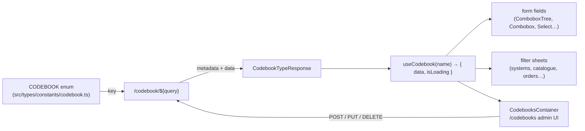
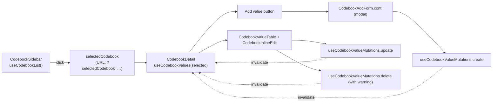
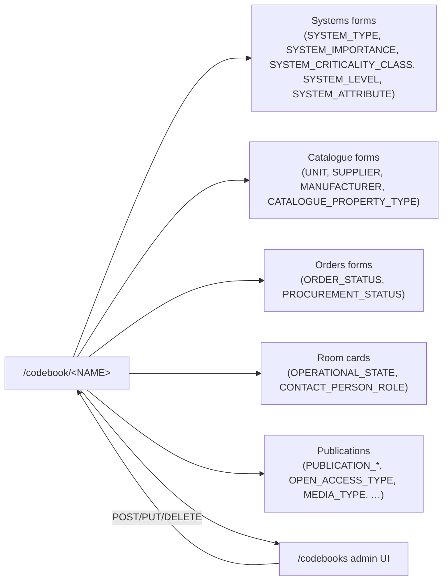

# Codebooks

A "codebook" is any small reference entity that backs a dropdown / combobox / filter elsewhere in PANDA. There are around forty of them — system types, units, suppliers, contact-person roles, item conditions, publication categories, and so on. The schema declares a handful of them as named GraphQL types (`SystemType`, `Unit`, `OperationalState`, …), but the **runtime catalogue, the admin UI, and the lookup API all funnel through a single generic codebook surface** rather than the per-type GraphQL resolvers.

Two consumers of that surface:

- **The admin UI** at `/codebooks` — `src/modules/codebooks/`.
- **Every form / filter / combobox** that needs to populate options — via `useCodebook(CODEBOOK.<name>)` from `src/hooks/fetch/useCodebook.ts`.

## Module location

```
src/modules/codebooks/
├── Codebooks.cont.tsx                       — /codebooks admin page
├── components/
│   ├── CodebookSidebar.tsx                  — left rail: list of codebooks
│   ├── CodebookSidebarItem.tsx
│   ├── CodebookEmptyState.tsx
│   ├── CodebookDetail.tsx                   — middle: values table for the selected codebook
│   ├── CodebookValueTable.tsx
│   ├── CodebookValueActions.tsx
│   ├── CodebookInlineEdit.tsx
│   ├── CodebookAddForm.cont.tsx             — add-value dialog (container)
│   └── CodebookAddForm.comp.tsx             — add-value form (presentation)
├── hooks/
│   ├── useCodebookList.ts                   — list of editable codebooks
│   ├── useCodebookValues.ts                 — values of one codebook
│   └── useCodebookValueMutations.ts         — create / update / delete value
├── schemas/codebook-value.schema.ts         — Zod (name required, max 255)
└── types/responses.ts                       — `CodebookValues = CodebookType[]`
```

Routes:

```
src/pages/codebooks/index.tsx     — /codebooks → CodebooksContainer
```

Shared hook (lives outside the module because every form consumes it):

```
src/hooks/fetch/useCodebook.ts    — useCodebook(codebookName, query?)
src/hooks/fetch/__tests__/useCodebook.spec.ts
```

## Concept



Every codebook value is shaped uniformly (`src/types/responses/codebook.ts`):

```ts
type CodebookType = {
    name: string
    uid: string
    code?: string
    additionalData?: string
    systemLevel?: SystemLevel    // only meaningful for SYSTEM_TYPE
}

type CodebookTypeResponse = {
    metadata: { code: string; type: string; nodeLabel?: string; roleEdit?: ROLE }
    data: CodebookType[]
}
```

The response carries:

- **`data`** — the rows the UI renders.
- **`metadata.roleEdit`** — the ROLE required to edit this codebook (server-driven, not hardcoded client-side).
- **`metadata.nodeLabel`** — the underlying Neo4j label, useful when reflecting on graph relationships.

The combination means a single generic admin page can render *any* codebook without per-type code: the metadata tells the UI what permissions to enforce, the data fills the table.

## The `CODEBOOK` enum

`src/types/constants/codebook.ts` declares the discriminator the rest of the codebase passes around. It has **40 entries** (full list inline in the file). The current entries cover:

| Family | Codes |
|---|---|
| Systems | `SYSTEM`, `SYSTEM_TYPE`, `SYSTEM_LEVEL`, `SYSTEM_ATTRIBUTE`, `SYSTEM_IMPORTANCE`, `SYSTEM_CRITICALITY_CLASS` |
| Catalogue | `CATALOGUE_CATEGORY`, `CATALOGUE_PROPERTY_TYPE`, `UNIT`, `MANUFACTURER`, `SUPPLIER`, `PROCUREMENTER` |
| Items | `ITEM_USAGE`, `ITEM_CONDITION_STATUS` |
| Orders | `ORDER_STATUS`, `PROCUREMENT_STATUS` |
| Room cards | `OPERATIONAL_STATE`, `CONTACT_PERSON_ROLE` |
| Locations | `LOCATION`, `ZONE`, `SUB_ZONE` |
| Org | `USER`, `EMPLOYEE`, `TEAM`, `DEPARTMENT` |
| Publications | `PUBLICATION_CATEGORY`, `PUBLICATION_SUPPORT`, `OPEN_ACCESS_TYPE`, `USER_CALL`, `USER_EXPERIMENT`, `GRANT`, `GRANT_GROUP`, `EXPERIMENTAL_SYSTEM`, `MEDIA_TYPE`, `PUBLISH_FORMAT`, `CONFERENCE_SCOPE` |
| Misc | `LANGUAGE`, `COUNTRY` |

Note that the enum is **larger than the editable set** — the `/codebooks` admin page only shows codebooks whose REST `metadata.roleEdit` is present (`useCodebookList` filters `{ editable: 'true' }`). Things like `USER`, `EMPLOYEE`, and `LOCATION` are *queryable* as codebooks (so a combobox can resolve them to a uid/name pair) but **not editable** from this surface.

## Two parallel data models

The codebook story has a deliberate split:

| | Schema-declared | REST-only |
|---|---|---|
| **Examples** | `SystemType`, `SystemTypeGroup`, `Unit`, `OperationalState`, `ContactPersonRole`, `SystemImportance`, `SystemCriticality`, `ItemUsage`, `ItemCondition`, `Zone`, `Team`, `Location`, `Employee`, `Supplier`, `User`, `Role`, `Facility` | `ORDER_STATUS`, `PROCUREMENT_STATUS`, `LANGUAGE`, `COUNTRY`, `PUBLICATION_*`, `OPEN_ACCESS_TYPE`, `MEDIA_TYPE`, `PUBLISH_FORMAT`, `CONFERENCE_SCOPE`, … |
| **GraphQL** | Yes — full type with `@authentication` (or `@authorization` for `User`) | No |
| **REST `/codebook/<name>`** | Also yes — every codebook is reachable via REST | Yes, the only surface |
| **Edited via `/codebooks`** | Yes (when `metadata.roleEdit` is set) | Yes (when `metadata.roleEdit` is set) |
| **Bulk-loaded by forms** | Via `useCodebook(...)` REST call | Via `useCodebook(...)` REST call |

Even for entities that *have* a GraphQL type (e.g. `Unit`), the **dropdown population path is REST**, not GraphQL. This keeps form bootstrapping cheap (one paginated REST call vs. a per-field GraphQL query) and the schema authoring directives off the hot path.

`@authorization` is **not** declared on any of these schema-side types — they are all `@authentication`-only (see [Permissions model → Schema directives](./permissions-model.md#layer-2--schema-directives)). The edit gate at `/codebooks` is enforced by `metadata.roleEdit` from the REST layer; the route itself requires `ROLE.ADMIN` (`PATH_ROLES_CONFIG[PATH.CODEBOOKS] = [ROLE.ADMIN]`).

## The `/codebooks` admin UI

`CodebooksContainer` is a three-column layout that lets an admin add / rename / delete values inside any editable codebook.



URL-state via `useQueryState('selectedCodebook')` (from `next-usequerystate`) makes the picked codebook bookmarkable and survives reloads. The middle pane lazy-loads via `useCodebookValues(selectedCodebook)`, which delegates to the shared `useCodebook(name, { limit: 5000 })` hook — a single REST round-trip per codebook.

### Mutation surface

`useCodebookValueMutations({ codebookType, queryKey })` exposes three `useMutation`s:

| Mutation | Wire shape | Endpoint |
|---|---|---|
| `create` | `{ name }` | `POST /codebook/<NAME>` |
| `update` | `{ uid, name, code? }` | `PUT /codebook/<NAME>/<uid>` |
| `delete` | `uid` | `DELETE /codebook/<NAME>/<uid>` |

All three invalidate the parent `queryKey` on success. The hook is **the** code path for codebook editing — there is no per-codebook override, which is also why every value's shape is restricted to `{ name, code?, uid }` (the `additionalData` and `systemLevel` fields are read-only at the admin surface).

Notable behaviours:

- **`isConflictError`** treats HTTP 409 as a uniqueness violation. The container converts that into a localised toast.
- **`sanitizeName` / `sanitizeCode`** trim whitespace before submit.
- **`useWarningModal`** wraps `delete` so the admin confirms before destructive actions.

### Permissions

| Layer | Gate |
|---|---|
| Route | `PATH_ROLES_CONFIG[PATH.CODEBOOKS] = [ROLE.ADMIN]`. Middleware redirects non-admins to `/404`. |
| List | `useCodebookList()` fetches `/codebooks?editable=true` — the server filters to only the codebooks the caller can edit. |
| Per-codebook | `CodebookTypeResponse.metadata.roleEdit` indicates the role needed to *change* values. The UI honours it; admins typically satisfy every `roleEdit`. |

The schema-level codebook types remain `@authentication`-only — see [Permissions model → Maintenance](./permissions-model.md#maintenance-recommendations).

## Shared lookup hook

`src/hooks/fetch/useCodebook.ts` is the consumer surface every other module imports:

```ts
const { data, isLoading } = useCodebook(CODEBOOK.SYSTEM_TYPE, { filter: [...] })
```

Internals:

- Query key `['codebook', { path: codebookName, query }]`.
- `placeholderData: keepPreviousData` — prevents combobox flicker when the filter changes.
- `enabled: !!codebookName` — safe to call with `null` (form skips the request until the user picks a context that determines the codebook).

`CodebookQuery.filter` lets consumers narrow values by `key/value` (e.g. "all `SUB_ZONE` values for parent `ZONE` xyz"); the filter array is JSON-stringified into the query so the request stays a single GET. The response shape (`CodebookTypeResponse` with `metadata.roleEdit`) lets the consumer hide write actions when the caller cannot edit — see `src/components/form/shared/useAddCodebookValue.tsx` for the canonical "create on the fly" pattern.

About 14 files in `src/` consume `useCodebook` directly; many more reach it through `ComboBoxControlled` / `ComboboxTree` / `CodebookTreeModalGraphql` (those primitives accept a `codebook` prop). The tree-shaped codebooks (`SUB_ZONE`, `LOCATION`, `CATALOGUE_CATEGORY`) also have a parallel `codebookTree` endpoint (`/codebook/<NAME>/tree${query}`, `src/utils/getEndpoints.ts:70`).

## Tests

- `src/hooks/fetch/__tests__/useCodebook.spec.ts` — the shared hook is the one piece with explicit coverage.
- `src/modules/codebooks/` itself has no `__tests__/` folders.

## Cross-module integration



Notably:

- **Systems family** — `SystemType.mask` is the system-code template (see [systems-family → system-type-edit](./systems-family/system-type-edit.md)). System types have their own admin surface (`/system/type-edit`) **in addition to** being listed under `/codebooks`. The two surfaces overlap.
- **Catalogue** — `CatalogueCategoryPropertyType` is exposed both as a schema entity (`schema.graphql:195-199`) and as the `CATALOGUE_PROPERTY_TYPE` codebook.
- **Room cards** — `OperationalState` and `ContactPersonRole` flow through codebooks; the *strings* `'Area Manager'` / `'Area Manager - Deputy'` are matched verbatim in `useCanEditOperationalState`. Renaming those entries in `/codebooks` silently breaks the room-card edit gate. See [Room Cards → Open questions](./room-cards.md#open-questions).
- **Orders** — `addUuidsToOrderData` hardcodes the "Requested" `ORDER_STATUS` uid (`'c5ef9d00-ac38-44c1-b48a-fde0d7095c54'`). Same fragility — see [Orders → Deprecated / legacy](./orders-and-order-items.md#deprecated--legacy).
- **Permissions** — even the `ROLE` enum is *somewhat* codebook-like: roles live in Neo4j as `Role` nodes (`schema.graphql:527-532`) but are duplicated in `src/types/constants/roles.ts`. See [Permissions model](./permissions-model.md).

## Deprecated / legacy

- **`SYSTEM_TYPE` is administered twice.** Once through `/codebooks` (generic table) and once through `/system/type-edit` (purpose-built editor with mask + group support). The two surfaces edit the same Neo4j nodes — coordinate.
- **`/codebooks` filename typo on the create form** — `CodebookAddForm.cont.tsx` exists alongside `CodebookAddForm.comp.tsx`. Consistent, but worth verifying the comp/cont split actually adds value here.
- **`CodebookType.additionalData`** is opaque (`string?`). Used by a few codebooks (the tree variants?) but is not introspected by the admin UI — drift between server and admin is possible.
- **`useCodebookValues` requests `limit: 5000`** unconditionally. Works because no codebook has 5,000 values today, but a misuse (e.g. fetching `EMPLOYEE`) would silently truncate.
- **`CODEBOOK.SYSTEM` and `CODEBOOK.USER`** appear in the enum but are not editable codebooks — they are query-able lookups against the system / user list. The semantic overload is confusing; either rename or split.
- **No `@authorization` on schema-declared codebook types** (`Unit`, `OperationalState`, `ContactPersonRole`, `SystemImportance`, …). Edit protection is REST-only; a hand-crafted GraphQL mutation can modify them. See [Permissions model → Maintenance](./permissions-model.md#maintenance-recommendations).

## Maintenance recommendations

1. **Decide whether SYSTEM_TYPE belongs in `/codebooks` or `/system/type-edit`** and remove it from one. Today both surfaces show the same data, the editors diverge in capability, and saved values can drift.
2. **Add `@authorization` to schema-declared codebook types** mirroring the `metadata.roleEdit` from REST. Today the gate is one-sided.
3. **Replace hardcoded value-uids in app code** (orders' `ORDER_STATUS` "Requested", room-cards' role names) with codebook *codes*. Codes are stable; names and uids are not.
4. **Surface `CodebookType.code` in the admin UI.** Updates can include `code` (`useCodebookValueMutations.update`), but the table primarily shows `name`. Exposing the code lets admins see what consumers actually match against.
5. **Standardise the `useCodebook` `limit`.** `useCodebookValues` hardcodes 5000; consumers that need pagination should reach for it explicitly.
6. **Treat `CODEBOOK.SYSTEM` / `CODEBOOK.USER` as look-up endpoints, not codebooks.** Either split them out of the enum or document them as read-only.

## 🔮 Planned

- A canonical "codebooks documentation" page that lists each codebook with its metadata and an example value — once the audit-edge story for codebooks is settled.
- Permissions Phase 1/2 do not directly affect codebooks (they are facility-wide reference data). Phase 2 might tighten which roles can edit specific codebooks via `metadata.roleEdit`.

## Open questions

- The REST `/codebooks` endpoint returns a list of editable codebooks (`{ editable: 'true' }`). Where does the editability flag live — a database column, a server config, or hardcoded server-side?
- For the tree-shaped codebooks (`SUB_ZONE`, `LOCATION`, `CATALOGUE_CATEGORY`), the admin surface uses the flat `useCodebookValues`. Is there a separate tree-edit flow somewhere, or do admins really edit them flat?
- `metadata.roleEdit` is exposed on the response. Does the UI honour it as a *necessary* condition, or also as *sufficient*? (I.e. can an admin without `roleEdit` edit anyway? Today the route gate is `ROLE.ADMIN`, but the metadata could let editors edit codebooks they own.)
- `CodebookType.additionalData` — what schema does it carry? It is consumed by a handful of UI components but is not validated server-side anywhere visible.

---

## Data model reference

> 🔧 *Engineer-only; stripped from the wiki.*
>
> Schema-declared codebook types: `SystemType` (`src/server/apollo/schema.graphql:453-459`), `SystemTypeGroup` (`:483-488`), `Unit` (`:490-494`), `OperationalState` (`:80-84`), `ContactPersonRole` (`:34-38`), `SystemImportance` (`:447-451`), `SystemCriticality` (`:429-433`), `ItemCondition` (`:435-439`), `ItemUsage` (`:441-445`), `Zone` (`:473-481`), `Team` (`:117-121`), `Location` (`:18-26`), `Supplier` (`:231-234`), `Employee` (`:123-138`), `Role` (`:527-532`). Constant: `src/types/constants/codebook.ts` (`CODEBOOK` enum). Shared hook: `src/hooks/fetch/useCodebook.ts`. Endpoint catalogue: `src/utils/getEndpoints.ts` (`codebook`, `codebooks`, `codebookTree`).
