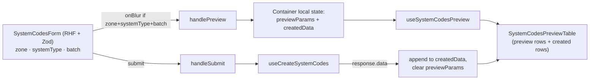

# Control Systems

The Control Systems module is the **system-code factory**: it lists existing system codes for a facility and offers a focused batch-create workflow that previews what *would* be generated before persisting. The module deliberately does **not** edit any other field of the underlying `System` — it owns the code-generation flow and surfaces a read-only view of the codes.

The implementation is recent (`docs/implementation-plans/control-systems-module.md` is its design doc) and is the cleanest example in the codebase of the **Zod-first, schema-as-source-of-truth** pattern.

## Module location

```
src/modules/control-systems/
├── ControlSystemsOverview.cont.tsx          — /control-systems/overview container
├── ControlSystemsOverview.comp.tsx          — overview presentation
├── SystemCodesCreate.cont.tsx               — /control-systems/system-codes-create container
├── SystemCodesCreate.comp.tsx               — create-page presentation
├── components/
│   ├── create/
│   │   ├── SystemCodesForm.tsx
│   │   ├── SystemCodesForm.schema.ts        — form-level Zod schema
│   │   ├── SystemCodesPreviewTable.tsx
│   │   ├── usePreviewTableColumns.tsx
│   │   └── __tests__/SystemCodesForm.schema.spec.ts
│   └── table/
│       ├── SystemCodesTable.tsx
│       ├── useSystemCodesColumns.tsx
│       ├── ControlSystemsTableHeader.tsx
│       ├── SearchPatternBadge.tsx
│       └── StyledSearchOverlay.tsx
├── hooks/
│   ├── useSystemCodes.ts                    — overview list query (REST + Query Manager)
│   ├── useSystemCodesPreview.ts             — preview query
│   └── useCreateSystemCodes.ts              — POST create mutation
├── types/
│   ├── schemas.ts                           — Zod schemas (source of truth)
│   ├── index.ts                             — re-exports + inferred types
│   └── constants.ts                         — `BATCH_LIMIT`, `ONLY_ROOT_ZONES`
└── utils/searchPattern.ts
```

Routes:

```
src/pages/control-systems/overview.tsx               — /control-systems/overview
src/pages/control-systems/system-codes-create.tsx    — /control-systems/system-codes-create
```

## Two surfaces

### Overview (`/control-systems/overview`)

The container is tiny — it hands the component a `tableId` and lets `useQueryManager` push filters into the URL:

```tsx
// ControlSystemsOverview.cont.tsx
const ControlSystemsOverviewContainer: FC = () => (
    <ControlSystemsOverviewComponent enableQueryURL={true} tableId={CONTROL_SYSTEMS_TABLE_ID} />
)
```

The component renders `SystemCodesTable` (sticky-header `PandaTableV2`) with columns `systemCode`, `name`, `location`, `zone`, `updatedBy`, `createdBy`. The three filters (search / zone / system type) hang off the same `useQueryManager` that drives `useSystemCodes`. Pagination, sort, and column visibility live in URL state, so an overview view is bookmarkable.

### Create (`/control-systems/system-codes-create`)



The container (`SystemCodesCreate.cont.tsx`) holds two pieces of local state — `previewParams` and `createdData` — and reduces the create surface to:

1. **Preview on edit.** When the form has `zone`, `systemType`, and `batch`, `handlePreview` sets `previewParams`. `useSystemCodesPreview(params)` issues a `GET /systems/system-codes/preview` and returns rows shaped like `SystemCodeResult` but with `uid`, `createdBy`, `updatedBy` missing — visibly marked as preview in the table.
2. **Submit creates.** `handleSubmit` clamps `batch` to `BATCH_LIMIT` (25), calls `useCreateSystemCodes`, and on success **appends** the returned rows to `createdData` while clearing `previewParams` (preview rows go away because their query is disabled with no params).

`createdData` is **append-only** within the container — the user can run multiple batches in one sitting and watch the table fill up. There is no client-side sort/dedupe; once the page unmounts, the local list is lost.

## Zod is the source of truth

`types/schemas.ts` is the single declaration of what an API row looks like. Everything else is inferred:

```ts
// types/index.ts
export type SystemCodeResult = z.infer<typeof systemCodeResultSchema>
export type SystemCodeRequest = z.infer<typeof systemCodeRequestSchema>
export type SystemCodesOverviewResponse = z.infer<typeof systemCodesOverviewResponseSchema>
export type SystemCodesPreviewParams = z.infer<typeof systemCodesPreviewParamsSchema>
```

Five schemas in one file:

| Schema | Shape |
|---|---|
| `codebookTypeSchema` | `{ uid, name, code? }` — reusable picker shape (zone, systemType, location) |
| `parentPathItemSchema` | `{ uid, name }` — breadcrumb hop |
| `systemCodeResultSchema` | the response row. `uid`, `createdBy`, `updatedBy`, `location` are optional/nullable to accommodate preview rows. |
| `systemCodeRequestSchema` | `{ zone, systemType, batch }` — POST body. Validates `batch ∈ [1, BATCH_LIMIT]`. |
| `systemCodesPreviewParamsSchema` | `{ zoneUid, systemTypeUid, batch }` — GET preview params. |
| `systemCodesOverviewResponseSchema` | `{ data: SystemCodeResult[], totalCount }` |

The form schema (`components/create/SystemCodesForm.schema.ts`) extends these for RHF — `zone` and `systemType` are `.nullable().refine(...)` so the form can show "no selection" while the request schema requires both. The schema-level cap (`max(100)`) is **looser** than `BATCH_LIMIT = 25` from `types/constants.ts`; the container clamps to the constant. See [Open questions](#open-questions).

The codebook combobox for `zone` is filtered to root zones only via `ONLY_ROOT_ZONES` (`[{ key: 'onlyRootElements', value: true }]`) so the user picks a top-level zone rather than a sub-zone.

## Fetcher surface

All three endpoints are REST. Keys from `src/utils/getEndpoints.ts`:

| Endpoint key | Path | Hook | Method |
|---|---|---|---|
| `systemCodes` | `/systems/system-codes${query}` | `useSystemCodes` | GET |
| `systemCodesCreate` | `/systems/system-codes` | `useCreateSystemCodes` | POST |
| `systemCodesPreview` | `/systems/system-codes/preview${query}` | `useSystemCodesPreview` | GET |

`useSystemCodes` plumbs into `useQueryManager(tableId, undefined, true)` so the overview list reads the *same* `tableId`-scoped URL state that the filter sheet writes. `keepPreviousData` prevents the table flicker when filters change. The hook surfaces `isError` through a `toast.error(...)` side effect — typical of the table modules in the repo.

`useCreateSystemCodes` wraps the mutation in `toast.promise` for loading/success/error feedback — see [`toast` skill prompt](../../.claude/skills/toast/).

## Schema integration

Control Systems does **not** declare its own GraphQL type. The "system code" is `System.systemCode` on the existing `System` node (`src/server/apollo/schema.graphql:311`). The REST endpoints under `/systems/system-codes` are server-side conveniences that:

- **Overview** — read `System` nodes server-side, project them as `SystemCodeResult`.
- **Preview** — synthesise rows from the chosen `zone` + `systemType` + `batch` **without persisting** anything. The server applies the same code-generation rules as the per-system [`useSystemCodeGenerate`](./systems-family/system-item.md#system-code-generation) flow.
- **Create** — applies preview values to *real* `System` nodes (creating them as needed) and returns them with `uid`, `createdBy`, `updatedBy` filled.

The control-systems module is therefore a **bulk** entry point to the same backend logic that the systems family touches one-system-at-a-time. The two flows must stay synchronised on the code-generation rules — server-side responsibility.

## Permissions

Route-level (`src/lib/navigation/config.ts`):

```ts
[PATH.CONTROL_SYSTEMS]:        [ROLE.CONTROL_SYSTEMS_VIEW, ROLE.CONTROL_SYSTEMS_EDIT],
[PATH.CONTROL_SYSTEMS_CREATE]: [ROLE.CONTROL_SYSTEMS_EDIT],
```

UI-level: there is **no** `usePermission` call inside the module today. The route gate is the only frontend enforcement. The create page is therefore implicitly editor-only by virtue of its path requiring `CONTROL_SYSTEMS_EDIT`.

Schema-level: `System` carries the existing `@authorization` directive (`systems-view` for READ, `systems-edit` for write — see [Permissions model → System](./permissions-model.md#system-role-gate)). Note **`CONTROL_SYSTEMS_*` roles are not referenced anywhere in the schema** — the `/systems/system-codes` REST endpoints presumably check them server-side, but a hand-crafted GraphQL mutation against `System` bypasses them entirely.

## Tests

The module ships with one local test: `components/create/__tests__/SystemCodesForm.schema.spec.ts`. The schema is testable in isolation because it is just Zod — the form, hooks, and container are exercised via integration paths.

## Cross-module integration

- **Systems family** — reads/writes `System.systemCode`. The single-system flow lives in [systems-family → system-item](./systems-family/system-item.md#system-code-generation).
- **Codebooks** — both `zone` and `systemType` come from `useCodebook(CODEBOOK.SYSTEM_TYPE)` / `useCodebook(CODEBOOK.ZONE)`. See [Codebooks](./codebooks.md).
- **Catalogue / Orders** — none today. Control Systems does not touch the catalogue or order pipelines; it only writes `System` nodes.
- **Sidebar** — `NAV_ITEMS` declares `/control-systems` with a *Cpu* icon and two children (`Overview`, `Create System Codes`) gated by `CONTROL_SYSTEMS_VIEW` / `CONTROL_SYSTEMS_EDIT`.

## Deprecated / legacy

- **`BATCH_LIMIT = 25`** in `types/constants.ts` vs. **`.max(100)`** in `SystemCodesForm.schema.ts` (`batch: z.coerce.number().min(1).max(100, ...)`). The container clamps to 25 but the form lets the user type up to 100. This is enforced redundantly in `useSystemCodesPreview` (which re-clamps to `BATCH_LIMIT`) and in `handleSubmit`. Pick one source of truth.
- **No `usePermission` in the module.** Sidebar + route gates are the only protection; field-level read-only is not exercised. Consistent with read-only-ish modules but worth a sweep.
- **`createdData` is in-memory only.** Closing the create page (e.g. accidental refresh) drops the row history. Surface a server-backed history if operators ever need to recover what they just generated.
- **The implementation plan still lives under `docs/implementation-plans/`** — once Control Systems is considered stable, the plan should be archived (or graduated into this technical doc set).
- **Custom `SearchPatternBadge` and `StyledSearchOverlay`** — bespoke search UX not reused elsewhere. Coordinate with the [`tables` skill prompt](../../.claude/skills/tables/) if those patterns generalise.

## Maintenance recommendations

1. **Reconcile `BATCH_LIMIT`.** Make `systemCodesFormSchema.batch.max(BATCH_LIMIT)` so the form refuses out-of-range input upfront. Today it accepts 100 and silently clamps to 25.
2. **Add `@authorization` to system-code mutation paths** (or document why the REST gateway is the only enforcement). Today `CONTROL_SYSTEMS_*` roles do not appear in `schema.graphql`.
3. **Persist created rows** — either via a server-side history endpoint or by linking the overview's "recently created" filter to the same `tableId`'s URL state. Today an operator who generated 200 codes in a session and refreshed loses the visible list (the codes themselves are saved; only the local copy disappears).
4. **Surface preview validation errors.** If the gateway returns a preview-time conflict (e.g. mask collision), today the `useSystemCodesPreview` query silently fails. A `useEffect`-driven toast (mirroring the overview hook) would match the rest of the module.
5. **Graduate `docs/implementation-plans/control-systems-module.md`** into a `docs/technical/system-code-generation.md` deep dive — the design doc is more detailed than this page on the code-generation rules.
6. **Cover `useCreateSystemCodes` + `useSystemCodesPreview` with unit tests.** The schema is well-covered; the hooks are not.

## 🔮 Planned

- Permissions Phase 1 will tighten **who** can create `SYSTEM_DOMAIN` / `TECHNOLOGY_UNIT`-level systems. The Control Systems create page would inherit the same gate via `System.@authorization` once it is augmented.
- Code-generation rules (`SystemType.mask` semantics) may evolve to support facility-specific token grammars — no concrete plan today.

## Open questions

- Is `BATCH_LIMIT = 25` a server-side hard cap or a UI guard? The container clamps regardless, but the contract is invisible from the frontend.
- The preview rows are not validated against a `Zone` having capacity for `batch` new codes. Does the gateway reject the create-time payload if it would overflow, or does it silently truncate?
- Should the overview page surface "preview vs. created" filters? Today the overview is read-only and shows every system code regardless of how it was generated.
- The implementation plan calls for a `usePreviewSystemCodesMutation` alternative to the GET preview query. Today the query path is used — was that a deliberate choice?

---

## Data model reference

> 🔧 *Engineer-only; stripped from the wiki.*
>
> The underlying data lives on `System` (`src/server/apollo/schema.graphql:296-369`) — the module does not declare its own GraphQL type. Module Zod schemas: `src/modules/control-systems/types/schemas.ts`. Form-level extensions: `src/modules/control-systems/components/create/SystemCodesForm.schema.ts`. Endpoint catalogue: `src/utils/getEndpoints.ts` (`systemCodes`, `systemCodesCreate`, `systemCodesPreview`). Implementation plan: `docs/implementation-plans/control-systems-module.md`.
