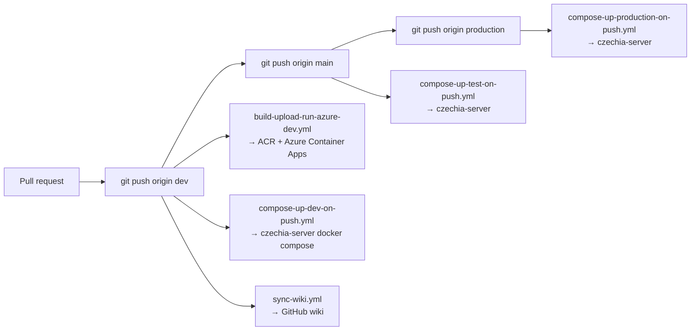
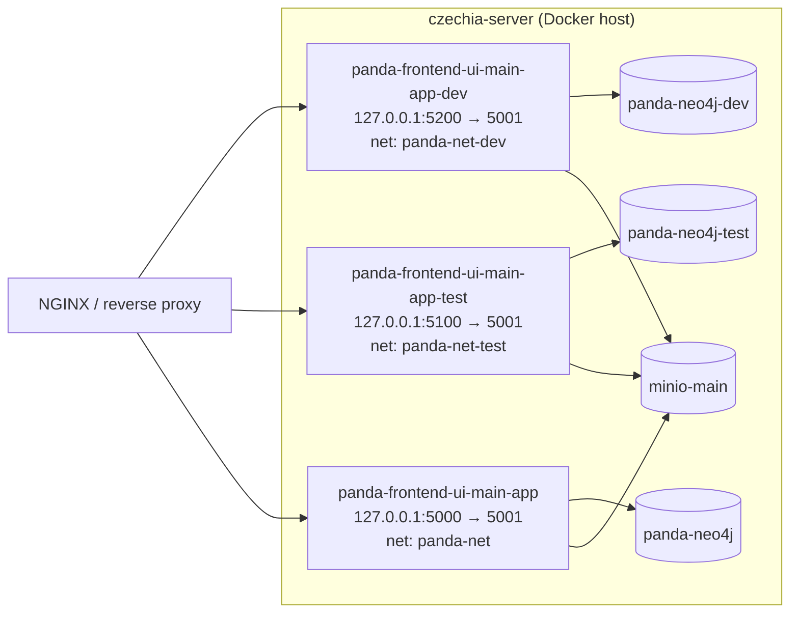
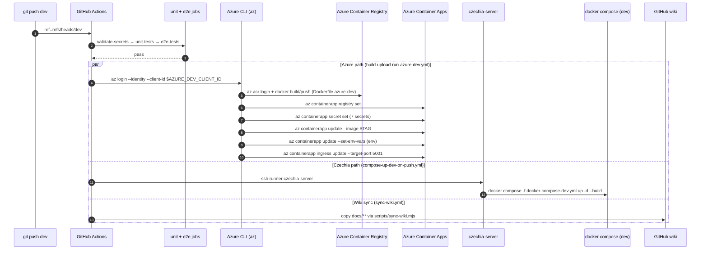

# Deployment & runbook

How the ELI PANDA frontend is built, packaged, and deployed across environments — and what to do when it breaks. Cross-references [App architecture](./app-architecture.md) for the runtime and [Authentication](./authentication.md) for the Azure/Entra ID side.

## Overview

The frontend ships as a standalone Next.js image. Three branches drive three environments via GitHub Actions; in dev the same push triggers **two parallel pipelines** — one to an Azure Container App, one to a Czechia-hosted Docker host via `docker compose`.

| Branch | Env | Triggers (workflows) | Surfaces |
|---|---|---|---|
| `dev` | dev | `build-upload-run-azure-dev.yml`, `compose-up-dev-on-push.yml`, `sync-wiki.yml` | Azure Container Apps + Czechia docker host |
| `main` | test | `compose-up-test-on-push.yml` | Czechia docker host |
| `production` | prod | `compose-up-production-on-push.yml` | Czechia docker host |

All pushes additionally run unit tests (`yarn test`) and Playwright E2E tests (via `Dockerfile.e2e`) before deploying.

## Stack at a glance

| Layer | Choice |
|---|---|
| Runtime image | `node:22-alpine` multi-stage build → Next.js `output: 'standalone'` |
| Build | Yarn 1.x `--frozen-lockfile` (enforced by `scripts/enforce-package-manager.cjs`) |
| Deploy A | Azure Container Apps + Azure Container Registry (ACR) |
| Deploy B | Self-hosted Docker on the `czechia-server` runner via `docker compose` |
| Object storage | MinIO (`minio-main` host, per-env bucket) |
| Database | Neo4j 5.x via `bolt://` (per-env host name) |
| Auth | Microsoft Entra ID — see [Authentication](./authentication.md) |
| Wiki publish | `.github/workflows/sync-wiki.yml` + `scripts/sync-wiki.mjs` |

## Environments



| Env | Public URL | API gateway | Auth callback domain | MinIO bucket | Neo4j host | Image tag |
|---|---|---|---|---|---|---|
| **localhost** | `http://localhost:5001` | `http://localhost:5001/api/mock-server` (default) | `http://localhost:5001` | dev shared | local tunnel | _no image_ |
| **dev** | `https://dev.panda.eli-beams.eu` | `https://api-dev.panda.eli-beams.eu/v1` | `https://dev.panda.eli-beams.eu` | `panda-dev` | `panda-neo4j-dev:7687` | `${{ github.sha }}` + `latest` on ACR |
| **test** | `https://test.panda.eli-beams.eu` | `https://api-test.panda.eli-beams.eu/v1` | `https://test.panda.eli-beams.eu` | `panda-test` | `panda-neo4j-test:7687` | locally built via compose |
| **prod** | `https://panda.eli-laser.eu` | `https://panda-api.eli-laser.eu/v1` | `https://panda.eli-laser.eu` | `panda-production` | `panda-neo4j:7687` | locally built via compose |

`APP_BASE_URL` (`src/types/constants/common.ts`) is selected at runtime from `PANDA_ENV`. CSP (`src/middleware.ts:117`) widens `connect-src` only when `PANDA_ENV === 'localhost'`.

## Images

Dockerfiles in the repo:

| File | Purpose | Used by |
|---|---|---|
| `Dockerfile` | Production / prod compose | `docker-compose.yml`, prod workflow |
| `Dockerfile.devenv` | Dev compose build (Czechia host) | `docker-compose-dev.yml`, dev compose workflow |
| `Dockerfile.testenv` | Test compose build | `docker-compose-test.yml`, test compose workflow |
| `Dockerfile.azure-dev` | Azure Container Apps build (dev) | `build-upload-run-azure-dev.yml` |
| `Dockerfile.e2e` | Playwright CI image | Every push workflow's `e2e-tests` job |
| `Dockerfile.devenv.czolap04` | Variant for the `czolap04` host | Operator-specific |

All app Dockerfiles share the same three-stage pattern (`deps` → `builder` → `runner`) and produce a Next.js standalone server listening on port 5001 as user `nextjs` (uid 1001). `Dockerfile.azure-dev` is the only one that takes env values as `--build-arg`s so the same image can be repointed at a different gateway/bucket without changing source.

Build invariants:

- **Image base**: `node:22-alpine` for app images; `node:22-bookworm` only for `Dockerfile.e2e` (Playwright system deps need glibc).
- **Final command**: `CMD ["node", "server.js"]` — Next.js standalone entry, no `yarn start`.
- **Port**: `5001` (`EXPOSE 5001`, `ENV PORT=5001`).
- **`sharp`** is reinstalled in the runner stage with platform-correct binaries (`yarn add sharp --ignore-scripts --prefer-offline`).

## Compose topology

The compose files only define **the frontend container**. Neo4j and MinIO live separately on the host — usually managed by the platform team out-of-band — and connect over the named bridge networks below.



Port map (`127.0.0.1` only — public access via the reverse proxy on the same host):

- Dev container → `127.0.0.1:5200`
- Test container → `127.0.0.1:5100`
- Prod container → `127.0.0.1:5000`

`docker-compose.minio.yml` (separate file) is a **local-dev convenience** for spinning MinIO up against `./s3data`. It is not used in any pipeline.

## Pipeline: dev (`feat/* → dev`)

The dev branch is the busiest in CI. A push to `dev` triggers three workflows concurrently.



### Azure pipeline (`build-upload-run-azure-dev.yml`)

Refusing-to-create safety net: the deploy job **fails** if the target Container App is missing rather than implicitly creating one (`az containerapp show … || exit 1`).

```yaml
# excerpt of the deploy step
if ! az containerapp show -g "${RG}" -n "${APP_NAME}" >/dev/null 2>&1; then
    echo "ERROR: Container App '${APP_NAME}' not found in RG '${RG}'. Refusing to create."
    exit 1
fi
```

Image tagging convention: each build is pushed as both `:${{ github.sha }}` and `:latest`. Container App is updated with the SHA tag — `:latest` is for humans pulling the same image locally.

Secrets land on the Container App via `az containerapp secret set` and are wired in as `secretref:` env-var references — they are not baked into the image.

### Czechia compose pipeline (`compose-up-dev-on-push.yml`)

Runs on the self-hosted `czechia-server` runner that already has Docker. The runner clones the repo, sets the secrets as env vars, and runs `docker compose -f docker-compose-dev.yml up -d --build`. Compose handles the image build inline; there is no separate registry hop. Container restart policy: `unless-stopped`.

## Pipeline: test (`main` branch)

`compose-up-test-on-push.yml` mirrors the dev compose pipeline with two differences:

- Triggered by pushes to `main`, not `dev`.
- Uses `MINIO_ACCESS_KEY_TEST` / `MINIO_SECRET_KEY_TEST` instead of the `_DEV` pair.
- Builds from `Dockerfile.testenv` via `docker-compose-test.yml`.

No Azure Container Apps surface for test today.

## Pipeline: production (`production` branch)

`compose-up-production-on-push.yml` triggers on pushes to `production`. Build is the bare `Dockerfile` via `docker-compose.yml` (the file that wires the prod env). Uses `MINIO_ACCESS_KEY_PROD` / `MINIO_SECRET_KEY_PROD`. No Azure surface today.

## Environment variables

The full list, with which file or secret feeds each:

| Variable | Purpose | Source |
|---|---|---|
| `PANDA_ENV` | Selects `APP_BASE_URL`, CSP, env helpers | Dockerfile `ENV` per env |
| `PANDA_API_GW_URL` | Base URL for REST gateway | Dockerfile `ENV` / compose env |
| `NEXTAUTH_URL` | NextAuth callback origin | Dockerfile `ENV` / GH workflow env |
| `NEXTAUTH_SECRET` | Signs session JWT and minted `apiAccessToken` | GitHub secret `NEXTAUTH_SECRET` |
| `NEO4J_URI` | Bolt URL of the Neo4j instance | Dockerfile `ENV` |
| `NEO4J_USER` | Neo4j username (`neo4j`) | Dockerfile `ENV` |
| `NEO4J_PASSWORD` | Neo4j password | GitHub secret `NEO4J_PASSWORD` |
| `MINIO_ENDPOINT` | MinIO host name (e.g. `minio-main`) | Dockerfile `ENV` |
| `MINIO_BUCKET_NAME` | Per-env bucket | Dockerfile `ENV` |
| `MINIO_PORT` | MinIO API port (`9000`) | Dockerfile `ENV` (Azure & dev compose) |
| `MINIO_USE_SSL` | `true`/`false` | Dockerfile `ENV` (Azure & dev compose) |
| `MINIO_ACCESS_KEY` | Single var, but `s3client.ts` also accepts the per-env `_DEV` / `_TEST` / `_PROD` variants | GitHub secret per env |
| `MINIO_SECRET_KEY` | Same | Same |
| `AZURE_AD_BEAMLINES_CLIENT_ID` | Entra ID app client | GitHub secret |
| `AZURE_AD_BEAMLINES_CLIENT_SECRET` | Entra ID app secret | GitHub secret |
| `AZURE_AD_BEAMLINES_TENANT_ID` | Single tenant GUID | GitHub secret |
| `AZURE_DEV_CLIENT_ID` | Azure managed-identity client ID for the dev pipeline | GitHub secret |
| `AZURE_DEV_CONTAINER_REGISTRY_NAME` | Dev ACR name | GitHub secret |
| `AZURE_DEV_RESOURCE_GROUP` | Dev resource group | GitHub secret |
| `AZURE_DEV_CONTAINER_APP_NAME_FRONTEND` | Dev Container App name | GitHub secret |
| `WIKI_PUSH_TOKEN` | PAT for wiki repo push | GitHub secret (used by `sync-wiki.yml`) |
| `PLAYWRIGHT_E2E` | `1` to bypass middleware auth redirect in E2E | Set inside `Dockerfile.e2e`'s `yarn e2e` run |

> 🛈 The repo-root `env-example` is the canonical template for local-dev `.env` files. NEVER commit a populated `.env`.

### MinIO key fallback

`src/server/s3client.ts:10-19` walks four env var names per key:

```ts
process.env.MINIO_ACCESS_KEY ??
process.env.MINIO_ACCESS_KEY_DEV ??
process.env.MINIO_ACCESS_KEY_TEST ??
process.env.MINIO_ACCESS_KEY_PROD ??
''
```

Both compose workflows pass the env-specific name (`MINIO_ACCESS_KEY_DEV`, etc.); the Azure pipeline maps the secret onto the generic `MINIO_ACCESS_KEY`. The fallback chain means the *first* defined name wins — be careful not to set both during local runs.

## Secrets management

All deployment secrets live in **GitHub Actions Secrets** (repo-level). The full required list per env is asserted by the `validate-secrets` job at the top of each workflow — pipelines fail fast with a descriptive message if any secret is missing.

| Secret | Used in |
|---|---|
| `NEXTAUTH_SECRET` | All deploys, all envs |
| `NEO4J_PASSWORD` | All deploys |
| `MINIO_ACCESS_KEY_{DEV,TEST,PROD}` | Per-env deploys |
| `MINIO_SECRET_KEY_{DEV,TEST,PROD}` | Per-env deploys |
| `AZURE_AD_BEAMLINES_CLIENT_ID` / `_CLIENT_SECRET` / `_TENANT_ID` | All envs (single Entra ID app, one secret per env when rotated) |
| `AZURE_DEV_CLIENT_ID` | Azure pipeline only |
| `AZURE_DEV_CONTAINER_REGISTRY_NAME` | Azure pipeline only |
| `AZURE_DEV_RESOURCE_GROUP` | Azure pipeline only |
| `AZURE_DEV_CONTAINER_APP_NAME_FRONTEND` | Azure pipeline only |
| `WIKI_PUSH_TOKEN` | Wiki sync only |

Rotation note: the `AZURE_AD_BEAMLINES_CLIENT_SECRET` Entra ID secret has a **730-day expiry** by checklist (`panda_entraid_app_registration.txt:48`). Calendar a rotation reminder.

## Health checks and verification

There is **no built-in `/api/health` endpoint** today. Manual verification per deploy:

1. **HTTP**: `curl -I https://<env-host>/` → expect 200/302 to login.
2. **Auth**: open the env host in a browser, hit *Sign in*, complete Entra ID round-trip. Look for the dashboard.
3. **GraphQL**: open devtools network tab, perform any read (e.g. open Systems). The request to `/api/graphql` should return 200 with data.
4. **REST gateway**: trigger any catalogue load. A 401 here usually means `NEXTAUTH_SECRET` mismatch between frontend and gateway.
5. **MinIO**: open any module that lists attachments (Catalogue items, System detail) — first GET to `MINIO_ENDPOINT` happens on demand.
6. **Container logs**: `az containerapp logs show -g $RG -n $APP_NAME --tail 200 -f` (Azure) or `docker logs panda-frontend-ui-main-app-{dev,test,*}` (Czechia).

See [Maintenance recommendations](#maintenance-recommendations) for the planned `/api/health` route.

## Wiki sync

`.github/workflows/sync-wiki.yml` triggers on pushes to `dev` that change `docs/**`, `scripts/sync-wiki.mjs`, or itself. It checks out the wiki repo with `WIKI_PUSH_TOKEN` and runs `scripts/sync-wiki.mjs`, which mirrors `docs/**` into the wiki, stripping the `## Data model reference` engineer-only sections.

Manual fallback: `workflow_dispatch` is enabled — trigger from the Actions tab.

## Rollback

### Azure Container Apps (dev)

Container Apps keep prior revisions. Two safe paths:

1. **Re-tag a known-good image and redeploy:**
   ```bash
   az containerapp update \
     -g $RG -n $APP_NAME \
     --image $ACR_NAME.azurecr.io/panda-frontend:$KNOWN_SHA
   ```
2. **Roll back to the previous revision** (Container Apps native):
   ```bash
   az containerapp revision list -g $RG -n $APP_NAME -o table
   az containerapp revision activate -g $RG -n $APP_NAME --revision <prev>
   ```

### Czechia docker compose (any env)

There is no preserved-image history other than what's in the local docker daemon. The pragmatic rollback is:

```bash
git revert <bad-commit>
git push origin <branch>   # dev / main / production
```

…and let the corresponding `compose-up-*-on-push.yml` rebuild from the reverted source. For a faster rollback when the cache still holds a prior image:

```bash
ssh czechia-server
docker images | grep panda-frontend
docker tag <prior-image-id> panda-frontend-ui-main-app-<env>:latest
docker compose -f docker-compose-<env>.yml up -d --no-build
```

### Database / object storage

Schema migrations are out of scope for this repo (`SchemaMigration` exists in the schema but the migration tool lives elsewhere). For data rollback, coordinate with the platform team owning Neo4j and MinIO.

## Common failure modes

| Symptom | Likely cause | First check |
|---|---|---|
| Workflow fails at `validate-secrets` with `secret is not set` | Missing GitHub repo secret | Settings → Secrets and variables → Actions |
| `az containerapp show … not found in RG … Refusing to create` | Container App was deleted or RG/name mismatch | Verify `AZURE_DEV_RESOURCE_GROUP` + `AZURE_DEV_CONTAINER_APP_NAME_FRONTEND` |
| 403 from `/api/graphql` after deploy | `NEXTAUTH_SECRET` differs between frontend and gateway | Re-sync the secret in both systems |
| Login redirects loop | Entra ID redirect URI not registered for this env's `NEXTAUTH_URL` | Add `https://<env>/api/auth/callback/azure-ad-beamlines` to the app registration |
| Logged-in user sees 404 on a module | `PATH_ROLES_CONFIG` requires a role the user does not have | See [Permissions model](./permissions-model.md) |
| MinIO `403 SignatureDoesNotMatch` | Mixed access/secret pair (e.g. `_DEV` key with `_PROD` secret) | Check the env vars actually injected — the s3client fallback can hide this |
| E2E job hangs on Playwright | Browser deps missing on runner | Re-run; long-term fix per the commented-out `e2e-tests` job in `compose-up-frontend-main-ui.yml` |
| Wiki not updated after merge | `WIKI_PUSH_TOKEN` expired or revoked | Rotate PAT; re-run `sync-wiki.yml` |

## Deprecated / legacy

- **`compose-up-frontend-main-ui.yml`** is a `workflow_dispatch`-only legacy workflow that still runs against the prod compose. Its `e2e-tests` job is commented out (`# TODO: Enable after installing Playwright system deps on runner`). Either rehabilitate or delete.
- **`docker-compose-dev-czolap04.yml`** + **`Dockerfile.devenv.czolap04`** — a host-specific variant. Document who runs `czolap04` or migrate to a single dev compose with overrides.
- **`compose-up-frontend-main-ui.yml`** line 12 has a suspicious shell pipeline (`echo "$NEXTAUTH_SECRET" | "$MINIO_ACCESS_KEY_PROD" | …`) that almost certainly does not do what it looks like. Treat as dead code.
- **`MINIO_ACCESS_KEY_PROD`** is used as the var name in `docker-compose-dev.yml` even though the workflow injects the dev MinIO key into that name. Confusing — rename to `MINIO_ACCESS_KEY` and let the fallback chain pick it up.
- **No production Azure pipeline.** Only dev has the `build-upload-run-azure-dev.yml` workflow. Test and prod live entirely on the Czechia compose host.
- Image build on the runner without a registry hop in test/prod means every deploy rebuilds the image locally — slow for the runner, fine for the team for now.

## Maintenance recommendations

1. **Add `/api/health`.** A no-op `pages/api/health.ts` returning `{ status: 'ok', version: process.env.GIT_SHA }` lets monitoring poll a real endpoint and provides a non-auth path to verify the process is alive. Wire `GIT_SHA` from the build env.
2. **Promote test and prod to Azure Container Apps.** Today only dev uses ACR + Container Apps. Bringing test and prod onto the same surface eliminates the Czechia host SPOF and gives revision-based rollback for free.
3. **Pin `node:22-alpine` to a specific digest.** All Dockerfiles use the floating tag. Pin to `node:22.<minor>-alpine@sha256:…` to make builds reproducible.
4. **Single Dockerfile + build-args.** `Dockerfile`, `Dockerfile.devenv`, `Dockerfile.testenv`, `Dockerfile.azure-dev` are nearly identical. Consolidate into one file with environment-driven build args (the `Dockerfile.azure-dev` already shows the pattern).
5. **Externalise per-env URLs.** API gateway, MinIO endpoint, Neo4j URI are baked into Dockerfile `ENV` lines. Moving them to compose / Container App env vars allows the same image to deploy to any env.
6. **Centralise secret rotation playbook.** Add a `docs/technical/runbook-rotations.md` covering `NEXTAUTH_SECRET`, `AZURE_AD_BEAMLINES_CLIENT_SECRET` (730-day expiry), Neo4j password, MinIO keys. Today it's tribal knowledge.
7. **Wire `[Security]` warns from middleware into a structured log sink.** Today they print to stdout — fine for `docker logs`, lossy in Container Apps.
8. **Delete or fix `compose-up-frontend-main-ui.yml`.** It is dispatch-only and contains a broken shell pipeline.

## 🔮 Planned

- A canonical `/api/health` route (see Maintenance #1).
- Test/prod Azure Container Apps deployment to retire the Czechia host (Maintenance #2).
- Multi-tenant deployment for ELI ALPS — would need per-tenant `AZURE_AD_*` secrets and a per-tenant `Facility.code` in the user-upsert Cypher (see [Authentication](./authentication.md)).

## Open questions

- Who owns the `czechia-server` self-hosted runner? Its labels (`czechia-server`, `ecz-vm-panda-dev-gwc-01`) suggest a small pool — what is the maintenance contract?
- Is `compose-up-frontend-main-ui.yml` still triggered manually, or has it been superseded by the `*-on-push.yml` set?
- Why do dev pushes deploy to **both** Azure Container Apps **and** the Czechia compose host? Is one intended to deprecate the other?
- What is the rollback contract for Neo4j? `SchemaMigration` is in the schema; is there an external migration tool whose runbook should be linked here?
- `docker-compose.minio.yml` exposes MinIO publicly on `:9000` with a default `12345678` key/secret. Is this only intended for local-dev, and is there a guard against it being run anywhere else?

---

## Data model reference

> 🔧 *This section is for engineers reading the docs in the repo. The wiki generator strips it.*
>
> Authoritative entity definitions live in `src/server/apollo/schema.graphql`. Deployment-relevant types: `SchemaMigration` (`schema.graphql:241-245`) which tracks DB schema versions but is not consumed by any frontend mutation today. Image and bucket configuration: `src/server/s3client.ts`. Neo4j driver bootstrap: `src/utils/neo4j.ts`.
