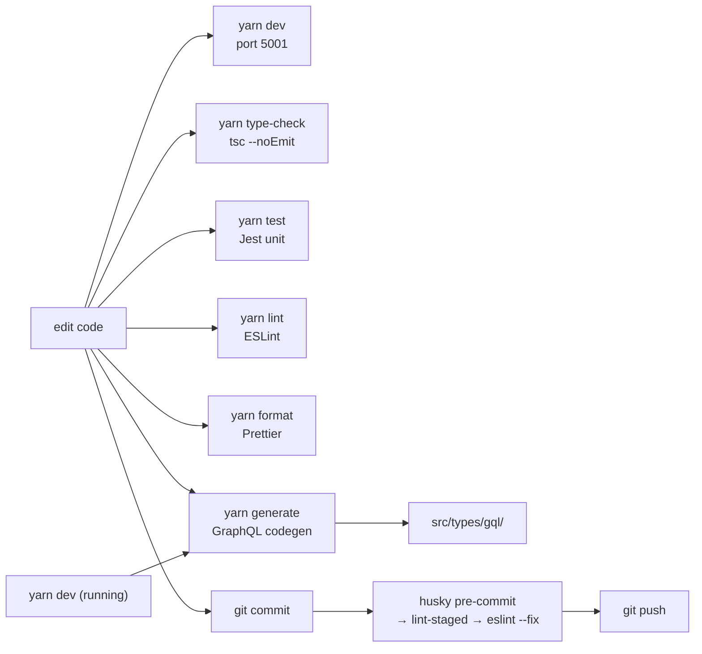

# Local development & conventions

Everything you need to get the app running locally, plus the conventions every contributor is expected to follow. Cross-references [App architecture](./app-architecture.md) for the stack and [Deployment & runbook](./deployment-runbook.md) for the production image.

## Prerequisites

| Tool | Version | Notes |
|---|---|---|
| Node.js | 22.x | `node:22-alpine` is the production base — match locally. Pinned in `.nvmrc` and `engines.node` in `package.json`. |
| Yarn | 1.x (classic) | Enforced — `npm` / `pnpm` are rejected by `scripts/enforce-package-manager.cjs`. |
| Docker + Compose v2 | recent | Only needed for local MinIO or running compose images. |
| Neo4j 5.x | running | Either local install, or SSH-tunnel to a shared instance (see `env-example`). |

`scripts/enforce-package-manager.cjs` runs from the `preinstall` hook in `package.json` and exits with `This repository requires Yarn. Please run: yarn install` if `npm_config_user_agent` does not start with `yarn/`.

## First-time setup

```bash
# 1. Clone
git clone git@github.com:eli-eric/ELI-panda.git
cd ELI-panda

# 2. Install deps (Yarn classic only)
yarn install --frozen-lockfile

# 3. Configure environment
cp env-example .env
# edit .env — see below
```

### `.env` essentials

The repo-root `env-example` is the canonical template. Minimum to boot locally against a remote Neo4j + Entra ID:

```env
PANDA_ENV="localhost"
PANDA_API_GW_URL="http://localhost:5001/api/mock-server"   # or the real dev gateway
NEXTAUTH_URL="http://localhost:5001/"
NEXTAUTH_SECRET="<dev secret matching your gateway>"

NEO4J_URI="bolt://localhost:7687"                          # or remote tunnel
NEO4J_USER="neo4j"
NEO4J_PASSWORD="<your password>"

# Entra ID — only needed if you want real sign-in locally
AZURE_AD_BEAMLINES_CLIENT_ID=…
AZURE_AD_BEAMLINES_CLIENT_SECRET=…
AZURE_AD_BEAMLINES_TENANT_ID=…

# MinIO (use docker-compose.minio.yml or remote)
MINIO_ENDPOINT="217.198.121.181"
MINIO_BUCKET_NAME="panda-dev"
MINIO_ACCESS_KEY="…"
MINIO_SECRET_KEY="…"
```

The full set of variables and what consumes them is in [Deployment & runbook → Environment variables](./deployment-runbook.md#environment-variables).

### SSH tunnel cheat sheet

If you need to reach the shared Neo4j browser, bolt port, or MinIO over SSH, the comment block at the bottom of `env-example` documents the tunnel:

```bash
ssh -L 7472:127.0.0.1:7472 -L 7682:127.0.0.1:7682 \
    -L 7471:127.0.0.1:7471 -L 7681:127.0.0.1:7681 \
    -L 7470:127.0.0.1:7470 -L 7680:127.0.0.1:7680 \
    -L 9000:127.0.0.1:9000 -L 9090:127.0.0.1:9090 \
    <username>@panda.eli-laser.eu
```

### Local MinIO (optional)

`docker-compose.minio.yml` spins MinIO up against `./s3data`:

```bash
docker compose -f docker-compose.minio.yml up -d
```

Default keys are `12345678`/`12345678` unless you set `MINIO_ACCESS_KEY` / `MINIO_SECRET_KEY` in the environment. The bucket is `panda-files` (default from `src/server/s3client.ts:6`) unless overridden.

## Daily commands



| Command | Purpose |
|---|---|
| `yarn dev` | Next.js dev server on **port 5001** (`PORT=5001 next dev`). |
| `yarn build` | Production build (`next build`); used by E2E and CI. |
| `yarn start` | Run the built app on **port 5001**, host `0.0.0.0`. |
| `yarn type-check` | `tsc --noEmit` — strict TypeScript, no transpile. |
| `yarn lint` | ESLint on `*.{ts,tsx,js,jsx}`. |
| `yarn lint:fix` | ESLint with `--fix`. |
| `yarn format` | Prettier on the whole repo. |
| `yarn test` | TS-compile the Jest sources (`tsconfig.jest.json`), then run Jest. |
| `yarn test path/to/X.spec.tsx` | Single-file Jest run. |
| `yarn e2e` | Playwright E2E against a built app on port `5002`. |
| `yarn e2e:headed` / `:ui` / `:report` / `:install` | Playwright variants — see [E2E testing](#e2e-testing-playwright). |
| `yarn generate` | One-shot GraphQL codegen → `src/types/gql/`. |
| `yarn generate:watch` | Continuous codegen — pair with `yarn dev`. |

> ⚠️ Do **not** start `yarn dev` from automation, scripts, or AI agents — the project convention is that the developer owns the dev server. The CLAUDE.md at the repo root explicitly forbids agents from spawning `yarn dev`.

### Codegen pairing

`yarn generate` hits `http://localhost:5001/api/graphql` (the running dev server) for the live schema. The typical loop:

1. Start `yarn dev` in one terminal.
2. Start `yarn generate:watch` in another.
3. Add or edit a `gql` document anywhere in `src/**/*.{ts,tsx}`.
4. Saved file → codegen re-emits `src/types/gql/` → TypeScript picks up the new types.

If your edits hit `src/server/apollo/schema.graphql`, restart `yarn dev` first — the running Apollo schema is what codegen reads.

## Coding conventions

The repo enforces a strict house style via ESLint + Prettier + EditorConfig-like settings in `.prettierrc.js`.

### Formatting (`.prettierrc.js`)

```js
{
    semi: false,                  // no semicolons
    singleQuote: true,            // single quotes for strings
    trailingComma: 'all',
    printWidth: 100,
    tabWidth: 4,
    endOfLine: 'lf',
    arrowParens: 'avoid',
}
```

### Linting (`.eslintrc.json`)

Notable rules:

| Rule | Setting | Why |
|---|---|---|
| `simple-import-sort/imports` | warn | Import order is automated; do not hand-sort. |
| `@typescript-eslint/consistent-type-imports` | warn | Prefer `import type` for type-only imports. |
| `unused-imports/no-unused-imports` | warn | Auto-fixed on save. |
| `@tanstack/query/exhaustive-deps` | error | Mirrors React hook deps for queries. |
| `@tanstack/query/stable-query-client` | error | Ensures the `QueryClient` singleton pattern in `_app.tsx`. |
| `react-hooks/rules-of-hooks` | error | Hooks discipline. |
| `react-hooks/exhaustive-deps` | warn | Read carefully when bypassing. |
| `react/jsx-no-literals` | warn (strings only) | All user-visible strings must come from `react-intl` — see [i18n](#i18n). Single-character allow-list permits punctuation. |
| `no-console` | warn | Use `src/server/logger.ts` server-side; avoid `console.*` in client code. |

The full settings live in `.eslintrc.json` and the formatting rules in `.prettierrc.js` — they are the source of truth, not this page.

### File naming

- `*.cont.tsx` — **container**. Owns data fetching, mutations, navigation, and store reads. Imports the matching `*.comp.tsx`.
- `*.comp.tsx` — **component**. Pure UI. No fetcher calls, no store reads beyond props.
- `*.spec.ts(x)` — Jest unit test. Lives under `__tests__/` next to the code under test.
- `*.e2e.ts` — Playwright test, only under `e2e/`.
- `*.fields.ts` / `*.schema.ts` — RHF field definitions and Zod schemas, respectively.

### Imports

- Alias `@/*` resolves to `src/*` (`tsconfig.json` `paths`).
- Group order is enforced by `simple-import-sort` — let the autofix handle it.
- `import type { Foo } from '...'` for type-only imports (eslint warns otherwise).

### Predicates

Boolean-returning functions follow `is*` / `has*` / `can*` / `should*`:

```ts
const isEmpty = (xs: unknown[]) => xs.length === 0
const hasEditPermission = (roles: ROLE[]) => roles.includes(ROLE.SYSTEM_EDIT)
const canEditCatalogue = usePermission([ROLE.CATALOGUE_EDIT])
```

See the [`predicates` skill prompt](../../.claude/skills/predicates/) for more.

### General rules from `CLAUDE.md`

- Strict TypeScript; avoid `any`, prefer `unknown` with type guards.
- Functions under 20 lines, single responsibility.
- Early returns over nested conditionals.
- Constants `UPPER_CASE` (e.g. `BASE_URL`, `APP_BASE_URL`).
- Test selectors use `data-testid`, **never** CSS classes or text matchers.
- Only use `fm` as an abbreviation; it stands for `formatMessage`.

## i18n

The app is English-only today. All user-facing strings come from `src/i18n/src/locale/en.ts` via `react-intl`:

```tsx
import { FormattedMessage, useIntl } from 'react-intl'
import { message } from '@/i18n/src/messages'

// Most common pattern
const { formatMessage: fm } = useIntl()
return <button>{fm({ id: message.common.buttons.save })}</button>

// Declarative variant
<FormattedMessage id={message.common.buttons.save} />
```

The `message` object in `src/i18n/src/messages.ts` is a nested record of string IDs — autocomplete works, and the `react/jsx-no-literals` rule catches accidental hardcoded strings. Hungarian is planned for ELI ALPS, not on the immediate roadmap.

See the [`i18n` skill prompt](../../.claude/skills/i18n/) for full conventions.

## Canonical patterns

The skill prompts under `.claude/skills/` document the patterns the team has standardised on. Each is a short, self-contained how-to that examples link back to.

| Skill | What it covers | Heaviest consumers |
|---|---|---|
| [`fetching/`](../../.claude/skills/fetching/) | TanStack Query + `queryFetcher` / `queryMutate` | Every module's hooks folder |
| [`toast/`](../../.claude/skills/toast/) | `toast.promise` for mutations | 26 files |
| [`modals/`](../../.claude/skills/modals/) | `useDynamicModalStore` + shadcn Dialog/Sheet | 92 files |
| [`tables/`](../../.claude/skills/tables/) | `PandaTableV2`, sticky headers, scroll | 30 files |
| [`wizard/`](../../.claude/skills/wizard/) | Multi-step forms (Form Wizard V3) | systemItem add flow, room-card edit, etc. |
| [`design/`](../../.claude/skills/design/) | shadcn/ui + Zod + Tailwind composition | All new components |
| [`shadcn-ui/`](../../.claude/skills/shadcn-ui/) | shadcn install / config / theming | Component vendoring |
| [`predicates/`](../../.claude/skills/predicates/) | `is* / has* / can* / should*` style | Pervasive |
| [`tdd/`](../../.claude/skills/tdd/) | Red-green-refactor with Jest | New feature work |
| [`architecture/`](../../.claude/skills/architecture/) | Where files live | New modules |
| [`grill-me/`](../../.claude/skills/grill-me/) | Interview-style design stress-test | Pre-implementation planning |
| [`skill-creator/`](../../.claude/skills/skill-creator/) | Authoring more skills | Adding a new pattern |

The `CLAUDE.md` at the repo root pulls these into the AI agent's context automatically; for humans they are just very dense convention docs.

### Toast on every mutation

```tsx
import { toast } from 'sonner'

const onSubmit = (values) => {
    toast.promise(
        mutate(values),
        {
            loading: fm({ id: message.common.status.saving }),
            success: fm({ id: message.common.status.saved }),
            error: (err) => fm({ id: message.common.status.saveFailed }, { detail: err.message }),
        },
    )
}
```

### Modals via the dynamic store

```tsx
import { useDynamicModalStore } from '@/store/useDynamicModalStore'

const open = useDynamicModalStore(s => s.openModal)
open({
    id: 'edit-system',
    component: <EditSystemSheet uid={uid} />,
})
```

The store handles z-index stacking, nested modals, and focus return.

## Testing

The project has two complementary test surfaces.

### Jest unit tests

- Runner config: `jest.config.ts` (uses `next/jest`).
- Environment: `jsdom`.
- Setup file: `jest.setup.ts`.
- Path alias `@/*` → `src/*` works in tests via `moduleNameMapper`.
- E2E is **excluded** from Jest runs (`testPathIgnorePatterns: ['<rootDir>/e2e/']`).
- Compile pass first: `yarn test` runs `tsc --project tsconfig.jest.json` before Jest.

Convention: tests live in `__tests__/` next to the unit under test, named `<unit>.spec.ts(x)`. Selectors use `data-testid` — see the existing tests under `src/hooks/__tests__/` and `src/utils/__tests__/` for the established style.

### E2E testing (Playwright)

- Runner config: `playwright.config.ts`.
- Test dir: `e2e/`, test glob: `**/*.e2e.ts`.
- `webServer`: Playwright builds and runs the app itself on port **5002** with `PANDA_ENV=localhost` and `PANDA_API_GW_URL=http://localhost:5002/api/mock-server`. Set `PLAYWRIGHT_E2E=1` to bypass the middleware auth redirect (`src/middleware.ts:15`).
- Tests are **deterministic**: network is fully mocked (no live API, no live GraphQL). See `e2e/README.md` for the recipe.

Helpers worth knowing:

| File | Purpose |
|---|---|
| `e2e/helpers/app.ts` | Registers app-level mocks (NextAuth session by default). |
| `e2e/helpers/network.ts` | Generic REST + GraphQL mock router (`setupNetworkMocks`). |
| `e2e/helpers/auth.ts` | `mockNextAuthSession(page, { roles })`. Default roles: `basics`, `systems-view`, `system-edit`. |
| `e2e/fixtures/test.ts` | Shared `page` fixture; import from here instead of `@playwright/test`. |
| `e2e/fixtures/<module>.mock.ts` | Per-module deterministic data. |
| `e2e/helpers/<module>Mocks.ts` | Per-module REST + GraphQL handler map. |

Adding a new module's tests:

1. Drop fixture data into `e2e/fixtures/<module>.mock.ts`.
2. Create `e2e/helpers/<module>Mocks.ts` calling `setupNetworkMocks(...)`.
3. Add `e2e/<module>/<name>.e2e.ts` and use the shared page fixture.

## Pre-commit hooks

`.husky/pre-commit` runs:

```
yarn lint-staged
```

`lint-staged` (configured inline in `package.json`) runs `eslint --fix` on staged `*.{ts,tsx,js,jsx}` files. Commits with lint errors fail; Prettier is **not** in the hook — run `yarn format` yourself (or rely on your editor).

To bypass in an emergency: `git commit --no-verify` (then send a follow-up commit that fixes the lint output — do not let `--no-verify` become a habit).

## Editor setup

Recommended: VS Code with the following extensions enabled and `formatOnSave` on:

- ESLint (`dbaeumer.vscode-eslint`) — fix-on-save.
- Prettier (`esbenp.prettier-vscode`) — set as default formatter.
- Tailwind CSS IntelliSense.
- "Trailing spaces" + "EditorConfig for VS Code" honour the `.prettierrc.js` settings.

For JetBrains IDEs, enable the *Prettier* and *ESLint* integrations and point the configuration paths at the repo defaults.

## Troubleshooting

| Symptom | Likely cause | Fix |
|---|---|---|
| `This repository requires Yarn` | Ran `npm install` / `pnpm i` | Use `yarn install --frozen-lockfile` |
| `yarn dev` won't bind to 5001 | Port already in use (often by an orphaned dev process) | `lsof -i :5001 -nP` → kill the holder |
| Sign-in redirect loop locally | Entra ID redirect URI missing for `http://localhost:5001/api/auth/callback/azure-ad-beamlines` | Add the URI to the Entra ID app registration; see [Authentication](./authentication.md) |
| GraphQL types missing after a schema edit | `yarn generate` not re-run | Run `yarn generate` (or `:watch`) against a running `yarn dev` |
| Codegen says it can't reach the schema | Dev server not running on 5001 | Start `yarn dev` first |
| Strange Tailwind class behaviour | Tailwind v4 — utilities live in `src/app/globals.css`, no `tailwind.config.js` | Add custom utilities to `globals.css` |
| `yarn test` fails to find a module under `@/...` | `tsconfig.jest.json` paths drift | Ensure `moduleNameMapper` in `jest.config.ts` matches; restart Jest |
| Playwright run hangs in CI | Browser deps not installed | `yarn e2e:install` locally; in CI the `Dockerfile.e2e` already runs `playwright install --with-deps chromium` |
| `[Security] Unauthorized access attempt` in dev console | Your local session lacks a role required by the path | Adjust the user's roles in Neo4j or pick a different test account |

## Deprecated / legacy

- `axiosInstance` (`src/core/axios/axiosInstance.ts`) — gradually being replaced by `fetchClient`. New code should never import it; see [App architecture → Maintenance recommendations](./app-architecture.md#maintenance-recommendations).
- `@headlessui/react` — still present in ten files; the migration target is shadcn/ui. Don't introduce new HeadlessUI consumers.
- Legacy modal infrastructure (`useModalStore`, `useModalFormStateStore`, `useModalGlobalStore`, `useFormControlStore`) — pick `useDynamicModalStore` for any new modal surface.
- `tsconfig.json:noImplicitAny` is `false`. Strict mode is on, but `any` slips through without a separate flag — use `unknown` and narrow.
- `Dockerfile.devenv.czolap04` + `docker-compose-dev-czolap04.yml` — operator-specific dev variants. Not used by mainstream contributors.

## Maintenance recommendations

1. **Add `.nvmrc`** pinning Node 20. The repo currently relies on the Docker image and CI workflow to pin the Node version; humans get whatever their `nvm` defaults to.
2. **Run Prettier in `lint-staged`.** Today only ESLint runs at commit time, so formatting drift only gets caught by `yarn format` runs (or CI). Add `prettier --write` to the lint-staged glob.
3. **Make `tsc --noEmit` part of CI.** Today CI runs unit tests and E2E but not `yarn type-check`. Adding it catches type regressions that Jest does not.
4. **Document `.env` more granularly in this page.** The variables listed above came out of grepping the codebase; an authoritative comment-block-per-variable in `env-example` would make onboarding cheaper.
5. **Promote skills to the wiki.** Today they live under `.claude/skills/` — invaluable for the team, invisible to anyone reading the GitHub wiki. Either copy them into `docs/conventions/` or auto-mirror via the wiki sync script.
6. **Set `noImplicitAny: true`** once the residual `any` is paid down. The compiler is already on strict — this is the last remaining laxity.

## 🔮 Planned

- Hungarian localisation (`hu` locale) for ELI ALPS — adding a `messages.hu` and an `IntlProvider` selector is the entry point, but no concrete schedule today.
- A canonical `docs/conventions/` set in the wiki — see Maintenance #5.
- A `/api/health` endpoint that doubles as a local-dev sanity check — see [Deployment & runbook → Maintenance](./deployment-runbook.md#maintenance-recommendations).

## Open questions

- Where is the authoritative list of `data-testid` selectors? They are scattered across `.cont.tsx` files; no central registry. Worth one?
- The `e2e/helpers/auth.ts` default roles are `basics`, `systems-view`, `system-edit` — but the canonical role for write is `systems-edit` (with an "s"). Is `system-edit` a typo or a parallel constant?
- `tsconfig.json` sets `noImplicitAny: false` while `strict: true`. Was the laxity deliberate (codegen output?) or accidental?

---

## Data model reference

> 🔧 *This section is for engineers reading the docs in the repo. The wiki generator strips it.*
>
> The schema lives at `src/server/apollo/schema.graphql`; generated TypeScript at `src/types/gql/`. Convention skill prompts live under `.claude/skills/`. Repo-level conventions live in the root `CLAUDE.md`.
