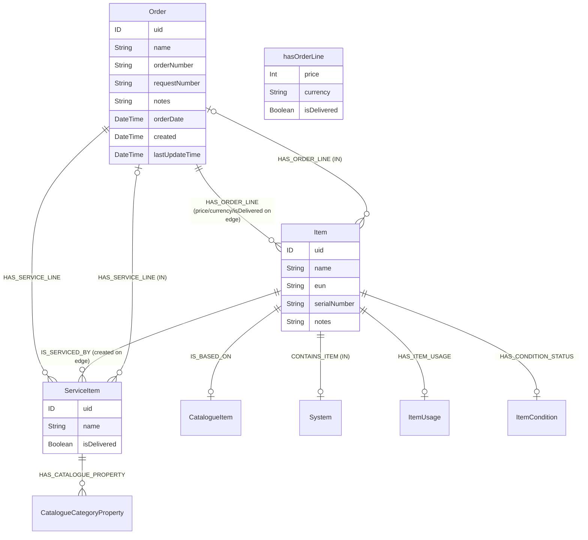
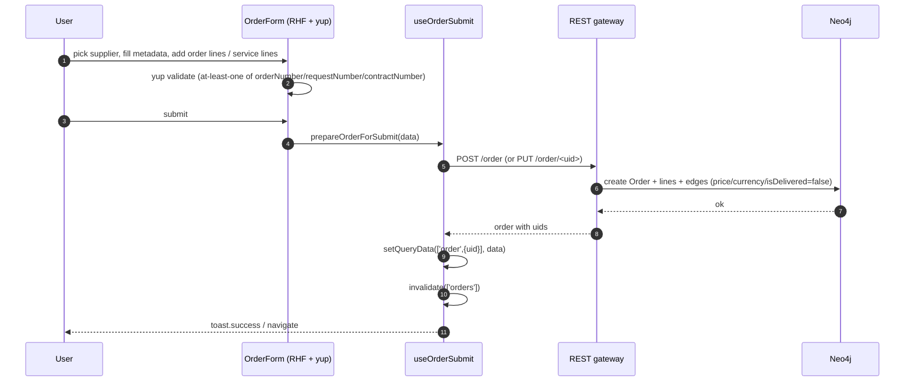
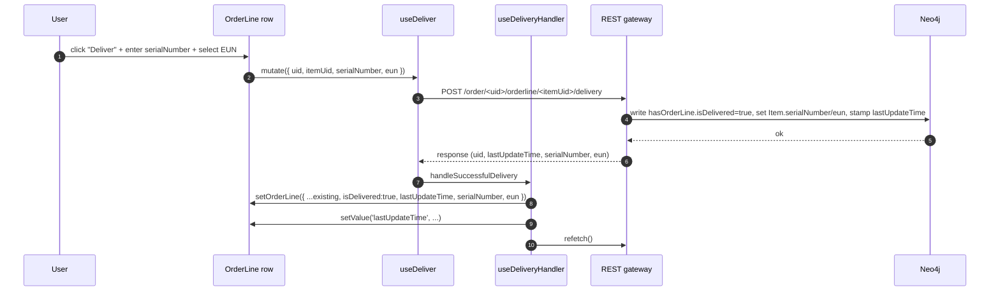

# Orders & Order Items

Orders track procurement — what was requested, from whom, at what price, when it was delivered, and what physical thing it became. Each order has **order lines** (which become `Item` nodes attached to the order) and optional **service lines** (`ServiceItem` nodes). Orders are the only place where new `Item` nodes are created — every physical asset in PANDA starts life as an order line.

Two modules:

- `src/modules/orders/` — the `/orders` list page.
- `src/modules/orderItem/` — the `/order/[uid]` detail page (single order with all its lines + service lines).

## Module locations

```
src/modules/orders/
├── Orders.cont.tsx                  — /orders table page
├── components/
│   ├── OrderColumns.tsx             — PandaTableV2 column defs
│   ├── HeaderButtons.tsx            — toolbar
│   ├── TableActions.tsx             — row-level menu
│   └── filters/                     — filter sheet + button
├── hooks/useOrders.ts               — main list query
├── types/                           — TS shapes
└── utils/getColorClassStatus.ts     — status colour mapping

src/modules/orderItem/
├── OrderItem.cont.tsx               — /order/[uid] page
├── components/
│   ├── form/                        — yup schema + RHF + OrderForm component
│   ├── orderLines/                  — OrderLines table (one row per line)
│   ├── serviceLines/                — service lines table + add button
│   └── …
├── hooks/
│   ├── useOrderDetail.ts            — read single order
│   ├── useOrderSubmit.ts            — create/update mutation
│   ├── useDeliver.ts                — mark one order line delivered
│   ├── useDeliverAll.ts             — bulk delivery for all order lines
│   ├── useServiceDelivery.ts        — mark one service line delivered
│   ├── useServiceDeliveryAll.ts     — bulk service-line delivery
│   ├── useDeliveryHandler.ts        — post-delivery form sync
│   ├── useOrderLine.ts              — per-line read helpers
│   └── useServiceLine.ts            — per-service-line helpers
├── context/
│   ├── OrderLineContext.tsx         — per-row context for OrderLine table
│   ├── ServiceLineContext.tsx       — same for ServiceLine table
│   └── index.ts
├── actions/
│   ├── orderLine/orderLine.actions.tsx
│   └── serviceLine/serviceLine.actions.tsx
├── utils/
│   ├── order-transforms.ts          — API ↔ form shape adapter
│   ├── parseSerialNumbers.ts        — bulk paste-serials parser
│   └── service-line-details.ts      — property-bag wiring (mirrors catalogue)
└── types/form.ts
```

Routes:

```
src/pages/orders/index.tsx     — /orders → OrdersContainer
src/pages/order/index.tsx      — /order → OrderItemContainer (create)
src/pages/order/[uid].tsx      — /order/<uid> → OrderItemContainer (edit)
```

## Data model



### Two flavours of "order line"

`Order` connects to its lines via two different edges:

| Edge | Other end | Edge interface | Meaning |
|---|---|---|---|
| `HAS_ORDER_LINE` | `Item` | `hasOrderLine` (`price`, `currency`, `isDelivered`) | A line that *becomes* a physical asset (`Item`). |
| `HAS_SERVICE_LINE` | `ServiceItem` | _none_ | A line that *delivers a service* (calibration, repair, install). |

Both are written from the same form (`OrderForm`); both are tracked for delivery; both hit different REST endpoints for their delivery flow.

### `Item` is the join point

`Item` is the central node in the procurement → installation chain:

```
CatalogueItem  ──IS_BASED_ON──  Item  ──HAS_ORDER_LINE──  Order
                                  │
                                  ├──CONTAINS_ITEM──> attached to System
                                  ├──IS_SERVICED_BY──> ServiceItem (history of services)
                                  ├──HAS_ITEM_USAGE──> ItemUsage codebook
                                  └──HAS_CONDITION_STATUS──> ItemCondition codebook
```

When an order line is "delivered", the backend creates the `Item` with a `serialNumber` and `eun` (Equipment Unique Number) and flips `hasOrderLine.isDelivered` to `true`. From that moment forward the `Item` can be moved between systems (via [Systems family → System item](./systems-family/system-item.md)) without touching the `Order` it came from.

### Service lines reuse the catalogue property bag

`ServiceItem.details` reuses `HAS_CATALOGUE_PROPERTY + hasCatalogueProperty.value` — the same edge model as [Catalogue & Items](./catalogue-and-items.md#three-layer-property-model). Service-type properties live in the catalogue, services fill them in per line.

## Flows

### Authoring an order



### Delivering an order line



`useDeliverAll` runs the same shape against `/order/<uid>/orderlines/delivery` for bulk delivery. Service lines use the parallel pair (`/order/<uid>/serviceline/<itemUid>/delivery` and `/order/<uid>/servicelines/delivery`).

## Fetcher surface

All reads and writes are REST; there are no GraphQL operations in either module. The endpoint inventory:

| Endpoint key | Path | Used by |
|---|---|---|
| `orders` | `/orders${query}` | `useOrders` |
| `ordersMinMaxPrice` | `/orders/order-lines/min-max-prices` | Price filter slider bounds |
| `order` | `/order{uid?}` | `useOrderDetail`, `useOrderSubmit` |
| `orderLineDelivery` | `/order/{uid}/orderline/{itemUid}/delivery` | `useDeliver` |
| `orderLinesDeliverAll` | `/order/{uid}/orderlines/delivery` | `useDeliverAll` |
| `serviceLineDelivery` | `/order/{uid}/serviceline/{itemUid}/delivery` | `useServiceDelivery` |
| `serviceLinesDeliverAll` | `/order/{uid}/servicelines/delivery` | `useServiceDeliveryAll` |
| `eunforPrint` | `/orders/eun-for-print/{uid}${query}` | EUN print sheet |
| `catalogueOrders` | `/catalogue/{uid}/orders` | "Orders that use this catalogue item" (consumed by Catalogue module) |

All go through `queryFetcher` / `queryMutate` and inherit `Authorization: Bearer ${apiAccessToken}`.

## Form architecture

`OrderItem.cont.tsx` is a sizable RHF container. Notable design choices:

1. **Yup, not Zod.** This module uses `@hookform/resolvers/yup` (`OrderForm.schema.tsx`) — the only systems-/orders-family module to do so. Everything else uses Zod. See [Deprecated / legacy](#deprecated--legacy).
2. **Composite validation rule.** "At least one of `orderNumber` / `requestNumber` / `contractNumber` must be filled" is a yup `.test('at-least-one-filled', …)` at the schema root — not a per-field validator. Worth knowing if you add a fourth identifier later.
3. **Memo on every section.** `OrderItem.cont.tsx:30-33` wraps `OrderLinesTable`, `ServiceLinesContainer`, `OrderFormComponent`, and `FileManager` in `memo` — each section's re-render cost dominates on orders with many lines.
4. **Provider sandwich.** `OrderLineProvider` / `ServiceLineProvider` (`context/`) carry per-row context so deeply-nested action menus can read and mutate a single line without prop-drilling.
5. **Form `id` field is RHF-internal.** `addUuidsToOrderData` (`utils/order-transforms.ts`) preserves IDs on read; `removeUuidsFromLines` strips them before submit. The id is a `useFieldArray` artefact, not a backend concept.
6. **Warning modal gate.** `OrderItem.cont.tsx` uses `useWarningModal` to confirm submit when `hasEmptyLines(data) === true` — saving an order with no lines is allowed but flagged.

### `prepareOrderForSubmit` and friends

`utils/order-transforms.ts` is the only adapter layer:

- `addUuidsToOrderData(orderDetail)` — read-side: hydrates the form with a default `orderStatus = "Requested"` (uid hardcoded — see [Open questions](#open-questions)).
- `removeUuidsFromLines(lines)` — strip RHF's `id` before POST/PUT.
- `prepareOrderForSubmit(data)` — the canonical write transform. Coerces `price` strings to `Number` for both order lines and service lines (`useOrderSubmit.ts:91-103`).
- `parseSerialNumbers` (`utils/parseSerialNumbers.ts`) — accepts a pasted blob of serials (whitespace / newline / comma separated) and emits an array. Used by bulk delivery dialogs.
- `service-line-details.ts` — collapses the property-bag value structure into RHF-friendly shape, mirroring [Catalogue → adapter](./catalogue-and-items.md#form-architecture).

## Status, optimistic concurrency, and conflicts

`Order` does not carry a versioning field, but `useOrderSubmit` (`useOrderSubmit.ts:64-72`) treats HTTP **409 Conflict** as the optimistic-concurrency signal:

```ts
onError: (e: AxiosError) => {
    if (e.response?.status === 409) {
        toast.error('Order was updated by another user. Please refresh the page. And try again.')
    } else {
        toast.error(e.message)
    }
}
```

The backend writes `lastUpdateTime` on every successful update; the server-side handler presumably refuses a PUT whose payload `lastUpdateTime` is older than the stored one. The frontend does not pre-fetch to compare — it just surfaces the 409 verbatim.

Status colour mapping lives in `src/modules/orders/utils/getColorClassStatus.ts` — codebook codes → Tailwind classes.

## Cross-module integration

- **Catalogue** — every order line resolves to an `Item` whose `IS_BASED_ON` edge points at a `CatalogueItem`. The catalogue page shows the inverse via `useCatalogueOrders` → `catalogueOrders` endpoint.
- **Systems family** — order lines that have been *delivered* and *installed* show up as `Item.system` in [System item](./systems-family/system-item.md). The delivery flow does **not** assign a `System` — that happens later, from the Systems UI.
- **Services** — `ServiceItem.servicedItem` points back to the `Item` being serviced via `IS_SERVICED_BY`. A single `Item` can have many `ServiceItem`s over time.
- **Permissions** — `PATH.ORDERS` and `PATH.ORDER` require any of `ORDERS_VIEW`, `ORDERS_EDIT`, `ORDERS_DELIVERY_EDIT` (`PATH_ROLES_CONFIG`). The schema-level `@authentication` does **not** enforce this distinction.

## Permissions

Route-level (`src/lib/navigation/config.ts`):

```ts
[PATH.ORDERS]: [ROLE.ORDERS_VIEW, ROLE.ORDERS_EDIT, ROLE.ORDERS_DELIVERY_EDIT],
[PATH.ORDER]:  [ROLE.ORDERS_VIEW, ROLE.ORDERS_EDIT, ROLE.ORDERS_DELIVERY_EDIT],
```

The three roles imply three audiences:

- `ORDERS_VIEW` — read everything.
- `ORDERS_EDIT` — edit the header, lines, and service lines.
- `ORDERS_DELIVERY_EDIT` — flip lines to delivered (the buyer might not be the same person who logs receipt).

`Order`, `Item`, and `ServiceItem` are `@authentication`-only in the schema today; the delivery split is enforced solely by the REST gateway and the UI. See [Permissions model → Maintenance](./permissions-model.md#maintenance-recommendations).

## Tests

`__tests__` folders cover:

- `src/modules/orderItem/context/__tests__/` — context providers.
- `src/modules/orderItem/utils/__tests__/` — `order-transforms.spec.ts`, `parseSerialNumbers.spec.ts`, `service-line-details.spec.ts`.
- `src/modules/orderItem/hooks/__tests__/` — `useDeliveryHandler.spec.tsx`, `useOrderDetail.spec.ts`.

The orders list module has no local tests.

## Deprecated / legacy

- **Yup instead of Zod** — this is the only module in the systems/orders/catalogue suite still on yup (`@hookform/resolvers/yup`). Migrating would align with the house convention.
- `src/modules/orders/components/filters/OrdersFilter.tsx:11-12` — `// TODO: 1. Create a new file in src/hooks/table/useOrdersFilter.tsx` and `// TODO: 2. Refactor the code to use the new useQueryState hook`. The filter scaffolding has been "about to be" refactored for a while.
- **Hardcoded "Requested" status uid** in `addUuidsToOrderData` (`utils/order-transforms.ts`): `{ uid: 'c5ef9d00-ac38-44c1-b48a-fde0d7095c54', name: 'Requested' }`. The uid is environment-specific; if a future codebook reset changes it, new orders break silently.
- The 409-conflict optimistic concurrency model is implicit — no schema field carries the version. The UI relies entirely on the gateway returning 409 with a specific contract that is not documented in this repo.
- `usePandaTable` + `PandaTableV2` mix in `Orders.cont.tsx` — the older `PandaTable` hook drives the new `PandaTableV2` component. Tests exist but the duality should be tracked alongside the broader table migration.

## Maintenance recommendations

1. **Migrate `OrderForm.schema.tsx` to Zod.** It eliminates the yup dependency in this module and aligns with the rest of the codebase. `OrderForm.fields.ts` already follows the RHF + dynamic schema pattern.
2. **Replace the hardcoded "Requested" status uid** with a runtime lookup against the codebook. The single line in `addUuidsToOrderData` is the only place this constant appears.
3. **Document the 409 contract.** A short note in `src/server/apollo/schema.graphql` or this page explaining what the gateway requires (probably `lastUpdateTime` matching). Without it, the optimistic-concurrency story is invisible.
4. **Add `@authorization` to `Order`, `Item`, and `ServiceItem`** to enforce `ORDERS_*` roles at the schema layer. Today a hand-crafted GraphQL mutation can bypass the gateway.
5. **Sync the filter refactor**. The two TODO comments in `OrdersFilter.tsx` have been there for a while; either complete the move to `useQueryState` or remove the markers.
6. **Capture the `Item`-creation rule** explicitly. New code should treat orders as the only canonical creator of `Item` nodes — the rule is implicit today and a custom mutation can violate it.

## 🔮 Planned

- A unified delivery wizard that handles both order-lines and service-lines in one modal (today they are two distinct surfaces). No concrete plan, but the duplication in `useDeliver` / `useServiceDelivery` is the hint.
- Permissions Phase 1/2 affect *systems-edit*; the orders-side roles (`ORDERS_*`) are already module-scoped and unlikely to change in those phases.

## Open questions

- The "Requested" status uid is hardcoded. Are there other status entries (in-progress, delivered, cancelled) that the frontend creates by uid rather than name? Today the search shows none, but the pattern is fragile.
- Does the gateway support **atomic bulk delivery** (one request invalidates the order's `lastUpdateTime`) or does `useDeliverAll` race? The hook makes a single call but the server contract is undocumented.
- `useOrderSubmit` does not call `updatedByResolver` after a successful save. Is the audit trail handled server-side for `Order`, or are orders intentionally excluded from `WAS_UPDATED_BY`?
- `parseSerialNumbers` accepts multiple separators and trims aggressively. Is the expected pasting source a printer label batch? Worth documenting the input contract for warehouse operators.

---

## Data model reference

> 🔧 *Engineer-only; stripped from the wiki.*
>
> Schema: `Order` (`src/server/apollo/schema.graphql:461-471`), `Item` (`schema.graphql:395-408`), `ServiceItem` (`schema.graphql:414-427`), `hasOrderLine` and `isServicedBy` `@relationshipProperties` interfaces (`schema.graphql:389-393`, `410-412`). Endpoint catalogue: `src/utils/getEndpoints.ts` (`orders`, `order`, `orderLineDelivery`, `serviceLineDelivery`, …). Form transform layer: `src/modules/orderItem/utils/order-transforms.ts`.
