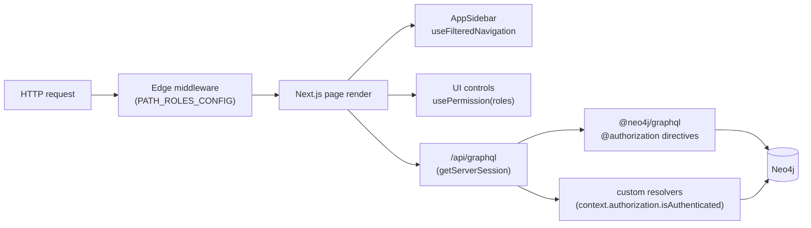
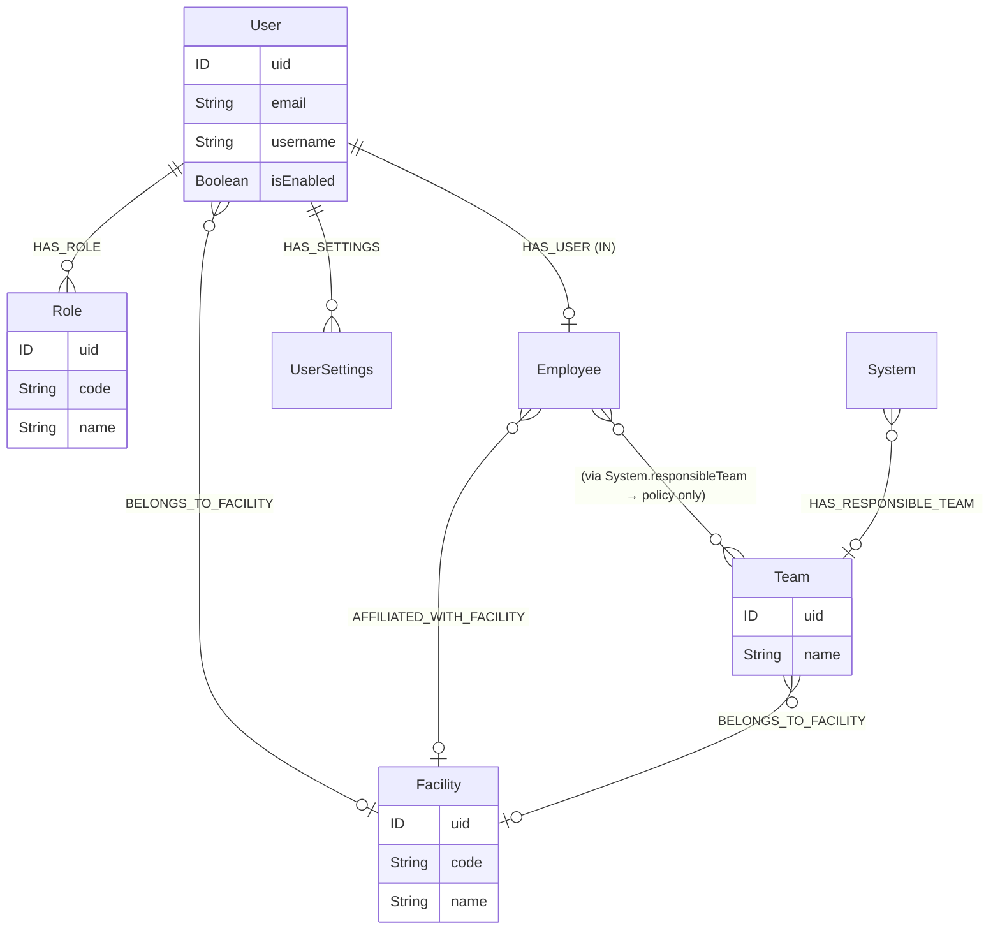
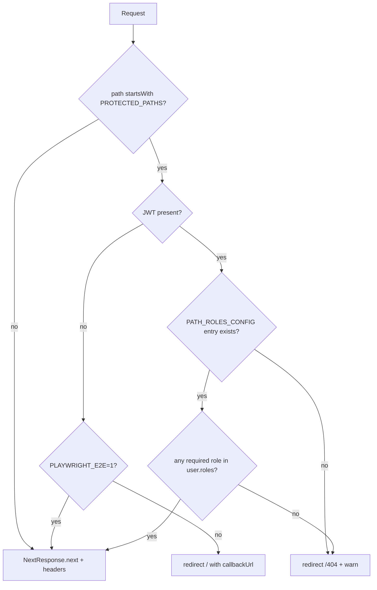

# Permissions model

How ELI PANDA expresses, stores, and enforces user permissions today, and the planned phased tightening. Cross-references [Authentication](./authentication.md) for the JWT shape and middleware gate, and [App architecture](./app-architecture.md) for the request lifecycle.

## Overview

Permissions are **flat, role-based, and JWT-carried**. A user has a set of role codes; each route, GraphQL operation, and UI control checks "does the user hold *any* of these roles?". There is no inheritance and no per-resource ACL in the GraphQL schema. The one exception now live is **[per-system edit responsibility](#per-system-edit-responsibility)** — a per-resource + team-scoped check the backend enforces on its REST endpoints and the `systemHierarchy` module enforces on the client; broader team-scoped enforcement remains policy-only and is tracked under [🔮 Planned](#-planned).

Authorization is enforced in **four** independent layers:



Layer-by-layer:

| Layer | Where | What it gates |
|---|---|---|
| 1. Routing | `src/middleware.ts` + `PATH_ROLES_CONFIG` | URL access; redirect to `/404` on role mismatch. |
| 2. Schema | `@authentication` / `@authorization` directives in `src/server/apollo/schema.graphql` | Every CRUD operation against every entity. |
| 3. Custom resolvers | `src/server/apollo/resolvers/*.ts` | Server-side mutations not auto-generated by Neo4j GraphQL. |
| 4. UI | `usePermission` hook + sidebar filter | Hide / disable controls the user cannot act on. |

UI gating is **cosmetic**; layers 1-3 are the actual enforcement. Removing the `disabled` prop in a browser still bounces off the schema or the middleware.

## Role inventory

The single source of truth for role *codes* is `src/types/constants/roles.ts`. Codes are kebab-case strings stored on `Role.code` in Neo4j and sent inside the JWT `roles: string[]` claim.

```ts
// src/types/constants/roles.ts
export enum ROLE {
    BASICS = 'basics',

    // Catalogue
    CATALOGUE_VIEW = 'catalogue-view',
    CATALOGUE_EDIT = 'catalogue-edit',
    CATALOGUE_CATEGORY_EDIT = 'catalogue-category-edit',
    SUPPLIER_EDIT = 'supplier-edit',

    // Systems
    SYSTEMS_VIEW = 'systems-view',
    SYSTEM_EDIT = 'systems-edit',
    SYSTEM_TYPE_VIEW = 'system-types-view',
    SYSTEM_TYPE_EDIT = 'system-types-edit',

    // Orders
    ORDERS_VIEW = 'orders-view',
    ORDERS_EDIT = 'orders-edit',
    ORDERS_DELIVERY_EDIT = 'orders-delivery-edit',

    // Room cards
    ROOM_CARD_VIEW = 'room-cards-view',
    ROOM_CARD_EDIT = 'room-cards-edit',

    // Publications
    PUBLICATIONS_VIEW = 'publications-view',
    PUBLICATIONS_EDIT = 'publications-edit',

    // Services
    SERVICE_VIEW = 'catalogue-service-view',
    SERVICE_EDIT = 'catalogue-service-edit',

    // Control systems
    CONTROL_SYSTEMS_VIEW = 'control-systems-view',
    CONTROL_SYSTEMS_EDIT = 'control-systems-edit',

    // Zones
    ZONES_VIEW = 'zones-view',
    ZONES_EDIT = 'zones-edit',

    // Misc
    REPORTS_VIEW = 'reports-view',
    CODEBOOKS_ADMIN = 'codebooks-admin',
    DASHBOARD_FILES_ADMIN = 'dashboard-files-admin',
    ADMIN = 'admin',
}
```

Convention: a `*-view` role grants read on the module's surface; the `*-edit` companion grants write. `admin` is the platform-wide superuser and is checked explicitly by entity-level directives (see `User` below).

> 🛈 Two enum members reference `system-types-*` roles (`SYSTEM_TYPE_VIEW`, `SYSTEM_TYPE_EDIT`) that do not appear anywhere in `schema.graphql`'s `@authorization` directives. They gate the `system-type-edit` module via `PATH_ROLES_CONFIG` only. See [*Open questions*](#open-questions).

### Default roles on first login

`neo4GetOrCreateUser` (`src/pages/api/auth/[...nextauth].js:170-219`) seeds these codes on a brand-new `User` node:

```
basics, catalogue-view, systems-view, room-cards-view, orders-view
```

Promotion to editor or admin happens in the Administration module — there is no in-app self-service. See [Administration (Users & Roles)](./administration.md) (planned).

## Identity graph

The shape of user / role / facility / team data:



Notable shapes (`src/server/apollo/schema.graphql`):

- `Role` carries a human-readable `name` and a stable `code` — the code is what ships in the JWT and what the directives compare against.
- `System.responsibleTeam` exists today but is **not** referenced by any `@authorization` rule — it is read by humans and used by future Phase 2 (see [🔮 Planned](#-planned)).
- `User` is the only entity with `@authorization`-style row-level access (a user can `READ`/`UPDATE` their own node by `uid: "$jwt.sub"`).

## Layer 2 — schema directives

`@neo4j/graphql` exposes two relevant directives:

- **`@authentication`** — require *any* logged-in JWT, no further constraint. Used on most reference data (`Location`, `Team`, `Employee`, every codebook type, `Order`, `Item`, `Zone`, …).
- **`@authorization`** — full predicate-based access policy. Used today on exactly **two** entities: `System` and `User`.

In `src/server/apollo/schema.graphql`, 31 types declare `@authentication`. 2 types declare `@authorization`.

The JWT type is declared explicitly so the directive expressions can reference its claims:

```graphql
type JWT @jwt {
    roles: [String!]!
}
```

### `System` (role gate)

`schema.graphql:296-305`:

```graphql
type System implements SystemInterface
    @authorization(
        validate: [
            { operations: [READ], where: { jwt: { roles_INCLUDES: "systems-view" } } }
            {
                operations: [UPDATE, CREATE, DELETE, READ]
                where: { jwt: { roles_INCLUDES: "systems-edit" } }
            }
        ]
    )
```

Read with **either** `systems-view` or `systems-edit`; write requires `systems-edit`. The two rules are OR'd by the `validate` array. Note that `admin` is **not** mentioned here — admin can only read/write `System` nodes if the same user *also* carries `systems-edit`. See [*Open questions*](#open-questions).

### `User` (row-level + admin)

`schema.graphql:496-505`:

```graphql
type User
    @authorization(
        validate: [
            { operations: [UPDATE, READ], where: { node: { uid: "$jwt.sub" } } }
            {
                operations: [UPDATE, CREATE, READ, DELETE]
                where: { jwt: { roles_INCLUDES: "admin" } }
            }
        ]
    )
```

A user can read or update *only their own* `User` node by JWT `sub`. `admin` may CRUD any user. Anyone else gets zero rows back — `@neo4j/graphql` filters rather than 403'ing for `where:` predicates.

### What that means in practice

For everything else, the `@authentication` directive means "logged-in users can read and write at will from the schema's perspective." Real-world write protection comes from:

- The middleware gate refusing the route (e.g. `/codebooks` requires `ROLE.ADMIN`).
- UI controls disabling the action (`usePermission`).
- The API gateway rejecting downstream REST writes the GraphQL surface doesn't cover.

This is a known asymmetry — see [Maintenance recommendations](#maintenance-recommendations).

## Layer 1 — middleware route gate

`src/middleware.ts` reads the JWT with `getToken({ req })` and consults two exports from `src/lib/navigation/config.ts`:

```ts
export const PROTECTED_PATHS = [
    PATH.DASHBOARD,
    PATH.CATALOGUE, PATH.SYSTEMS, PATH.SYSTEM, PATH.REPORTS,
    PATH.ORDERS, PATH.ROOM_CARD, PATH.ROOM_CARDS,
    PATH.ADMIN_USERS, PATH.ADMIN_USER, PATH.ADMIN,
    PATH.PROFILE_GENERAL, PATH.PROFILE_SECURITY, PATH.PROFILE_TEAM,
    PATH.SYSTEMS_MOVING, PATH.SYSTEM_ALIAS,
    PATH.PUBLICATIONS, PATH.PUBLICATION,
    PATH.SERVICES, PATH.SERVICE,
    PATH.GRANTS, PATH.RESEARCHERS,
    PATH.CONTROL_SYSTEMS, PATH.CONTROL_SYSTEMS_CREATE,
    PATH.SYSTEMS_HIERARCHY, PATH.ZONES,
]

export const PATH_ROLES_CONFIG: Record<PATH, ROLE[]> = {
    [PATH.CATALOGUE]: [ROLE.CATALOGUE_CATEGORY_EDIT, ROLE.CATALOGUE_EDIT, ROLE.CATALOGUE_VIEW],
    [PATH.SYSTEMS]: [ROLE.SYSTEM_EDIT, ROLE.SYSTEMS_VIEW],
    [PATH.SYSTEMS_MOVING]: [ROLE.SYSTEM_EDIT],
    [PATH.CODEBOOKS]: [ROLE.ADMIN],
    [PATH.ADMIN_USERS]: [ROLE.ADMIN],
    [PATH.CONTROL_SYSTEMS]: [ROLE.CONTROL_SYSTEMS_VIEW, ROLE.CONTROL_SYSTEMS_EDIT],
    [PATH.ZONES]: [ROLE.ZONES_VIEW, ROLE.ZONES_EDIT],
    // … (see file for the full map)
}
```

Behaviour (`hasRequiredRole`, `src/middleware.ts:30`): a path matches if **any** required role is present in the JWT (`requiredRoles.some(role => userRoles.includes(role))`). Mismatch redirects to `PATH.NOT_FOUND` and logs `[Security] Unauthorized access attempt` with user / roles / path / required-roles.

Routes inside `PROTECTED_PATHS` that have no entry in `PATH_ROLES_CONFIG` redirect to `/404` and log `[Security] Protected path not found in roles config`.

### Decision tree



## Layer 3 — custom resolvers

Most mutations are auto-generated by `@neo4j/graphql`, and inherit the type's authorization. Four custom resolvers live in `src/server/apollo/resolvers/`:

| Resolver | File | Auth check |
|---|---|---|
| `updatedByResolver` | `updatedByResolver.ts:32` | `if (!context.authorization.isAuthenticated) throw …` |
| `itemOriginatedResolver` | `itemOriginatedResolver.ts` | same `isAuthenticated` gate |
| `systemMovedFromResolver` | `systemMovedFromResolver.ts` | same |
| `moveSystem` | `moveSystemResolver.ts` | same |

These resolvers only check *authentication*, not the role — they assume the caller has already cleared the schema-level `@authorization` for the entity they're touching. The context carries the parsed JWT (`context.authorization.jwt`), so adding role checks is a one-line change if needed.

## Layer 4 — UI gating

### `usePermission`

`src/hooks/usePermission.ts` — 13 lines, used in ~64 files:

```ts
export const usePermission = (roles?: ROLE[]) => {
    const { data } = useSession()
    return useMemo(
        () => data?.user?.roles?.some(role => roles?.includes(role)),
        [data, roles],
    )
}
```

`true` if the session JWT contains **any** of the requested roles. Returns `undefined` when the session is loading. Call sites commonly negate it to compute a `disabled` prop:

```tsx
// src/modules/catalogueItem/CatalogueItem.cont.tsx:38
const disabledEdit = !usePermission([ROLE.CATALOGUE_EDIT])
```

Or to compute a `canEdit` flag:

```tsx
// src/modules/roomCard/RoomCardDetail.cont.tsx:45
const canEdit = usePermission([ROLE.ROOM_CARD_EDIT])
```

The hook is wrapped in `useMemo`, so the returned value is stable across renders for the same JWT — safe to use in dependency arrays.

### Sidebar filter

`src/components/navigation/app-sidebar.tsx` uses `useFilteredNavigation` (`src/hooks/useFilteredNavigation.ts`) against the two nav-item arrays in `src/lib/navigation/config.ts`. Each `NavigationItem` declares a single `role: ROLE`; the hook hides the item when the user lacks that role.

Sidebar visibility and the middleware route gate are **not** kept in sync automatically. If a `NAV_ITEMS` entry's role differs from the corresponding `PATH_ROLES_CONFIG` entry, a user can see the sidebar item and click it only to bounce to `/404`. See [Maintenance recommendations](#maintenance-recommendations).

## Per-system edit responsibility

A first step beyond the flat role model — and toward [Phase 2](#phase-2--team-based-scoping) — is now live for **systems**. `systems-edit` still answers "may edit systems at all"; a second, per-resource check answers "may edit *this* system": the user must be responsible for it directly, via its `responsibleTeam`, or via any ancestor up the `HAS_SUBSYSTEM` chain.

The backend owns the decision and exposes it as a REST read, and enforces it (403) on its mutating REST endpoints:

```
GET /system/{uid}/can-edit → { result: boolean, responsibles: User[] }
```

`result` folds in the role check (a non-`systems-edit` user gets `false`); `responsibles` is deduped across the system + ancestors so the UI can name who to contact.

**Enforcement gap this closes.** `System.@authorization` (Layer 2) gates GraphQL by role only — it has no per-resource predicate — and the `systemHierarchy` module mutates via GraphQL (`updateSystems`, `updateItems`, `createSystems`), which the backend's REST 403 does **not** cover. So the frontend enforces per-system responsibility on the client for that module: it fetches `can-edit`, disables every editable surface when denied, and **hard-guards** the mutation hooks (`guardSystemEdit` before `mutateAsync`) so an unpermitted GraphQL patch cannot fire. This is client-side enforcement standing in until those mutations migrate to guarded REST PATCH endpoints — it is not a substitute for schema-level authorization. Engineering detail: [System Hierarchy → Per-system edit permission](./systems-family/system-hierarchy.md#per-system-edit-permission).

## Audit trail

Every entity that needs change history points at `User` via the `WAS_UPDATED_BY` relationship:

```graphql
# src/server/apollo/schema.graphql:247-260
interface wasUpdatedBy @relationshipProperties {
    at: DateTime! @timestamp
    action: Actions!
    previousState: String
    newState: String
    changes: String
}

enum Actions { INSERT, UPDATE, DELETE, OPERATION_STATE }
```

A representative consumer (`schema.graphql:346-347`):

```graphql
updatedBy: [User!]!
    @relationship(type: "WAS_UPDATED_BY", direction: OUT, properties: "wasUpdatedBy")
```

Writing an audit edge is **explicit, client-driven**: modules call the `updatedByResolver` mutation after a successful write. Example call sites:

- `src/modules/systemHierarchy/hooks/mutations/useSystemFieldUpdate.ts`
- `src/modules/shared/system/system-edit/hooks/useSystemSheetUpdate.ts`
- `src/modules/systemItem/hooks/useSystemSheetUpdate.ts`
- `src/modules/roomCard/hooks/useRoomCardUpdate.ts`

The resolver (`src/server/apollo/resolvers/updatedByResolver.ts:62-65`) executes:

```cypher
MATCH (a:${node}), (u:User)
WHERE a.uid = $nodeUid AND u.uid = $userUid
CREATE (a)-[r:WAS_UPDATED_BY { action, at, previousState?, newState?, changes? }]->(u)
```

`$userUid` comes from `context.authorization.jwt.sub` — the audit edge is signed by the JWT subject, not by whatever the client claims. Mutations that touch state but forget to call `updatedByResolver` leave no audit trail.

> The user-facing surface of this audit data is the **History** tab in System Hierarchy. See the user guide → [`docs/user-guide/systemHierarchy/workflows/viewing-change-history.md`](../user-guide/systemHierarchy/workflows/viewing-change-history.md).

## Putting it together — a write

A `systems-edit` user editing a system field traverses every layer:

1. Middleware admits the URL (`/system/...` requires `SYSTEM_EDIT` *or* `SYSTEMS_VIEW`).
2. UI control is rendered because `usePermission([ROLE.SYSTEM_EDIT])` returns `true`.
3. The mutation hits `/api/graphql`; `getServerSession` confirms the cookie.
4. `@neo4j/graphql` evaluates `System.@authorization` — `systems-edit` allows `UPDATE`.
5. After the write, the hook calls `updatedByResolver`; `context.authorization.isAuthenticated` is true, the audit edge is created.

A `systems-view` user attempting the same write fails at step 2 (button disabled) and step 4 (`@authorization` denies `UPDATE`). A hand-crafted GraphQL mutation reaches step 4 directly and is rejected there.

## Deprecated / legacy

- `ROLE.SYSTEM_TYPE_VIEW` / `ROLE.SYSTEM_TYPE_EDIT` (`src/types/constants/roles.ts:7-8`) gate `PATH.SYSTEM_TYPE_EDIT` in middleware but are not referenced in `schema.graphql` `@authorization` blocks. Either complete the schema enforcement or document the intentional UI-only gate.
- `ROLE.DASHBOARD_FILES_ADMIN`, `ROLE.CODEBOOKS_ADMIN`, `ROLE.SUPPLIER_EDIT` exist in the enum but are not referenced by `PATH_ROLES_CONFIG`. They may be checked by `usePermission` consumers — verify before deleting.
- `console.warn('[Security] Protected path not found in roles config', …)` in `src/middleware.ts:78` should never fire in production; the path list and the role map are maintained side-by-side in `src/lib/navigation/config.ts`. Consider deleting after the next codebase sweep.
- Two `@authorization` directives in 33 entity types is a lopsided distribution. Everything else relies on `@authentication` and the assumption that the route gate plus UI gate together prevent unwanted writes. This is fragile — see [*Maintenance*](#maintenance-recommendations).

## Maintenance recommendations

1. **Sync `NAV_ITEMS` role with `PATH_ROLES_CONFIG`.** Today the sidebar and middleware can disagree silently. Either derive one from the other, or add a test that walks `NAV_ITEMS` and asserts each item's `role` appears in `PATH_ROLES_CONFIG[item.url]`.
2. **Promote `@authentication`-only types to `@authorization` where appropriate.** Reference data (codebooks) is fine, but `Order`, `Item`, `ServiceItem`, `RoomCard`, `Zone` should declare role gates so a misconfigured route doesn't open up writes via raw GraphQL.
3. **Decide whether `admin` is implicit-everywhere.** Today `admin` does *not* satisfy `System.@authorization` — only `systems-edit` does. Either add `admin` to every entity directive or codify "admin ⊃ all roles" at the JWT mint step (`jwt` callback in `[...nextauth].js`).
4. **Move `usePermission` checks into a single predicate file.** Sixty-plus call sites repeat the `[ROLE.X]` array literal. A `canEditCatalogue` / `canEditSystem` predicate module would make grepping for permission boundaries trivial.
5. **Tighten the custom-resolver auth gate.** `updatedByResolver` accepts any authenticated caller. If a mutation can fabricate `node`/`nodeUid` for an entity the caller cannot otherwise write, the audit log gets polluted. Add an explicit role check (or factor a `requireRole(['systems-edit'])` helper).
6. **Surface `[Security]` middleware logs.** They go to `console.warn` only. Wiring them through `src/server/logger.ts` (or a future structured-log pipeline) makes the audit story end-to-end.
7. **Document `system-types-*` enforcement.** Either add `@authorization` on `SystemType` / `SystemTypeGroup` or write the rationale for keeping it UI-only.

## 🔮 Planned

### Phase 1 — level-based admin/editor split

The user guide already describes Phase 1 behaviour (see [`docs/user-guide/systemHierarchy/README.md`](../user-guide/systemHierarchy/README.md)). Mapping to the schema:

- `admin` retains exclusive edit on `SYSTEM_DOMAIN` and `TECHNOLOGY_UNIT` levels.
- `systems-edit` is restricted to `KEY_SYSTEMS`, `SUBSYSTEMS_AND_PARTS`, and `TRASH`.

Implementation sketch: add a `where: { node: { systemLevel_IN: [...] } }` clause to a third `validate` rule on `System`, plus parallel rules on derived entities (`Item`, `Link`, etc.). `@neo4j/graphql` supports `node`-shaped predicates today (already used by `User.uid: "$jwt.sub"`), so the change is schema-only.

### Phase 2 — team-based scoping

> Partially live: the backend now enforces per-system edit responsibility (direct responsible, `responsibleTeam`, or an ancestor's) on its **REST** endpoints, and the `systemHierarchy` module enforces it client-side for its GraphQL mutations — see [Per-system edit responsibility](#per-system-edit-responsibility). What remains below is folding the same rule into `@neo4j/graphql` `@authorization` so raw GraphQL is gated too.

Each system already carries `responsibleTeam: Team @relationship(type: "HAS_RESPONSIBLE_TEAM")`. Phase 2 schema-level enforcement needs:

- A `User`→`Team` (or `Employee`→`Team`) relationship — the schema does **not** have one today. `Employee.user` exists but no `Team` membership edge does.
- The JWT carrying the user's team UIDs alongside `roles`.
- A `where: { node: { responsibleTeam: { uid_IN: "$jwt.teamUids" } } }` clause on `System` and derived entities.

The schema work is blocked on the data structure for "team membership" — both the relationship and the JWT claim.

### Other roadmap items

- **`admin` everywhere semantics** (Maintenance #3).
- **`@authorization` coverage** for the eight or so high-value entity types still relying on `@authentication` (Maintenance #2).

## Open questions

- Why does `System.@authorization` omit `admin`? Today an `admin` who lacks `systems-edit` cannot edit a system through GraphQL. Is that intentional?
- `ROLE.SYSTEM_TYPE_VIEW` and `ROLE.SYSTEM_TYPE_EDIT` gate `PATH.SYSTEM_TYPE_EDIT` only — is the lack of schema-level enforcement on `SystemType` / `SystemTypeGroup` deliberate?
- `ROLE.DASHBOARD_FILES_ADMIN`, `ROLE.CODEBOOKS_ADMIN`, `ROLE.SUPPLIER_EDIT` — used or vestigial? They show up nowhere in `PATH_ROLES_CONFIG`. Are they consumed by `usePermission` somewhere not covered by this sweep?
- For Phase 2, should team membership be modelled on `User` or `Employee`? The Employee path keeps user-of-record on HR data; the User path is cheaper to put in the JWT but ties roles to login identity.
- What happens to the audit edge on cascade deletes? `WAS_UPDATED_BY` points at `User` — if a user is removed, the edge dangles. Is there a cleanup procedure or is the `User` node effectively never deleted?

---

## Data model reference

> 🔧 *This section is for engineers reading the docs in the repo. The wiki generator strips it.*
>
> Authoritative entity definitions live in `src/server/apollo/schema.graphql`. Permission-relevant types: `JWT @jwt`, `User`, `Role`, `Team`, `Employee`, `Facility`, and the `System`/`User` `@authorization` blocks (`schema.graphql:296-305` and `schema.graphql:496-505`). The role enum lives in `src/types/constants/roles.ts`; route/role mapping in `src/lib/navigation/config.ts`.
