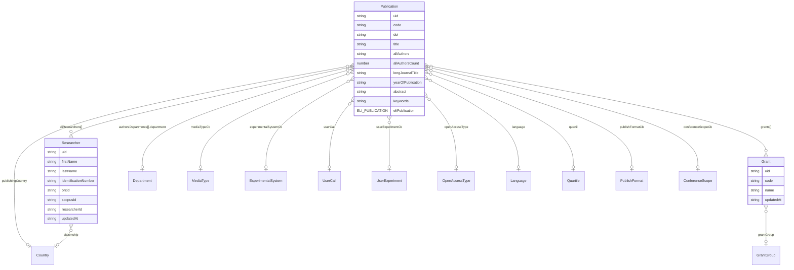
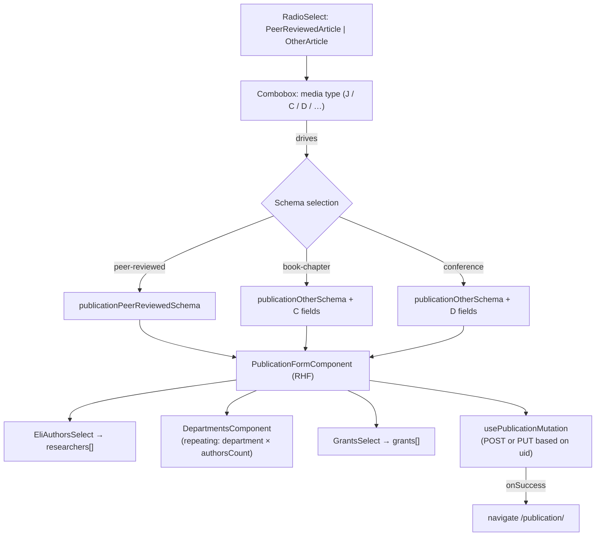
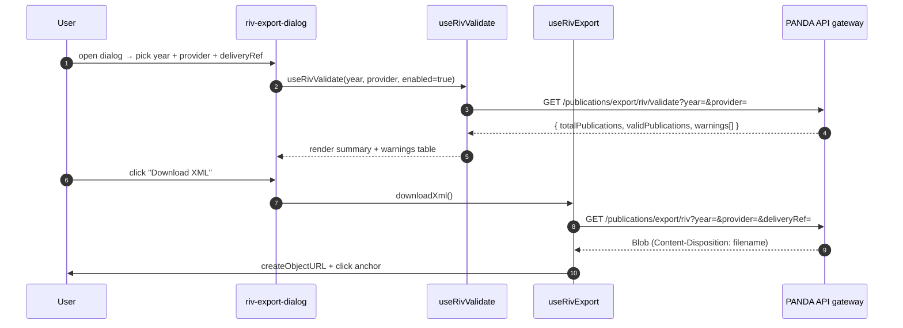

# Publications

The publications stack tracks scientific output (peer-reviewed articles, book chapters, conference proceedings, …), the researchers who produced it, and the grants that funded it. It is the **largest fully-REST module set in the codebase**: none of `Publication`, `Researcher`, or `Grant` appears in `src/server/apollo/schema.graphql` — the entire surface lives behind `/publication`, `/publications`, `/researcher(s)`, `/grant(s)` REST endpoints (the gateway side likely backs them with Neo4j nodes, but the GraphQL surface does not expose them).

Four modules under `src/modules/`:

- `publication/` — single-publication detail / create / edit (`/publication/[uid]`)
- `publications/` — list page with RIV export (`/publications/overview`)
- `researchers/` — list + form for "ELI authors" (`/publications/researchers`)
- `grants/` — list + form for grants (`/publications/grants`)

## Module locations

```
src/modules/publication/
├── publication-detail.cont.tsx          — /publication/[uid] detail+edit container
├── publication-update.cont.tsx          — orchestrates submit + navigation
├── form/scheme.ts                       — Zod (peer-reviewed + other variants)
├── form/__tests__/scheme.spec.ts
├── components/
│   ├── publication-form.comp.tsx        — primary form layout
│   ├── eli-authors-select.comp.tsx      — researcher picker
│   ├── grants-select.comp.tsx           — grant picker
│   ├── department.listbox.tsx           — single department combobox
│   ├── departments.comp.tsx             — repeating departments + author-count rows
│   └── web-link.field.tsx
├── hooks/
│   ├── usePublication.ts                — single read
│   ├── usePublicationMutation.ts        — POST / PUT
│   ├── usePublicationFields.ts          — derived form-field metadata
│   ├── useMediaTypeStore.ts             — Zustand: selected media-type variant
│   └── useGenerateUid.ts                — local-only uid generator (form rows)
├── types/
│   ├── responses.ts                     — Publication wire shape
│   ├── form.ts                          — re-exports + form type aliases
│   └── constants.ts                     — MEDIA_TYPE_UID, ELI_PUBLICATION, helpers
└── utils/formatters.ts

src/modules/publications/
├── publications.cont.tsx                — /publications/overview container
├── publications.columns.tsx
├── components/
│   ├── action-buttons.comp.tsx
│   ├── TitleCell.tsx
│   ├── export.button.tsx                — generic publications CSV export
│   ├── riv-export.button.tsx            — RIV-specific XML export button
│   ├── riv-export-dialog.cont.tsx       — RIV export wizard (validate → download)
│   └── riv-export-dialog.comp.tsx
├── hooks/
│   ├── usePublications.ts               — list query
│   ├── usePublicationDelete.ts          — delete mutation
│   ├── useRivValidate.ts                — pre-export validation
│   └── useRivExport.ts                  — XML download (blob)
└── types/responses.ts                   — overview row shape (note: drift from publication's Publication type)

src/modules/researchers/
├── researchers.cont.tsx                 — /publications/researchers list page
├── researchers.columns.tsx
├── form/researcher-form.{schema,comp,cont}.ts(x) + researcher-edit.cont.tsx
├── components/researcher-actions.comp.tsx
├── hooks/                               — useResearchers, useResearcher, useResearcherMutation,
│                                          useResearcherDelete, useOpenResearcherForm
└── types/researcher.types.ts

src/modules/grants/
└── (same shape as researchers)
```

Routes (`src/pages/`):

```
publication/index.tsx                 — /publication (create)
publication/[uid].tsx                 — /publication/<uid> (detail / edit)
publications/overview/index.tsx       — /publications/overview (list + RIV export)
publications/researchers/index.tsx    — /publications/researchers
publications/grants/index.tsx         — /publications/grants
```

## Data model (REST-side)

The data exists only as TypeScript interfaces today.



The publication entity carries 50+ scalar fields and ~12 codebook references — the largest form in the application. The shape lives in `src/modules/publication/types/responses.ts`.

### Media-type variants

The form is **driven entirely by `mediaTypeCb`** (a `MEDIA_TYPE` codebook entry). Three distinct shapes:

| Media type | Code / UID | Form variant | Extra fields |
|---|---|---|---|
| Peer-Reviewed Article | code `J`, uid `2a17af4e-806a-4189-9709-7565847e0619` | `publicationPeerReviewedSchema` | Standard journal fields (volume, issue, pages, impact factor, quartile) |
| Book Chapter | uid `a17ab43b-897e-4c3b-9a83-34cfce7f44e6` | "Other" variant + C fields | `publisher`, `publishPlace`, `isbn`, `bookTitle`, `bookPagesCount`, `editionVolume` |
| Conference Proceedings | uid `37906038-04f6-4a2b-b189-c9411f2f0784` | "Other" variant + D fields | `proceedingsIsbn`, `conferenceDate`, `conferencePlace`, `conferenceScopeCb` |

Predicates (`src/modules/publication/types/constants.ts`):

```ts
isMediaTypeC(uid)   // book chapter
isMediaTypeD(uid)   // conference proceedings
isMediaTypeCOrD(uid)
isPeerReviewedMediaType(mediaTypeCb)
```

`isPeerReviewedMediaType` falls back to a **name-prefix match** (`mediaTypeCb.name?.startsWith('J ')`) when the codebook response omits `code`. The hardcoded UIDs and the dual-mode predicate are flagged in [Deprecated / legacy](#deprecated--legacy).

### `eliResearchers` vs. `eliAuthors`

`Publication.eliResearchers` is the canonical array of `SelectedResearcher { uid, firstName, lastName }` — the "ELI authors" who are also tracked as `Researcher` entities. `eliAuthors` is a free-text fallback `string` field kept for backward compatibility. Both fields exist on the wire; new code uses `eliResearchers`. The Zod schema requires at least one researcher (`min(1, 'At least one ELI Author is required')`).

The companion picker `EliAuthorsSelect` (`components/eli-authors-select.comp.tsx`) pulls candidates from the researchers REST surface and dedupes by `uid`.

### `authorsDepartments`

`AuthorsDepartment { department, authorsCount }` is a repeating field — each row pairs a department codebook entry with how many ELI authors come from that department. Total across rows should equal `eliAuthorsCount`, but the schema does not enforce that sum.

## Form architecture



The top-level container `publication-detail.cont.tsx` decides which variant to render based on `mediaTypeCb` and threads RHF context through every sub-component. `useMediaTypeStore` (Zustand) holds the currently chosen variant so the form can switch shape without losing already-typed values for shared fields.

`usePublicationFields` derives per-field metadata (label, required, helper text) — used both by the form and by the table columns so column visibility tracks form structure.

## Fetcher surface

All REST. Keys from `src/utils/getEndpoints.ts`:

| Endpoint key | Path | Hook |
|---|---|---|
| `publication` | `/publication{uid?}` | `usePublication`, `usePublicationMutation` |
| `publications` | `/publications${query}` | `usePublications` |
| `publicationsExport` | `/publications/export${query}` | `useExport` (CSV button) |
| `rivValidate` | `/publications/export/riv/validate${query}` | `useRivValidate` |
| `rivExport` | `/publications/export/riv${query}` | `useRivExport` (XML blob) |
| `researcher` | `/researcher{uid?}` | researchers module |
| `researchers` | `/researchers${query}` | researchers module |
| `grant` | `/grant{uid?}` | grants module |
| `grants` | `/grants${query}` | grants module |

All hit the PANDA API gateway, all auth via `apiAccessToken`. No GraphQL surface — `src/server/apollo/schema.graphql` has zero matches for `Publication`, `Researcher`, or `Grant`.

## RIV export flow

The Czech *Register of Information about Results* (RIV) is a national research output registry. PANDA can export a year's worth of publications as RIV-compliant XML for a given provider.



Notable in `useRivExport`:

- **Direct `fetchRequestDetailed`** (`src/core/http/fetchClient.ts`) bypassing `queryMutate` because the response is a binary `Blob`.
- **Content-Disposition parsing** to recover the server-suggested filename, with a fallback to `riv-export-${year}-${provider}.xml`.
- **`window.URL.createObjectURL` + click-the-anchor** download — the canonical browser idiom for "save this blob".

`useRivValidate` is a normal TanStack query — the `enabled` flag delays the validation until the user has chosen year + provider.

## Permissions

Route-level (`src/lib/navigation/config.ts`):

```ts
[PATH.PUBLICATIONS]:    [ROLE.BASICS],
[PATH.PUBLICATION]:     [ROLE.BASICS],
[PATH.RESEARCHERS]:     [ROLE.PUBLICATIONS_EDIT],
[PATH.GRANTS]:          [ROLE.PUBLICATIONS_EDIT],
```

The publications **list and detail** are open to every authenticated user (`BASICS`); the researchers and grants admin surfaces require `PUBLICATIONS_EDIT`. Sidebar mirrors that split: *Overview* under `PUBLICATIONS_VIEW`, *Researchers* + *Grants* under `PUBLICATIONS_EDIT`.

UI-level: no `usePermission` calls in any of the four modules today — the route gate is the only frontend enforcement.

Schema-level: none. The entities are REST-only.

## Tests

Coverage is light compared to zones / room-cards:

- `src/modules/publication/form/__tests__/scheme.spec.ts` — Zod schema matrix for the peer-reviewed + other variants.

No local tests on the list pages, mutation hooks, or RIV export flow.

## Cross-module integration

- **Codebooks** — heavy consumer. ~12 codebooks: `MEDIA_TYPE`, `EXPERIMENTAL_SYSTEM`, `USER_CALL`, `USER_EXPERIMENT`, `OPEN_ACCESS_TYPE`, `LANGUAGE`, `COUNTRY`, `DEPARTMENT`, `PUBLICATION_CATEGORY`, `PUBLICATION_SUPPORT`, `PUBLISH_FORMAT`, `CONFERENCE_SCOPE`, `GRANT_GROUP`. See [Codebooks](./codebooks.md).
- **Researchers ↔ Publications** — `Publication.eliResearchers` references `Researcher.uid`. There is no inverse list on `Researcher` ("publications by this researcher"); the relationship is publication-driven.
- **Grants ↔ Publications** — same shape: `Publication.grants[]` references `Grant.uid`. No back-reference today.
- **Permissions model** — see role split above.
- **Wiki sync** — these pages publish to the GitHub wiki via the standard `sync-wiki.yml`.

## Deprecated / legacy

The most-marked module in the codebase. Quoted comments:

- `src/modules/publication/types/responses.ts:9` — `/** @deprecated use mediaTypeCb */` on `mediaType: string`. The old free-text variant is still on the wire.
- `:14` — `/** @deprecated use experimentalSystemCb */` on `experimentalSystem: string`. Same pattern.
- `:18` — `/**  @deprecated use userExperimentCb */` on `userExperiment: string`.
- `:45` — `/** @deprecated use grants array */` on `grant: string`.
- `eliAuthors` (no `@deprecated` tag, but commented "Deprecated: kept for backward compatibility") — superseded by `eliResearchers`.

Other smells:

- **Hardcoded media-type UIDs** in `src/modules/publication/types/constants.ts` (peer-reviewed, book chapter, conference proceedings). Same fragility as Orders' `ORDER_STATUS` "Requested" uid — a codebook reset breaks the variant selector.
- **Dual-mode `isPeerReviewedMediaType`** — matches `code === 'J'` *or* `name.startsWith('J ')`. The fallback exists because some codebook responses omit `code`. Document the API contract instead.
- **`publications/types/responses.ts` has its own `Publication` type** (overview row shape) that drifts from `publication/types/responses.ts`'s wire shape. Aliased on import to disambiguate. Consolidate.
- **Mixed Czech / English domain comments** in `publications/types/responses.ts` (e.g. `// codebook? - nevime, konkretni beam line`). Translate or remove before publishing.
- **No optimistic-concurrency handling** in `usePublicationMutation` — unlike Orders, there's no 409 path.
- **No `@authorization`** on any of these entities — the entire stack relies on `BASICS` / `PUBLICATIONS_*` route gates.

## Maintenance recommendations

1. **Drop the deprecated wire fields** once the gateway stops sending them. Five fields marked `@deprecated` across one file is the largest cluster in the repo.
2. **Replace hardcoded media-type UIDs** with code-based lookups (`mediaTypeCb.code === 'J'/'C'/'D'`). The codebook codes are stable; UIDs are environment-specific.
3. **Reconcile the two `Publication` types.** Either share `src/modules/publication/types/responses.ts` from the list module or codify the projection.
4. **Add `@authorization` to `Publication`, `Researcher`, `Grant`** once they enter the schema. Today there is no schema-level write protection.
5. **Translate or strip the Czech inline comments** in `publications/types/responses.ts` — they leak development context into wiki-synced docs.
6. **Cover RIV export with tests.** The most consequential UI in the module (compliance-driven, blob download, Content-Disposition parsing) has zero local coverage.
7. **Surface an explicit "deliveryRef" validator.** RIV requires a specific identifier format; today the input is a free-text field that the server validates.

## 🔮 Planned

- Migration of publications/researchers/grants to the GraphQL schema. Today they are REST-only; aligning would let publication writes participate in the audit-edge story.
- A "publications by researcher" inverse view — currently only the publication-side carries the link.
- Permissions Phase 1/2 do not directly affect publications. The `PUBLICATIONS_*` roles are already module-scoped.

## Open questions

- The publications list page (`/publications/overview`) requires `BASICS` — meaning *every* authenticated user sees every publication. Is that the intended audience, or should `PUBLICATIONS_VIEW` gate it instead?
- `Publication.code` is required and looks like a server-generated identifier (`useGenerateUid.ts` exists in the module). Is the code reused as the RIV identifier?
- `Researcher.identificationNumber`, `orcid`, `scopusId`, `researcherId` are all optional. Is any of them treated as the canonical key by RIV export? The validator returns `publicationCode` warnings — does it also warn on missing researcher IDs?
- The drift between `src/modules/publication/types/responses.ts` (`Publication`) and `src/modules/publications/types/responses.ts` (`Publication`) is named-collision risky in imports — was the projection intentional?

---

## Data model reference

> 🔧 *Engineer-only; stripped from the wiki.*
>
> No GraphQL schema entries exist for publications. Wire shapes live in `src/modules/publication/types/responses.ts`, `src/modules/researchers/types/researcher.types.ts`, `src/modules/grants/types/grant.types.ts`. Zod schemas in `src/modules/publication/form/scheme.ts`, `src/modules/researchers/form/researcher-form.schema.ts`, `src/modules/grants/form/grant-form.schema.ts`. RIV endpoints: `rivValidate`, `rivExport` (`src/utils/getEndpoints.ts`). Hardcoded UIDs: `src/modules/publication/types/constants.ts` (`MEDIA_TYPE_UID`).
