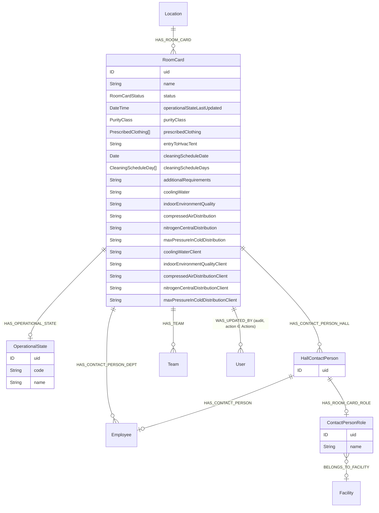
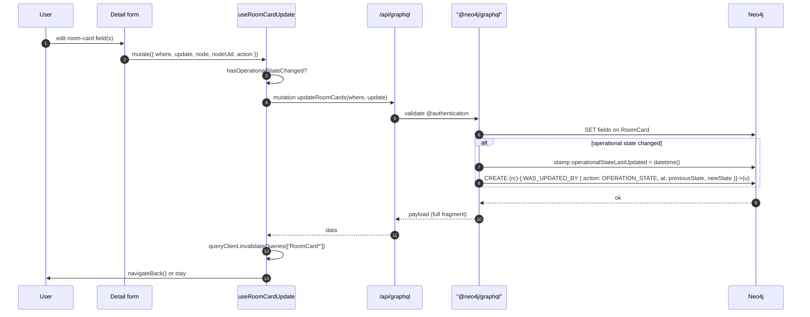

# Room Cards

Room Cards capture the *operational profile* of a physical room — cleanroom class, HVAC and utility specifications, prescribed clothing, contact persons, owning teams, and the rolling state of the room (dirty / clean / in preparation, plus the codebook-driven `OperationalState`).

This is the module where the codebase has most cleanly committed to **GraphQL via `@neo4j/graphql`**: every read and write is a generated GraphQL operation, the schema authoring directives are honoured end-to-end, and only the optional file-attachment surface goes through REST.

Two modules:

- `src/modules/roomCards/` — the `/room-cards` list page.
- `src/modules/roomCard/` — the `/room-card/[uid]` detail/edit page plus all per-card mutation hooks.

## Module locations

```
src/modules/roomCards/
├── RoomCards.cont.tsx                — /room-cards table page
├── components/
│   ├── RoomCards.columns.tsx
│   └── LocationCell.tsx
└── hooks/
    ├── useRoomCards.ts               — list query
    └── useRoomCardDelete.ts

src/modules/roomCard/
├── RoomCardDetail.cont.tsx           — /room-card/[uid] (edit)
├── RoomCardNew.cont.tsx              — /room-card (create)
├── RoomCard.comp.tsx                 — shared layout for both flows
├── components/
│   ├── RoomCardInfoCard.tsx          — header card
│   ├── RoomCardStatusIcon.tsx
│   ├── OperationalStateIcon.tsx
│   ├── OperationalStateHistoryButton.tsx
│   ├── OperationalStateHistoryModal.tsx
│   ├── RoomCardDetail.skeleton.tsx
│   └── table/                        — every per-relationship widget
│       ├── RoomCard.columns.tsx
│       ├── RoomCardLocationsCard.tsx        ── locations connect/disconnect
│       ├── AddLocationButton.tsx
│       ├── RoomCardContactsCard.tsx         ── hall contacts (HallContactPerson)
│       ├── ContactHallButton.tsx
│       ├── ContactHallModal.cont.tsx        ── create / edit hall contact
│       ├── DeptContactButton.tsx
│       ├── ContactDeptModal.cont.tsx        ── dept-contact picker
│       ├── TeamButton.tsx
│       ├── TeamModal.cont.tsx
│       ├── RoomCardCleanRoomsCard.tsx       ── cleanroom-specific fields
│       ├── RoomCardBuildingMaintenanceCard.tsx
│       ├── CellInput.tsx
│       └── CellWithDelete.tsx
├── schemas/roomCard.schema.ts        — Zod schema for the form
├── types/form.ts
├── hooks/
│   ├── useRoomCard.ts                — single-card read (GraphQL)
│   ├── useRoomCards.ts               — re-exports the list query
│   ├── useRoomCardContacts.ts        — locations / hall / dept contacts
│   ├── useRoomCardCreate.ts          — create mutation
│   ├── useRoomCardUpdate.ts          — update mutation (with audit metadata)
│   ├── useContactMutations.ts        — bundle of connect / disconnect mutations
│   ├── useOperationalStateHistory.ts — `WAS_UPDATED_BY` filtered to OPERATION_STATE
│   ├── useCanEditOperationalState.ts — predicate: is the user an Area Manager?
│   └── useTeams.ts
└── utils/
    ├── constants.ts
    ├── statusColors.ts               — status → Tailwind class
    └── index.ts                      — hasOperationalStateChanged, updateRoomCardVariables, …
```

Routes:

```
src/pages/room-cards/index.tsx     — /room-cards → RoomCardsContainer
src/pages/room-card/index.tsx      — /room-card → RoomCardNewContainer
src/pages/room-card/[uid].tsx      — /room-card/<uid> → RoomCardDetailContainer
```

## Data model



### Schema enums

`RoomCard` is one of the more enum-heavy entities in the schema (`src/server/apollo/schema.graphql:28-78`):

| Enum | Values | Used by |
|---|---|---|
| `RoomCardStatus` | `DIRTY_MODE`, `CLEAN_MODE`, `IN_PREPARATION_MODE` | `RoomCard.status` |
| `CleaningScheduleDay` | `MONDAY` … `SUNDAY` | `RoomCard.cleaningScheduleDays` (`[CleaningScheduleDay!]`) |
| `PrescribedClothing` | 13 items: `CAP`, `GLOVES`, `BEARD_COVER`, `SHOE_COVERS`, `OVERAL_ISO_5/7`, `BOOTS_ISO_5`, `SOCKS_ISO_5`, `CR_SHOES`, `HOOD`, `FACE_MASK`, `COAT`, `T_SHIRT_AND_TROUSERS` | `RoomCard.prescribedClothing` (`[PrescribedClothing!]`) |
| `PurityClass` | `ISO_5`, `ISO_6`, `ISO_7`, `ISO_8` | `RoomCard.purityClass` |
| `Actions` (shared) | `INSERT`, `UPDATE`, `DELETE`, **`OPERATION_STATE`** | `wasUpdatedBy.action` — see [Operational-state audit history](#operational-state-audit-history) |

### Facility vs. client utility fields

The schema declares **paired** utility fields — one for the facility's supply, one for the client's draw:

| Facility side | Client side |
|---|---|
| `coolingWater` | `coolingWaterClient` |
| `indoorEnvironmentQuality` | `indoorEnvironmentQualityClient` |
| `compressedAirDistribution` | `compressedAirDistributionClient` |
| `nitrogenCentralDistribution` | `nitrogenCentralDistributionClient` |
| `maxPressureInColdDistribution` | `maxPressureInColdDistributionClient` |

The split mirrors the user-facing distinction between *what we provide* and *what the lab expects to consume*. `RoomCard.comp.tsx` renders the two columns side-by-side in the same form.

### `HallContactPerson` is its own entity

Two flavours of contact person attach to a `RoomCard`:

- **`HAS_CONTACT_PERSON_DEPT`** → directly to `Employee`. No role metadata. The "department contact".
- **`HAS_CONTACT_PERSON_HALL`** → through a dedicated `HallContactPerson` node that carries a `ContactPersonRole` (e.g. *Area Manager*, *Area Manager - Deputy*). The hall contact list represents the on-site responsibility roster.

The intermediate `HallContactPerson` node lets the same `Employee` show up in multiple `RoomCard`s with different roles, and lets a single `RoomCard` track multiple roles on the same `Employee` if needed. The cost is one extra node-write per assignment and a custom mutation flow (`useCreateHallContact` / `useDeleteHallContact`).

## Fetcher style — GraphQL-first

Unlike most other modules, `roomCard` reads and writes through the **`useGraphQL` / `useGraphQLMutation`** wrappers (`src/hooks/fetch/useGraphQL`), which sit on top of TanStack Query and a server-side resolver pass. Hook-by-hook:

| Hook | Operation | Notes |
|---|---|---|
| `useRoomCard(uid)` | `RoomCardQuery` | All scalar fields plus `operationalState`. |
| `useRoomCardContacts*` | `RoomCardContactsHallQuery`, `RoomCardContactsDeptQuery`, `RoomCardLocationsQuery`, `RoomCardTeamsQuery` | Separate queries per relationship slice — kept narrow so mutations only invalidate the slice they changed. |
| `useRoomCardCreate` | `createRoomCards` (auto-generated) | Reuses the same fragment as the read. |
| `useRoomCardUpdate` | `updateRoomCards` | Passes `node`, `nodeUid`, `action` for audit-edge stamping (see [Operational-state audit history](#operational-state-audit-history)). |
| `useContactMutations.useConnectDeptContact` / `useDisconnectDeptContact` | `updateRoomCards` with nested `connect` / `disconnect` | Department contact toggles. |
| `useConnectTeam` / `useDisconnectTeam` | `updateRoomCards` (HAS_TEAM) | Team membership. |
| `useCreateHallContact` / `useDeleteHallContact` | `updateRoomCards` with create-node-on-edge | Custom because `HallContactPerson` itself needs to be created/deleted. |
| `useConnectLocation` / `useDisconnectLocation` | `updateRoomCards` (HAS_ROOM_CARD, inverse) | Location attachment. |
| `useOperationalStateHistory` | `RoomCardHistoryQuery` filtered to `edge: { action: OPERATION_STATE }` | The only consumer of the `OPERATION_STATE` audit action. |
| `useCanEditOperationalState` | `CurrentUserQuery` | Resolves the session user's `Employee.uid` and checks role membership. |
| `useRoomCardDelete` | `deleteRoomCards` | List-side. |

Endpoint-key REST entries in `src/utils/getEndpoints.ts` (`roomCard*`) exist but are largely unused in this module today — the migration to GraphQL is complete.



## Operational-state audit history

`RoomCard.updatedBy: [User!]` uses the shared `wasUpdatedBy` `@relationshipProperties` interface (see [Permissions model → Audit trail](./permissions-model.md#audit-trail)). What makes this module special is the dedicated `Actions.OPERATION_STATE` value — every operational-state flip writes an audit edge with that action, allowing the UI to surface a *separate* operational-state history without showing every other field edit.

`useOperationalStateHistory` issues:

```graphql
roomCards(where: { uid: $roomCardUid }) {
  updatedByConnection(where: { edge: { action: OPERATION_STATE } }) {
    edges { at, action, previousState, newState, node { uid, firstName, lastName, email } }
  }
}
```

`OperationalStateHistoryButton` + `OperationalStateHistoryModal` consume this directly.

`useRoomCardUpdate` decides whether to write the OPERATION_STATE edge by calling `hasOperationalStateChanged(previous, next)` (`src/modules/roomCard/utils/index.ts`). The frontend builds `previousState` / `newState` strings on the client and passes them along; the audit-edge resolver creates the edge.

## Operational-state edit gate

`useCanEditOperationalState(uid)` is the only place in the codebase that gates a field on **graph-derived role membership** rather than the JWT:

1. Reads the current user's `Employee.uid` via a `users(where: { uid: $userUid })` query.
2. Reads the room card's `contactPersonsHall` (with role).
3. Returns `true` iff the user's `Employee` shows up in the hall contacts **with role name `Area Manager` or `Area Manager - Deputy`**.

The role names are **string-matched verbatim** — they live in the `ContactPersonRole` codebook (`schema.graphql:34`), not in the `Role` table that powers JWT roles. Renaming a `ContactPersonRole` therefore silently breaks the edit gate. See [Open questions](#open-questions).

## Form architecture

`RoomCardDetail.cont.tsx` and `RoomCardNew.cont.tsx` share `RoomCard.comp.tsx` for layout. The form uses:

- **Zod** (`schemas/roomCard.schema.ts`) — the typical house style.
- **RHF** with `useForm({ resolver: zodResolver(...) })`.
- **Optimistic UI** for connect/disconnect mutations via `queryClient.invalidateQueries(['<slice>'])` after success.
- `usePermission([ROLE.ROOM_CARD_EDIT])` at `RoomCardDetail.cont.tsx:45` and `RoomCardNew.cont.tsx:24` for the page-level gate.
- `useCanEditOperationalState(uid)` for the field-level gate on `operationalState`.

### Permission layers

```mermaid
flowchart TD
    A[Authenticated user] --> B{has ROLE.ROOM_CARD_VIEW or ROOM_CARD_EDIT?}
    B -->|no| Block[Middleware → /404]
    B -->|yes| C[/room-card/uid renders]
    C --> D{has ROLE.ROOM_CARD_EDIT?}
    D -->|no| ReadOnly[All fields read-only]
    D -->|yes| E[Editable form]
    E --> F{useCanEditOperationalState\nuser is Area Manager / Deputy?}
    F -->|no| OSReadOnly[operationalState field locked]
    F -->|yes| OSEditable[operationalState editable]
```

This is the only place in the app where field-level edit permission is computed from data, not from JWT roles. See [Permissions model → Open questions](./permissions-model.md#open-questions).

## Cross-module integration

- **Locations** — `Location.roomCards: [RoomCard!]!` via `HAS_ROOM_CARD` (`schema.graphql:25`). The roomCard module owns the inverse `RoomCard.locations` query and the connect/disconnect modal.
- **Teams** — `RoomCard.teams: [Team!]` via `HAS_TEAM`. `Team` is a codebook-like entity (`schema.graphql:117-121`).
- **Employees + ContactPersonRole** — for the hall and dept contact rosters.
- **OperationalState codebook** — `OperationalState` is `@authentication`-only with `uid`, `code`, `name` (`schema.graphql:80`). Lives next to other codebooks in [Codebooks](./codebooks.md) (planned).
- **Audit** — `WAS_UPDATED_BY` edge writes participate in the [Permissions model → Audit trail](./permissions-model.md#audit-trail) story. The `OPERATION_STATE` action is unique to this module.

## Permissions

Route-level (`src/lib/navigation/config.ts`):

```ts
[PATH.ROOM_CARDS]: [ROLE.ROOM_CARD_VIEW, ROLE.ROOM_CARD_EDIT],
[PATH.ROOM_CARD]:  [ROLE.ROOM_CARD_VIEW, ROLE.ROOM_CARD_EDIT],
```

UI-level: `usePermission([ROLE.ROOM_CARD_EDIT])` (page-wide read-only flip) and `useCanEditOperationalState(uid)` (field-level gate).

Schema-level: `@authentication` only — no `@authorization` directive on `RoomCard`, `HallContactPerson`, `OperationalState`, or `ContactPersonRole`. See [Permissions model → Maintenance](./permissions-model.md#maintenance-recommendations).

## Tests

The module ships without local `__tests__/` folders. Coverage is implicit through component tests in `src/components/` and integration via Playwright (`e2e/` does not currently include a room-cards scenario).

## Deprecated / legacy

- **`refetchQueries` TODO** — `src/modules/roomCard/hooks/useRoomCardCreate.ts:39` carries `// TODO: refetchQueries: ['RoomCards', 'RoomCard']`. Today the consumer manually `refetch`es; the comment suggests a centralised approach was considered.
- **Verbatim role-name strings** in `useCanEditOperationalState` (`'Area Manager'`, `'Area Manager - Deputy'`) — codebook-driven role names baked into client code. Rename in Neo4j and the edit gate silently fails.
- **No `@authorization`** on `RoomCard` (or any related type). The route gate + UI gate together cover the realistic threat model, but a hand-crafted mutation can bypass the field-level edit logic.
- **`useRoomCards` is duplicated.** `src/modules/roomCards/hooks/useRoomCards.ts` is the list-page hook; `src/modules/roomCard/hooks/useRoomCards.ts` re-exports it. Pick one home.
- **`OperationalState` audit relies on client-built strings** — `previousState` and `newState` are formatted client-side before being sent to the audit edge. Diff drift between client formatter and any future server-side renderer would produce non-comparable history rows.

## Maintenance recommendations

1. **Move the Area-Manager check to a JWT-time role** (or a graph predicate evaluated server-side). Today the check happens **after** GraphQL has authorised the update — a hand-crafted mutation can succeed even when the UI grays the field out.
2. **Resolve `useRoomCardCreate.ts:39`** by adopting the consistent invalidation pattern (a single `queryClient.invalidateQueries({ queryKey: ['RoomCards'] })` inside the hook's `onSuccess`).
3. **Capture the audit-string format** server-side. `previousState` / `newState` should be canonical codes (e.g. `OperationalState.code`) rather than human-readable names, and any rendering belongs in the UI.
4. **Add `@authorization` to `RoomCard`** mirroring `ROLE.ROOM_CARD_EDIT` for writes. Catches mutations that bypass the route gate.
5. **Codify the facility/client utility-field pairs** as a single typed structure (`UtilityPair { facility, client }`) — both the schema and the form treat them as ten independent strings today.
6. **Bring the hall-contact / dept-contact + team / location modals onto one shared "select employee / team / role" primitive.** Today each gets its own `*Modal.cont.tsx`.

## 🔮 Planned

- Permissions Phase 1/2 do not directly affect room cards (no system-level scoping). Phase 2's team-based enforcement is closest in spirit — `RoomCard.teams` is already populated and would be a natural anchor.
- A second `Actions` audit action (e.g. `STATUS`) for `status` changes, mirroring `OPERATION_STATE`. No concrete plan today.

## Open questions

- The Area Manager / Area Manager - Deputy strings are codebook entries — should the codebook expose stable `code` values the client can match against instead of `name`?
- `useCreateHallContact` writes a brand new `HallContactPerson` node and the edge in one mutation. Is there a deduplication path for "same Employee + same RoomCard + same role" — or do duplicates just stack?
- The `OperationalState` history view filters on `action: OPERATION_STATE`. Are there cases where the same field is updated via `action: UPDATE` (e.g. data migrations) that we'd want to surface in the same view?
- `useRoomCardUpdate` invalidates broad cache keys. Is there a contract for which slice each connect/disconnect mutation invalidates (today implicit per hook)?

---

## Data model reference

> 🔧 *Engineer-only; stripped from the wiki.*
>
> Schema: `RoomCard`, `RoomCardStatus`, `CleaningScheduleDay`, `PrescribedClothing`, `PurityClass`, `OperationalState`, `HallContactPerson`, `ContactPersonRole`, `Actions.OPERATION_STATE` (`src/server/apollo/schema.graphql:28-115` and `wasUpdatedBy` interface at `:247-260`). GraphQL wrappers: `src/hooks/fetch/useGraphQL.ts`. Form schema: `src/modules/roomCard/schemas/roomCard.schema.ts`.
