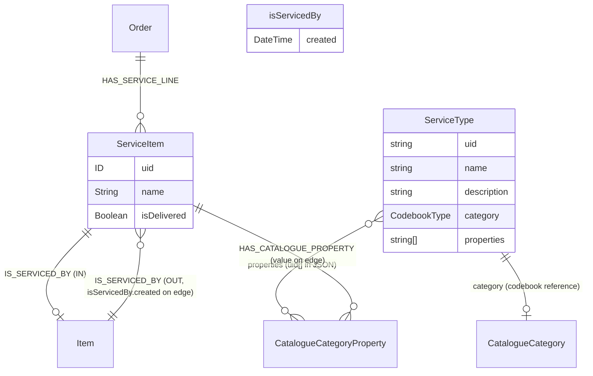
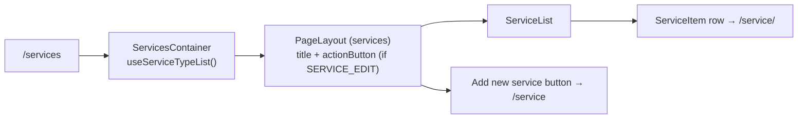
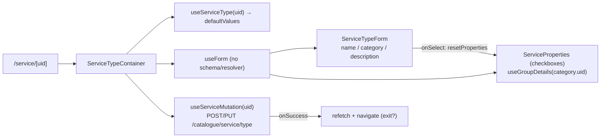

# Services

Services in PANDA are the *catalogue of repair, calibration, and maintenance offerings* — not the work orders themselves. A `ServiceType` declares what can be ordered (name, target catalogue category, optional property subset). Concrete service work is tracked as `ServiceItem` instances created by [Orders](./orders-and-order-items.md) and linked back to the `Item` being serviced via `IS_SERVICED_BY`.

Two modules:

- `src/modules/services/` — the `/services` list page and shared hooks.
- `src/modules/serviceTypeItem/` — the `/service/[uid]` (or `/service`) detail/edit page for a single service type.

## Module locations

```
src/modules/services/
├── services.cont.tsx                — /services page: list of ServiceTypes
├── components/
│   ├── layout/ServiceLayout.tsx
│   └── serviceTypes/
│       ├── ServiceList.tsx           — list rows
│       ├── ServiceItem.tsx           — single row
│       └── DeleteService.btn.tsx
├── hooks/
│   ├── useServiceTypeList.ts         — GET /catalogue/service/types
│   ├── useServiceType.ts             — GET /catalogue/service/type/<uid>
│   ├── useServiceMutation.ts         — POST / PUT /catalogue/service/type
│   └── useServiceTypeDelete.ts       — DELETE /catalogue/service/type/<uid>
└── types/responses.ts                — ServiceTypeResponse shape

src/modules/serviceTypeItem/
└── form/
    ├── service-type.form.tsx         — header form (name, category, description)
    └── serivce-properties.cont.tsx   — property-checkbox section (typo intentional)
└── ServiceType.cont.tsx              — /service/[uid] container
```

Routes:

```
src/pages/services/index.tsx     — /services → ServicesContainer
src/pages/service/index.tsx      — /service → ServiceTypeContainer (create)
src/pages/service/[uid].tsx      — /service/<uid> → ServiceTypeContainer (edit)
```

## Data model

There are **two distinct schema concerns** named "service":



| Concept | Schema | Owner module | Purpose |
|---|---|---|---|
| **`ServiceType`** | _REST-only resource at `/catalogue/service/type{...}`_ | `src/modules/services/`, `serviceTypeItem/` | A definition — "what kind of service we offer". Selects a catalogue category and a subset of its properties to apply when this service is performed. |
| **`ServiceItem`** | `schema.graphql:414-427` | Created and managed by [Orders](./orders-and-order-items.md) | A *single occurrence* of a service. Lives on an order's `HAS_SERVICE_LINE` edge; points at the `Item` it serviced through `IS_SERVICED_BY`. |

Service-type metadata does **not** appear in `schema.graphql`. The `serviceType` / `serviceTypeList` REST endpoints back a separate (presumably catalogue-side) store. The on-graph entity is `ServiceItem` only.

### `ServiceItem` reuses the property bag

`ServiceItem.details` consumes the same `HAS_CATALOGUE_PROPERTY` edge with the same `hasCatalogueProperty.value` interface as [Catalogue items](./catalogue-and-items.md#three-layer-property-model). The Service-type author picks **which** of the category's properties this service fills; at execution time the order's service line fills those properties with concrete values.

## Page flows

### List (`/services`)



The container is minimal — list query, permission gate for the "Add" button (`ROLE.SERVICE_EDIT`), and a stateless list. No filters, no pagination, no URL state.

### Edit (`/service/[uid]`)



The category combobox carries an `onSelect` that resets the properties form value — switching category invalidates the previous checkbox selection because the property set is per-category. The properties section consults `useGroupDetails(category?.uid)` (imported from the catalogue module — see [Cross-module dependencies](#cross-module-dependencies)) to fetch the category's property groups and renders one checkbox per property.

On submit the array of selected property uids is reconstructed from the boolean map:

```ts
// ServiceType.cont.tsx:42-48
const newProperties = Object.keys(data.properties)
    .map(key => (data.properties[key] ? key : null))
    .filter(Boolean)
```

…and persisted as `properties: string[]`. This is the canonical wire shape; the RHF representation (`Record<uid, boolean>`) is form-only.

## Fetcher surface

All operations are REST against the catalogue subtree. Endpoint keys from `src/utils/getEndpoints.ts`:

| Endpoint key | Path | Hook |
|---|---|---|
| `serviceTypeList` | `/catalogue/service/types${query}` | `useServiceTypeList` |
| `serviceType` | `/catalogue/service/type{uid?}` | `useServiceType`, `useServiceMutation`, `useServiceTypeDelete` |
| `serviceLineDelivery` | `/order/{uid}/serviceline/{itemUid}/delivery` | _orders module_ (`useServiceDelivery`) |
| `serviceLinesDeliverAll` | `/order/{uid}/servicelines/delivery` | _orders module_ (`useServiceDeliveryAll`) |

No GraphQL operations.

## Cross-module dependencies

The services module is **not** self-contained — `ServiceProperties` imports two pieces from the catalogue module:

```ts
// src/modules/serviceTypeItem/form/serivce-properties.cont.tsx
import useGroupDetails from '@/modules/catalogueItem/hooks/useGroupDetails'
import type { CatalogueItemDetail } from '@/modules/catalogueItem/types/responses'
```

That dependency is structural: a service type *is* a subset of a catalogue category's property metadata, and `useGroupDetails` is the only existing reader for that shape. The coupling is justified but worth understanding — refactors in catalogue ripple into services.

Other cross-module touch points:

- **Orders** — `useServiceDelivery` / `useServiceDeliveryAll` write `ServiceItem.isDelivered`. See [Orders](./orders-and-order-items.md#delivering-an-order-line).
- **Catalogue** — `ServiceTypeForm` uses `ComboboxTree` against `CODEBOOK.CATALOGUE_CATEGORY` to pick the category.
- **Items** — `Item.serviceItems` exposes the inverse `IS_SERVICED_BY` edge so a system-item detail page can list a service history.

## Permissions

`PATH_ROLES_CONFIG` (`src/lib/navigation/config.ts`):

```ts
[PATH.SERVICES]: [ROLE.BASICS],
[PATH.SERVICE]:  [ROLE.BASICS],
```

Both routes are gated on the lowest role — every authenticated user can land on them. **Write permission** (`ROLE.SERVICE_EDIT`) is enforced only by `usePermission` in:

- `ServicesContainer:20` — hides the "Add new service" button.
- `ServiceTypeForm:12`, `ServiceProperties:14` — disables form fields.

The corresponding read role `ROLE.SERVICE_VIEW` (`catalogue-service-view`) exists in the enum but is **not** consulted anywhere in this module. `ServiceItem` itself is `@authentication`-only on the schema (`schema.graphql:414`), with no `@authorization` directive — same caveats as Orders and Catalogue.

## Tests

Neither `src/modules/services/` nor `src/modules/serviceTypeItem/` ships local `__tests__/`. Service-line behaviour does have coverage on the orders side: `src/modules/orderItem/utils/__tests__/service-line-details.spec.ts`.

## Deprecated / legacy

- **No `@authorization` on `ServiceItem`.** Same gap as `Order` and `CatalogueItem` — schema-level write protection is missing.
- **`ROLE.SERVICE_VIEW`** exists in the enum but is never consumed. Either wire it into `PATH_ROLES_CONFIG[PATH.SERVICES]` to tighten the gate or delete it.
- **Filename typo** — `serivce-properties.cont.tsx` (note `serivce`). Single-rename PR.
- **No Zod / yup schema** on the service-type form. Validation is implicit (required attribute via component contracts). Aligning with the rest of the family is cheap.
- **`useServiceMutation` swallows the error** beyond a toast — no log, no telemetry hook. Acceptable, but if/when an error pipeline lands, this is one of the places to wire.
- **No `useServiceMutation.onSuccess`** invalidation. The container's `refetch` calls handle it, which works because the list and detail hooks are both `useQuery`-based, but a `queryClient.invalidateQueries(['useServiceTypeList'])` inside the hook would be more discoverable.
- **`useServiceMutation` mutation key** is `['serviceType', { uid }]` — the same key the list hook uses for *reads*. Won't conflict but is unconventional.

## Maintenance recommendations

1. **Rename `serivce-properties.cont.tsx` → `service-properties.cont.tsx`.** Cosmetic, but cheap.
2. **Add a Zod schema** to the service-type form. Required: `name`, `category`. Optional with default `[]`: `properties`. Brings the module into line with [Local development & conventions](./local-development.md).
3. **Move list invalidation inside `useServiceMutation`.** Today the container does `refetch()` manually — a single `queryClient.invalidateQueries({ queryKey: ['useServiceTypeList'] })` in the hook's `onSuccess` would centralise the contract.
4. **Wire `ROLE.SERVICE_VIEW` into the route gate** (`PATH_ROLES_CONFIG[PATH.SERVICES]`) or delete the enum entry.
5. **Add `@authorization` to `ServiceItem`.** Mirror the role split — `ORDERS_DELIVERY_EDIT` for `isDelivered`, `SERVICE_EDIT` (or `ORDERS_EDIT`) for the rest.
6. **Extract `useGroupDetails`** into `src/modules/shared/catalogue/` so services does not reach across module boundaries. The structural dependency stays; the import path becomes a shared one.

## 🔮 Planned

- A service-history view on `Item` (already supported by the schema via `Item.serviceItems`) — no UI surface today.
- Schema-level enforcement of who can flip `ServiceItem.isDelivered` — see [Maintenance #5](#maintenance-recommendations).
- Permissions Phase 1/2 do not directly affect services today; they are facility-level write-gated, not system-level.

## Open questions

- Is `ServiceType` a frontend-only construct (REST endpoints only), or does Neo4j hold `ServiceType` nodes that the schema simply does not expose? The `/catalogue/service/type*` endpoints feel graph-backed, but the schema is silent.
- Why does the services module use `ROLE.SERVICE_EDIT` (`catalogue-service-edit`) but `PATH_ROLES_CONFIG` gates the routes on `ROLE.BASICS` instead of a stricter view role? Intentional looseness or oversight?
- `useGroupDetails` returns category properties; when a category's property set *changes* after a service type has been authored, the saved `properties` uid array can drift. Does the backend or frontend handle that drift?
- `ServiceProperties` does not surface a "select all" or "clear" — for service types tied to large categories the UX is checkbox-heavy. Worth a follow-up?

---

## Data model reference

> 🔧 *Engineer-only; stripped from the wiki.*
>
> Schema (graph-side): `ServiceItem` (`src/server/apollo/schema.graphql:414-427`), `isServicedBy` `@relationshipProperties` interface (`schema.graphql:410-412`), `Item.serviceItems` (`schema.graphql:403-404`). Service-type metadata: REST-only, no schema declaration. Endpoint catalogue: `src/utils/getEndpoints.ts` (`serviceTypeList`, `serviceType`, `serviceLineDelivery`, `serviceLinesDeliverAll`). Form types: `src/modules/services/types/responses.ts`.
