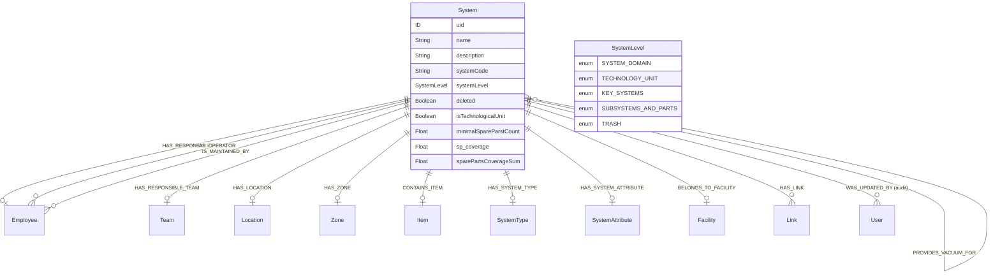
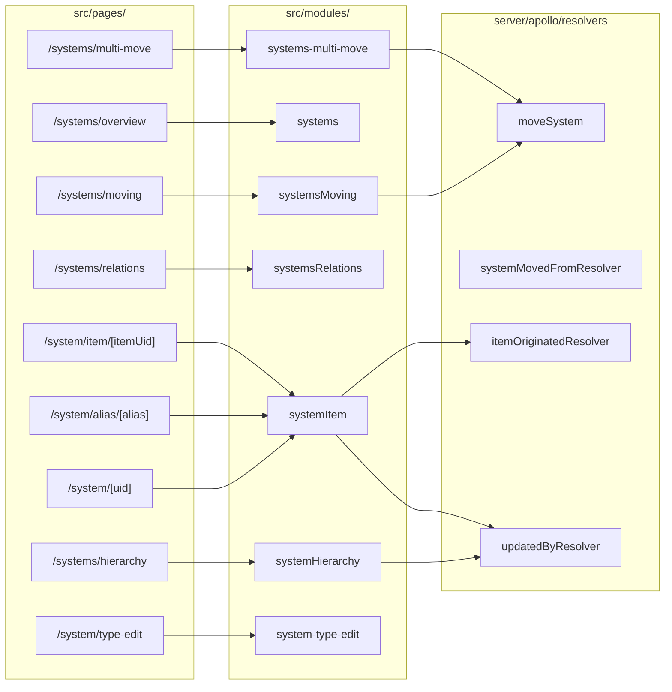
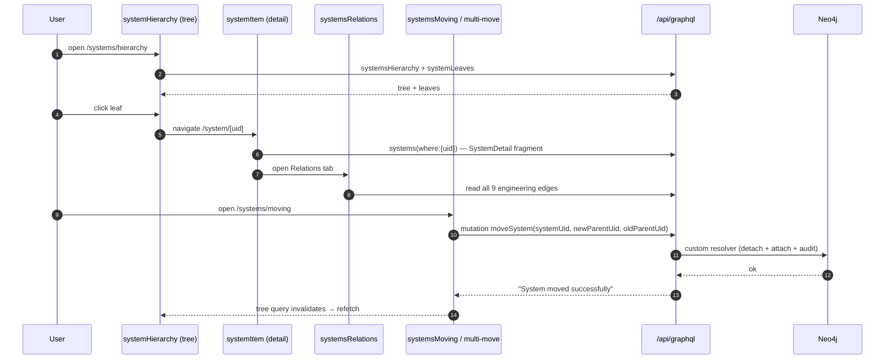

# Systems family

The systems family covers every module that reads or writes the `System` graph — the central entity around which ELI PANDA is built. Seven Next.js modules collaborate around this entity, each with its own UI surface and dedicated subpage in this directory.

> User-facing companion: [System Hierarchy user guide](../../user-guide/systemHierarchy/README.md).

## In this directory

| Page | Module(s) | Surface |
|---|---|---|
| [System Hierarchy](./system-hierarchy.md) | `src/modules/systemHierarchy/` | `/systems/hierarchy` — tree explorer, leaves panel, tabbed detail, relationship graph |
| [Systems overview](./systems-overview.md) | `src/modules/systems/` | `/systems/overview` — flat table |
| [System item (detail)](./system-item.md) | `src/modules/systemItem/` | `/system/[uid]` — detail page, sub-systems, spares, relations |
| [Relations & spares](./relations-and-spares.md) | `src/modules/systemsRelations/` | `/systems/relations` — engineering relations + spare-for tables |
| [Moving systems](./moving.md) | `src/modules/systemsMoving/`, `src/modules/systems-multi-move/` | `/systems/moving`, `/systems/multi-move` |
| [System type editor](./system-type-edit.md) | `src/modules/system-type-edit/` | `/system/type-edit` |

## Data model

The systems family revolves around the `System` type. The full entity ships seventeen non-structural relationships in `src/server/apollo/schema.graphql:296-369`.



Two `@cypher` fields are computed at read time (`schema.graphql:348-369`):

- **`keySystem`** — walks up `:HAS_SUBSYSTEM` and returns the nearest ancestor whose `systemLevel` is `TECHNOLOGY_UNIT` or `KEY_SYSTEMS`.
- **`parentPath: [ParentPathItem]`** — collects the full ancestor chain up to 50 levels, reversed (root first). Used by every breadcrumb in the UI.

### `SystemInterface`

`SystemInterface` (`schema.graphql:266-294`) declares the read shape that *both* `System` and the read-only `ParentPathItem` projection satisfy. Most fragments in `src/utils/graphql/fragments/` consume the interface, not the concrete type, so a `SystemDetail`-shaped object can be primed before the network fetches the real one — see [System Hierarchy → `primeSystemDetailCache`](./system-hierarchy.md#primeSystemDetailCache).

### Engineering relationship matrix

Nine relationship types — one structural plus eight engineering. The matrix lives in code (`src/modules/systemHierarchy/types/graph.ts` exports `RELATIONSHIP_DEFINITIONS`):

| Cypher edge | Forward field | Inverse field | Domain meaning |
|---|---|---|---|
| `HAS_SUBSYSTEM` | `subSystems` | `parentSystem` | Hierarchy / tree parent-child (1-to-1 child) |
| `IS_SPARE_FOR` | `sparePartsFor` | `spareParts` | Designated spare relationship (carries `coverage`) |
| `IS_POWERED_FROM` | `poweredFrom` | `powers` | Electrical supply |
| `IS_COOLED_FROM` | `cooledFrom` | `cools` | Cooling |
| `IS_CONTROLLED_BY` | `controlledBy` | `controls` | Control signal |
| `IS_INTERLOCKED_BY` | `interlockedBy` | `interlocks` | Safety interlock |
| `PROVIDES_DATA_TO` | `providesDataTo` | `receivesDataFrom` | Data feed |
| `DIRECTS_BEAM_TO` | `directsBeamTo` | `receivesBeamFrom` | Optical / particle beam path |
| `PROVIDES_VACUUM_FOR` | `providesVacuumFor` | `receivesVacuumFrom` | Vacuum supply |

The relationship-properties interfaces (`IsSpareFor`, `wasUpdatedBy`) carry metadata on the edge itself.

## Schema authorization

`System` is one of only two entities with `@authorization` (`schema.graphql:297-305`):

```graphql
type System implements SystemInterface
    @authorization(
        validate: [
            { operations: [READ], where: { jwt: { roles_INCLUDES: "systems-view" } } }
            {
                operations: [UPDATE, CREATE, DELETE, READ]
                where: { jwt: { roles_INCLUDES: "systems-edit" } }
            }
        ]
    )
```

Read with `systems-view` *or* `systems-edit`; write requires `systems-edit`. Note `admin` is **not** mentioned — see [Permissions model](../permissions-model.md#open-questions).

## Custom resolvers

`@neo4j/graphql` auto-generates most CRUD. Four custom mutations live in `src/server/apollo/resolvers/` and exclusively check `context.authorization.isAuthenticated`:

| Resolver | File | What it writes |
|---|---|---|
| `moveSystem` | `moveSystemResolver.ts` | Atomic: detach all `HAS_SUBSYSTEM` parents, attach new parent, write `WAS_MOVED_FROM`. |
| `systemMovedFromResolver` | `systemMovedFromResolver.ts` | Standalone audit edge `(:System)-[:WAS_MOVED_FROM]->(:System)`. |
| `itemOriginatedResolver` | `itemOriginatedResolver.ts` | `(:Item)-[:IS_ORIGINATED_FROM]->(:System)` when an item moves between systems. |
| `updatedByResolver` | `updatedByResolver.ts` | Generic `WAS_UPDATED_BY` audit edge — see [Permissions model → Audit trail](../permissions-model.md#audit-trail). |

## Module map



`src/pages/system/alias/[alias].tsx` resolves a human-readable alias to a `uid` and reuses the `systemItem` module; `src/pages/system/item/[itemUid].tsx` opens a system from a physical-item reference.

## Cross-module flows



## Front-end conventions

The systems family is the densest test of every house pattern documented in [Local development & conventions](../local-development.md):

- **Container vs. component split** is strict — see `SystemHierarchyExplorer.cont.tsx` (one screen, four containers).
- **Fetcher choice is mixed**: most modules use `queryFetcher` against the REST gateway (`getEndpoints` keys like `systemsHierarchy`, `systemsList`, `systemDetail`), but `systemItem` and parts of `systemHierarchy` issue **direct GraphQL** via `graphql-request` (`request('/api/graphql', ...)`). See [Open questions](#open-questions).
- **Zustand stores** persist UI state across navigations — eight stores between these modules (see [Stores](#stores)).
- **React Flow** drives the graph view in `systemHierarchy/components/graph/` and `systemItem/components/relationships/`.
- **React Hook Form + Zod** is used in `systemItem` and `systemsMoving` for edit forms.

### Stores

| Store | Module | Persisted? | Purpose |
|---|---|---|---|
| `useHierarchyStore` | `systemHierarchy` | yes (`persist`) | Tree expansion, graph expansion, copy-paste buffer (`copiedSystemUid`), graph layout mode |
| `useDetailGraphStore` | `systemHierarchy` | yes (`persist`) | Per-system detail graph: visible relationship types, layout mode, expanded nodes |
| `useSystemItemStore` | `systemItem` | no | Current edit state (`editMode`, `dirty`) for the system form |
| `useSystemContext` | `systemItem` | no | UID/router context shared across child containers |
| `useRelationsStore` | `systemsRelations` | no | Selection + filter state for the cross-systems relations table |
| `useSystemMovingStore` | `systemsMoving` | no | Source/destination + dialog state for single-system move |
| `useSystemsMoveStore` | `systems-multi-move` | no | Bulk move selection + status |

Two `persist`ed stores mean expansion state and graph layout survive navigation and tab switches but **not** server-rendered initial loads — they are populated from `localStorage` on hydration.

## Deprecation & maintenance audit

### Deprecated / legacy

- `src/modules/systemItem/components/form/SystemForm.cont.tsx:49` — `// TODO: split to update and create form`. The same RHF surface handles both create and edit; mode is inferred from `uid` presence. Splitting would clarify validation and reduce the "if `uid`" branches.
- `src/modules/systemItem/components/form/SystemForm.fields.ts:98` — `// TODO: add itemConditionStatus`. The physical-item edit on the system form omits `conditionStatus`; the Catalogue Item flow has it. Decide whether systems can edit this field too.
- `src/modules/systems/components/SearchBarButtons.tsx:16` — `// TODO: refetch()???`. Action follow-through (refetch after CSV export?) is undecided.
- `src/modules/systems/components/filters/SystemsFilterButton.cont.tsx:37` — `// Support both new 'side' prop and legacy 'panelSlide' prop`. Carry a deprecation warning, plan removal of `panelSlide`.
- **Direct `graphql-request` calls** in `systemHierarchy/hooks/queries/useSystemDetail.ts` and `systemItem` — bypass `queryFetcher` and the abort-signal plumbing. Either standardise on the `useGraphQL` wrapper (already imported elsewhere) or codify the case for direct calls.
- Duplicate utility: `useSubsystems` exists in both `src/modules/systems/hooks/` and `src/modules/systemItem/hooks/`. They differ slightly — one fetches via REST endpoint, one via GraphQL. Reconcile.
- Three competing "edit a system" surfaces — `systemItem/components/form/SystemForm`, `shared/system/system-edit/` (consumed by Hierarchy detail sidebar), and `systemsMoving/form/system-moving-edit.form.tsx`. Each duplicates schema + UI. Consolidation candidate.

### Maintenance recommendations

1. **Pick one fetcher style for the family.** `queryFetcher` + endpoint key is the documented convention; `graphql-request` direct calls hide behind no helper. Migrating `useSystemDetail` and friends to a `useGraphQL` wrapper would normalise abort signals, dev-time validation, and logging.
2. **Resolve the three system-edit surfaces.** They all produce the same Cypher mutation eventually — collapse to one container with mode switches.
3. **Document `RELATIONSHIP_DEFINITIONS`** as the canonical source of relationship metadata. It lives in `systemHierarchy/types/graph.ts` and is referenced by both detail-graph store and explorer toolbars; modules outside `systemHierarchy` that need the same metadata re-export from `shared/system/`.
4. **Add `@authorization` to derived entities.** `Item`, `Link`, `Order` are written by these flows but are `@authentication`-only. Today the gate happens implicitly because mutation paths go through the `System` directive — but a hand-crafted mutation against `Item.uid` skips the check. See [Permissions model → Maintenance](../permissions-model.md#maintenance-recommendations).
5. **Centralise audit-edge writing.** Every mutation hook that wants `WAS_UPDATED_BY` calls `updatedByResolver` by hand. A `useAuditedMutation` wrapper around `queryMutate` would prevent gaps.
6. **Type the relationship matrix.** `RELATIONSHIP_DEFINITIONS` is `Record<string, …>` — promoting it to a `Record<RelationshipType, …>` (a stricter union of the 9 types) would catch typos at compile time.

## 🔮 Planned

- **Permissions Phase 1** — `SYSTEM_DOMAIN` and `TECHNOLOGY_UNIT` admin-only; lower levels for `systems-edit`. The schema directive is the change point. See [Permissions model → 🔮 Planned](../permissions-model.md#-planned).
- **Permissions Phase 2** — team-scoped writes via `responsibleTeam`. Blocked on the absent `User`/`Employee` → `Team` membership edge.
- **System creation in Hierarchy** — today creation lives in `systemItem`; the user guide flags moving it into the Hierarchy module.
- **Drag-and-drop move at hierarchy level** — would obviate the dedicated `systemsMoving` module.
- **Use Spare in production** — the spare-swap wizard is wired into Hierarchy's Spare Parts tab (and the existing systemItem + overlay callers) on top of the shared `useSpareDialog`. Cache invalidation across all callers goes through `matchesSpareAffectedQuery` ([System Hierarchy → Cache invalidation for spare flows](./system-hierarchy.md#cache-invalidation-for-spare-flows)). The `enableSparePartsAssignment` feature flag still disables the button in production.

## Open questions

- Should `useSystemDetail` keep its hand-rolled `primeSystemDetailCache` + `graphql-request` path, or migrate to `useGraphQL` + TanStack Query? See `src/modules/systemHierarchy/hooks/queries/useSystemDetail.ts:38-46` for the rationale comment.
- `useSubsystems` exists twice (REST + GraphQL flavours) with different return shapes. Which is canonical?
- Is `system/alias/[alias].tsx` actively used by external systems linking into PANDA, or is it a vestigial route?
- `RELATIONSHIP_DEFINITIONS` includes `HAS_SUBSYSTEM` but it is hidden by default in the detail graph (`HIDDEN_BY_DEFAULT`) — is the structural edge meant to be re-enabled or should it leave the matrix entirely?

---

## Data model reference

> 🔧 *This section is for engineers reading the docs in the repo. The wiki generator strips it.*
>
> Authoritative entity definitions live in `src/server/apollo/schema.graphql`. Systems-family types: `System`, `SystemInterface`, `ParentPathItem`, `SystemLevel`, `SystemType`, `SystemTypeGroup`, `SystemAttribute`, `SystemImportance`, `SystemCriticality`, `Link`, `Item`, `IsSpareFor`, `wasUpdatedBy`, `Actions`. Generated TS types in `src/types/gql/graphql.ts`. The relationship-type registry is in `src/modules/systemHierarchy/types/graph.ts` (`RELATIONSHIP_DEFINITIONS`).
