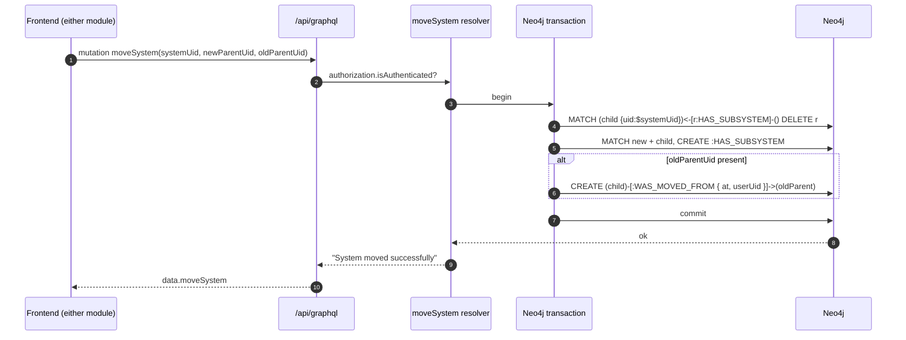

# Moving systems

Two routes, two modules, one server-side resolver — both rearrange the `HAS_SUBSYSTEM` hierarchy without mutating any other field of the moved systems.

| Route | Module | Surface |
|---|---|---|
| `/systems/moving` | `src/modules/systemsMoving/` | Drag-and-drop single system to a new parent |
| `/systems/multi-move` | `src/modules/systems-multi-move/` | Bulk: select N systems → choose one new parent → apply |

Both ultimately call the **`moveSystem`** custom resolver (`src/server/apollo/resolvers/moveSystemResolver.ts`).

## Server-side: `moveSystem` resolver



Important properties:

- **Atomic.** Detach + reattach + audit happen in a single Neo4j transaction. Failures roll back.
- **Idempotent on the parent side.** `MATCH … DELETE r` removes *all* existing `:HAS_SUBSYSTEM` parents — the schema allows at most one, but the query handles drift defensively.
- **Audit-edge stamped.** When `oldParentUid` is passed, a `:WAS_MOVED_FROM { at, userUid }` edge is created on the child for history.
- **Only checks `isAuthenticated`.** Role enforcement comes from the schema-level `@authorization` on `System` (`systems-edit`). Custom resolvers do not double-check.

## `systemsMoving` — single-system move

```
src/modules/systemsMoving/
├── SystemsMoving.cont.tsx              — container, hosts the explorer + edit dialog
├── form/
│   ├── system-moving-edit.cont.tsx     — RHF container for the edit dialog
│   ├── system-moving-edit.form.tsx     — UI
│   ├── SystemMoving.fields.ts          — field definitions
│   └── SystemMoving.form.tsx           — form skeleton
├── hooks/
│   ├── useSystemMovingDialog.ts        — open/close + selected state
│   └── useSystemMutate.ts              — calls `moveSystem` mutation
└── store/
    └── useSystemMovingStore.ts         — source + target + dialog state
```

### Flow

1. User opens `/systems/moving` — a tree explorer based on the same `useSystemHierarchy` query as Hierarchy.
2. Drag a system onto a new parent (HTML5 backend via `react-dnd`).
3. `useSystemMovingDialog` opens the confirm dialog with source / destination details.
4. The dialog also offers an *edit* surface (level / type) before the move commits — this is the source of the form duplication flagged in the family-level [Maintenance recommendations](./README.md#maintenance-recommendations).
5. On confirm, `useSystemMutate` calls `moveSystem`. Cache invalidation: `useSystemHierarchy`, `useSystemDetail` for affected nodes.

### Store

`useSystemMovingStore`:

| Field | Purpose |
|---|---|
| `sourceUid` | The system being moved |
| `targetUid` | The intended new parent |
| `oldParentUid` | Resolved from the tree at drag start; used for audit edge |
| `dialogOpen` | Modal visibility |

## `systems-multi-move` — bulk move

```
src/modules/systems-multi-move/
├── systems-multi-move.cont.tsx
├── move-systems.columns.tsx
├── components/
│   ├── moving-systems.table.tsx        — selection table (PandaTableV2 backed)
│   ├── select-all.checkbox.tsx
│   └── submit-move.button.tsx
├── hooks/useMoveSubmit.ts              — loops `moveSystem` per selected uid
├── store/useSystemsMoveStore.ts        — selection set + target parent
└── types/responses.ts
```

### Flow

```mermaid
flowchart LR
    A["select N systems\n(useSystemsMoveStore.selected)"] --> B["pick target parent\nuseSystemsMoveStore.targetUid"]
    B --> C["SubmitMoveButton\nuseMoveSubmit"]
    C --> D{"loop selected"}
    D -->|"moveSystem(uid, target, oldParent)"| E[/api/graphql]
    E --> R[moveSystem resolver]
    R --> DB[(Neo4j)]
    D -->|toast.promise progress| Toast
    D --> F[Cache invalidation\nuseSystemHierarchy + useSystems]
```

### Store

`useSystemsMoveStore`:

| Field | Purpose |
|---|---|
| `selected` | `Set<string>` — uids checked across pages |
| `targetUid` | Common new parent |
| `status` | `'idle' \| 'submitting' \| 'partial' \| 'done'` |
| `failures` | Per-uid error map for partial-failure reporting |

### Partial-failure model

`useMoveSubmit` issues one `moveSystem` call per selected uid sequentially (parallel would burn Neo4j connections). Failures are collected, not aborted — the user sees a summary toast with successes/failures and can retry just the failures.

This contrasts with `moveSystem`'s server-side atomicity per call — the **bulk** operation as a whole is **not** atomic.

## Cross-module concerns

- Both modules read the same `useSystemHierarchy` cache key, so a successful move invalidates the tree in Hierarchy, the table in Overview, and any open `SystemItem` detail page in one stroke.
- The shared form between `systemsMoving/form` and `systemItem/components/form` is a structural redundancy — see family-level [Maintenance recommendations](./README.md#maintenance-recommendations).

## Tests

`src/modules/systemsMoving/` and `src/modules/systems-multi-move/` ship without local `__tests__` folders. The move flow has e2e coverage via `e2e/systemHierarchy/` and unit coverage of the resolver only through its happy path.

## Deprecated / legacy

- Duplicate form definitions in `systemsMoving/form/` (system-moving-edit) and `systemItem/components/form/` — same Zod schema, different rendering.
- `select-all.checkbox.tsx` exists in **both** `systemsRelations/components/` and `systems-multi-move/components/` with slightly different selection semantics. Candidate for a single shared primitive.
- The `WAS_MOVED_FROM` edge has its own dedicated resolver (`systemMovedFromResolver`) **in addition** to being written by `moveSystem`. The standalone resolver is reachable from the schema but no UI calls it today — verify before deleting.

## Maintenance recommendations

1. **Make bulk move atomic on the server.** A `moveSystems(uids, newParentUid)` resolver that runs one transaction with `UNWIND` would remove the partial-failure mode.
2. **Collapse the two `select-all.checkbox.tsx` files** into one shared primitive in `src/modules/shared/`.
3. **Promote drag-and-drop into Hierarchy.** The user guide already flags this as planned — once shipped, `/systems/moving` becomes optional and can be deprecated.
4. **Delete `systemMovedFromResolver`** if no client invokes it — or document the case for keeping a standalone audit-edge writer.

## 🔮 Planned

- **Drag-and-drop at hierarchy level** — moves into the Hierarchy module's tree. See user guide → [Coming soon](../../user-guide/systemHierarchy/README.md#coming-soon).
- Permissions Phase 1 will restrict who can move systems at top levels; the schema directive on `System` already gates `UPDATE` — the audit-edge resolver may need a parallel role check.

## Open questions

- Bulk multi-move on a tree with hundreds of systems: at what point should the per-uid loop give way to a streaming server-side mutation?
- Is `systemMovedFromResolver` historically called by an external integration, or pure dead code?

---

## Data model reference

> 🔧 *Engineer-only; stripped from the wiki.*
>
> Schema: `Mutation.moveSystem` (`src/server/apollo/schema.graphql:1-13`), `WAS_MOVED_FROM` (custom edge written by the resolver, no schema declaration), `System.parentSystem` (`schema.graphql:334`). Resolver source: `src/server/apollo/resolvers/moveSystemResolver.ts`.
