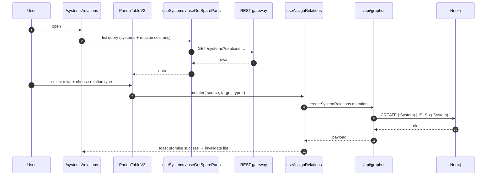

# Relations & spares

The `/systems/relations` route — a cross-system table view focused on the *relationships* between systems rather than the systems themselves. Drives the "show me everything that powers / is powered by / is spare for X" workflows that the single-system Relationships tab cannot answer in bulk.

## Module location

```
src/modules/systemsRelations/
├── SystemRelations.cont.tsx        — top-level container
├── SystemRelations.columns.tsx     — `PandaTableV2` column defs
├── components/
│   ├── ShowSpareButton.tsx         — toggle: relations table ↔ spare-parts table
│   ├── SpareParts.columns.tsx      — spare-parts variant columns
│   └── select-all.checkbox.tsx     — header checkbox with `useRelationsStore` selection
├── hooks/
│   ├── useAssignRelations.ts       — bulk create relationships (`useMutation`)
│   └── useGetSpareParts.ts         — read spare-parts slice
└── store/
    └── useRelationsStore.tsx       — selection + filter state
```

## Two surfaces

The same container hosts two tables, switched by a top-bar button (`ShowSpareButton`):

1. **Engineering relations table** — rows are systems, columns are presence/absence of each of the 8 engineering edges (powered-from, cooled-from, controlled-by, …). Bulk edits create or delete edges across the selection.
2. **Spare-parts table** — rows are systems flagged as spares, with coverage badges. Used by maintenance teams to plan replacements.

State of which surface is visible is held in `useRelationsStore`, not in the URL — switching tabs and coming back resets the choice.

## Data flow



## Store

`useRelationsStore` (Zustand, not persisted):

| Field | Purpose |
|---|---|
| `view` | `'relations'` ⟂ `'spares'` |
| `selectedUids` | UIDs currently checked across pages |
| `targetUid` | The "other side" of the relationship the user is editing |
| `relationType` | Which of the 8 engineering edges is being applied |
| `pendingRelations` | Optimistic queue used by `useAssignRelations` |

Selection survives pagination (the store backs the table's controlled selection state).

## Mutation

`useAssignRelations` accepts an array of `{ sourceUid, targetUid, type }` triples and issues one GraphQL mutation per pair. The container batches them under a single `toast.promise` so the user sees a unified progress indicator.

There is **no atomic "create N edges" backend operation** — partial failures are possible. The hook records successes/failures and surfaces a summary toast.

## Spare-parts table

`useGetSpareParts` reads systems with `IS_SPARE_FOR` edges via a dedicated REST endpoint (`getEndpoints.spareParts*`). Coverage badges are computed from the edge's `IsSpareFor.coverage` field + the system's `minimalSpareParstCount` (typo intentional — present in the schema).

`SpareParts.columns.tsx` defines a slightly different column set: coverage badge, spare-of target, last-updated timestamp.

## Cross-module integration

- Reuses the **shared SystemsComponent** indirectly via `PandaTableV2` from `src/modules/shared/table/`.
- Shares `RELATIONSHIP_DEFINITIONS` with [System Hierarchy](./system-hierarchy.md) and [System item](./system-item.md).
- Writes that succeed here invalidate the same `useSystemRelationships` cache that the per-system Relationships tab reads.

## Tests

No `__tests__` folder under `src/modules/systemsRelations/`. Coverage is end-to-end via shared table tests.

## Deprecated / legacy

- No `*.comp.tsx` split — the container does the rendering. Lower priority than the systems-family-wide form duplication.
- `useAssignRelations` issues N mutations rather than one batched call — accepts partial failure as a feature, but worth a server-side endpoint to make atomic.

## Maintenance recommendations

1. **Add a batched server-side mutation** so `useAssignRelations` becomes one request. Today's loop can leave inconsistent state on partial failure.
2. **Move the view toggle into the URL.** `?view=spares` makes the surface bookmarkable and survives page reloads — minimal change, large UX win.
3. **Test selection persistence across pagination.** The store-backed table contract is non-obvious; an explicit spec would prevent regressions.

## 🔮 Planned

- Permissions Phase 1 will restrict who can create relationships at the `SYSTEM_DOMAIN` / `TECHNOLOGY_UNIT` levels — see [Permissions model → 🔮 Planned](../permissions-model.md#-planned).
- Spare-parts table is a candidate for inline "Use Spare" actions (currently dormant in a deprecated shared flow).

## Open questions

- Should the spare table support multi-select swap (the spare-swap workflow), or is that the dedicated wizard's territory?
- Coverage thresholds (red/amber/green) are hardcoded in `SpareParts.columns.tsx` — codebook them?

---

## Data model reference

> 🔧 *Engineer-only; stripped from the wiki.*
>
> Schema: the 8 engineering relationship types are declared on `System` (`src/server/apollo/schema.graphql:320-333`); spare metadata is on the `IsSpareFor` `@relationshipProperties` interface (`schema.graphql:262-264`). Relationship registry: `src/modules/systemHierarchy/types/graph.ts`.
