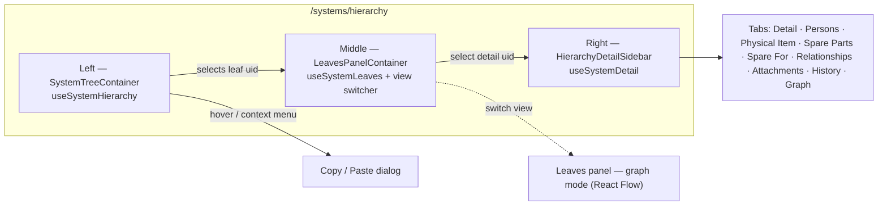

# System Hierarchy

The flagship surface of the systems family — `/systems/hierarchy` — a three-panel explorer that combines tree navigation, leaves panel (table or graph), and a tabbed detail view for the selected system.

> User-facing companion: [System Hierarchy user guide](../../user-guide/systemHierarchy/README.md).

## Module location

```
src/modules/systemHierarchy/
├── SystemHierarchyExplorer.cont.tsx     — top-level container
├── components/
│   ├── layout/                          — three-panel `HierarchyLayout`
│   ├── tree/                            — left tree (`SystemTree`)
│   ├── leaves/                          — middle panel (`LeavesPanel`, `LeavesTable`)
│   ├── filters/                         — leaves filter sheet
│   ├── sidebar/                         — right Quick-Info / Detail sidebar
│   ├── tabs/                            — Detail tabs (Detail, Persons, Physical Item, …)
│   ├── physical-item/                   — catalogue-property renderer shared by Physical Item tab + sidebar
│   ├── detail/                          — sub-views consumed by tabs
│   ├── history/                         — change-history timeline
│   ├── graph/                           — React Flow relationship graph
│   ├── copy/                            — Copy / Paste dialog
│   ├── create/                          — Create Subsystem dialog (right-click → Create System)
│   ├── relationships/                   — relationships tab visualisation
│   └── shared/                          — small reusables
├── hooks/
│   ├── queries/                         — TanStack Query read hooks
│   ├── mutations/                       — write hooks
│   └── useHierarchyNavigation.ts + many graph/leaves hooks
├── store/
│   ├── useHierarchyStore.ts             — tree + graph expansion, copy buffer
│   └── useDetailGraphStore.ts           — detail-graph view preferences
├── types/                               — schemas, constants, graph types
└── utils/                               — tree, graph, filter, colour helpers
```

Entry point (`SystemHierarchyExplorer.cont.tsx`):

```tsx
const SystemHierarchyExplorerContainer: FC = () => {
    const { selectedLeafUid } = useHierarchyNavigation()
    const { system } = useSystemDetail(selectedLeafUid)
    useHierarchyDeepLinkResolver()

    return (
        <HierarchyLayoutContainer
            tree={<SystemTreeContainer />}
            middle={<LeavesPanelContainer />}
            sidebar={selectedLeafUid ? <HierarchyDetailSidebar system={system} /> : undefined}
        />
    )
}
```

## Layout



The leaves panel toggles between **Tree View** (the default `LeavesTable`) and **Graph View** (`graph/` components using React Flow). The view choice is held in `useHierarchyStore.graphLayoutMode` and persisted.

## Query and mutation surface

### Queries (`hooks/queries/`)

| Hook | Endpoint key / GraphQL doc | Cache key (`HIERARCHY_QUERY_KEY` etc.) |
|---|---|---|
| `useSystemHierarchy` | `queryFetcher('systemsHierarchy')` (REST) | `HIERARCHY_QUERY_KEY`. 5-minute `staleTime`, no refetch on mount. |
| `useSystemLeaves` | `queryFetcher('systemLeaves')` (REST) | `[LEAVES_QUERY_KEY, { uid, query }]`. `query` carries pagination/search/filter/sorting from `useQueryManager` plus the optional `directOnly` flag — see [Direct end systems](#direct-end-systems). |
| `useSystemLeavesCount` | `queryFetcher('systemLeavesCount')` (REST) | `[LEAVES_COUNT_QUERY_KEY, { uid }]`, one query **per rendered tree node**. 5-minute `staleTime`. Always counts every descendant leaf — deliberately unaffected by `directOnly`. |
| `useSystemDetail` | `graphql-request` `query SystemHierarchyDetail($where)` (`gql` document) | seeded by `primeSystemDetailCache` |
| `useSystemHistory` | REST endpoint per uid | tab consumer |
| `useSystemRelationships` | REST endpoint per uid | Relationships tab |
| `useRelationshipGraph` | REST endpoint, graph slice | Graph tab + leaves graph view |
| `useRelationshipItemUsage` | REST endpoint, item usage lookup | RelationshipGraph hover |

### Mutations (`hooks/mutations/`)

| Hook | Operation |
|---|---|
| `useSystemFieldUpdate` | PATCH a single field on a `System` — used by inline edit. Calls `updatedByResolver` for audit. Hard-guards on `guardSystemEdit` before mutating and invalidates `['systemCanEdit']` after a responsible/team change — see [Per-system edit permission](#per-system-edit-permission). |
| `useItemFieldUpdate` | PATCH a single field on the attached `Item` (serial, usage, condition, notes). Takes `(systemUid, currentItem)`. Records the `WAS_UPDATED_BY` edge on the **owning System node** (not the Item) — same as `systemItem` — so item edits surface in the system's History tab. Builds change entries via `utils/fieldChangeBuilder` and passes them as `updatedByResolver(changes)`; on success invalidates `SYSTEM_DETAIL_QUERY_KEY` + `['history']`. Hard-guards on `guardSystemEdit` (against the owning system) before mutating. |
| `useSystemCopy` | Calls REST endpoint `system/<uid>/copy` — server orchestrates the recursive copy |
| `useCreateSubsystem` | `mutation CreateSystems` via `useGraphQLMutation`. Payload assembled by the pure `utils/buildCreateSubsystemPayload`, including `parentSystem.connect`, parent-inherited `responsible/location/zone`, and the required `updatedBy.connect[edge.action=Insert]` so `updatedByResolver` writes a history edge. On success seeds `[SYSTEM_DETAIL_QUERY_KEY, newUid]` with the full SystemDetail fragment returned by the server, then invalidates `HIERARCHY`, `LEAVES`, `LEAVES_COUNT`, and `RELATIONSHIP_GRAPH` keys. |
| `useDeleteSystem` | `queryMutate('system', 'delete', { uid })` — REST `DELETE /system/{uid}` (soft + recursive: `deleted=true` on the system and every subsystem). `onSuccess` stays **synchronous** so the delete resolves immediately: fires an instant invalidate of `HIERARCHY`, `LEAVES`, `LEAVES_COUNT`, `RELATIONSHIP_GRAPH`, then a background `recalculateSpareParts` POST that triggers a **second** invalidate on success (`.catch` swallows recalc failure so it can't mask the delete). UX orchestration (confirm, toast, 409, selection reset) lives in `useDeleteSystemAction` — see [Delete System](#delete-system). |
| `useSystemCodeGenerate` | Generate a code based on type + level + ancestry |
| `useSystemCodeClear` | Clear a previously generated code |
| `useDeleteRelationship` | Remove one of the 8 engineering edges. Always invalidates `RELATIONSHIP_GRAPH_QUERY_KEY`; on `IS_SPARE_FOR` disconnect additionally invalidates via `matchesSpareAffectedQuery([currentSystemUid, relatedSystemUid])` — see [Cache invalidation for spare flows](#cache-invalidation-for-spare-flows). |

`useSystemFieldUpdate` is the canonical hook for "inline-edit a system field" and is consumed by detail tabs, sidebar, and the Quick-Info panel.

### `primeSystemDetailCache`

`hooks/queries/useSystemDetail.ts:38-77` is worth a paragraph. The hook uses `refetchOnMount: false` so a leaf click feels instant, but that means *something* has to populate the cache before the first render — otherwise the breadcrumb and side panel render empty. The fix:

```ts
primeSystemDetailCache(queryClient, uid, hint)
  → seeds a partial SystemDetailFragment from the tree node's data
  → kicks off a background fetch (using the live cache key)
  → real fragment replaces the seed transparently
```

It is called from `SystemTree` selection handlers and `LeavesTable` row clicks. Treat it as part of the public surface of the hook — see the in-source comment for the rationale and the `primeSystemDetailCache.test.ts` for the contract.

## Stores

### `useHierarchyStore` (persisted)

State carried across page reloads:

| Field | Type | Purpose |
|---|---|---|
| `expandedNodes` | `string[]` | UIDs currently expanded in the tree |
| `graphLayoutMode` | `GraphLayoutMode` | `VERTICAL` / `HORIZONTAL` / `FORCE` for leaves graph |
| `graphExpandedNodes` / `graphExpandedEdges` | arrays | Cached graph state for the relationship view |
| `copiedSystemUid` | `string \| null` | Copy-paste buffer (one system at a time) |

Notable actions: `toggleNode`, `expandNodes`, `collapseAll`, `setCopiedSystemUid`, `addGraphExpanded` (merges into the persisted graph).

### `useDetailGraphStore` (persisted)

Per-system Graph tab preferences:

| Field | Notes |
|---|---|
| `relationshipTypes` | Visible relationship types; `null` means default (all except `HIDDEN_BY_DEFAULT = ['HAS_SUBSYSTEM']`). |
| `layoutMode` | Mirror of `graphLayoutMode` but local to the detail graph. |
| `expandedNodes` / `expandedEdges` | Persistable cache of graph expansion so coming back to the tab restores it. |

Two stores rather than one because the *leaves* graph (middle panel) and the *detail* graph (right tab) have independent UI state and should not collide.

## Tabs

The tabbed detail surface lives under `components/tabs/`:

| Tab | Container | Notes |
|---|---|---|
| Detail | `DetailTab.cont.tsx` | Inline-edit name / level / code / location / zone / description |
| Persons | `PersonsTab.cont.tsx` | Responsible person + team + operators + maintained by |
| Physical Item | `PhysicalItemTab.cont.tsx` | View/edit the `Item` attached via `CONTAINS_ITEM`. Below the editable fields, renders read-only **catalogue properties** grouped by property group via the shared `components/physical-item/` renderer — see [Catalogue properties & service overrides](#catalogue-properties--service-overrides). |
| Spare Parts | `SparePartsTab.cont.tsx` (+ `.types`, `SparePartActions.comp.tsx`) | List of systems flagged spare *for* this system, in the same row-card pattern as `SpareForTab` (icon + name + coverage badge + EUN badge). Each row carries **Use** (opens shared `useSpareDialog` wizard) + **Remove** (shared `SpareRelationshipDeleteButton`) inside `SparePartActions`. Use button has a 4-level priority tooltip chain — `!canEdit` → feature-flag off → `!physicalItem` → enabled. Header keeps the color-coded coverage indicator (`available`/`required`). Click + keydown propagation isolated by the actions wrapper so row-click `selectLeaf` still works. |
| Spare For | `SpareForTab.cont.tsx` | The inverse: lists `sparePartsForSystems` (exposed by `useSystemDetail`) with icon + name + EUN badge + outbound `SpareRelationshipDeleteButton`. |
| Relationships | `RelationshipsTab.cont.tsx` | List of all 9 relationship types, edit/delete |
| Attachments | `AttachmentsTab.cont.tsx` | File manager (MinIO-backed) |
| History | `HistoryTab.cont.tsx` | `WAS_UPDATED_BY` timeline + filters |
| Graph | `GraphTab.cont.tsx` | React Flow detail graph for this system |

## Catalogue properties & service overrides

User-facing companion: [Physical item details](../../user-guide/systemHierarchy/README.md).

`components/physical-item/` renders an item's catalogue properties on two surfaces — the **Physical Item tab** (full list under the editable fields) and the **Quick-Info sidebar** (same list, compact). Both read the already-cached `useSystemDetail(system.uid)` query (a cache hit — the parent already loaded it) for the `catalogueItem`/`serviceItem` fragments that the `SystemLeaf` projection drops, then feed the shared cross-module `useItemPropertiesData` engine (`src/hooks/useItemPropertiesData.ts`).

| File | Role |
|---|---|
| `PropertyRow.comp.tsx` | Row primitive: name → effective value + unit, optional `was X` override marker. `variant` `tab` (⚠ + strikethrough) / `sidebar` (compact `(was X)`). |
| `PhysicalItemProperties.comp.tsx` | Grouped renderer (group heading + `PropertyRow`s); skips the `General` bucket heading. Used by both surfaces via a `variant` prop. |
| `PhysicalItemPropertiesSidebar.comp.tsx` | Data-fetching wrapper for the sidebar: calls `useSystemDetail` + `useItemPropertiesData`, renders `PhysicalItemProperties` with `variant="sidebar"`. Returns `null` when the item has no catalogue properties. |

Override semantics come entirely from `useItemPropertiesData`: service items are sorted newest-first, the latest value per property wins, and `isOverridden = catalogueValue !== serviceValue`. A property's effective value is `serviceValue || catalogueValue` — safe because the engine formats every value to a non-empty string (`'N/A'` fallback), so a real service value never falsy-falls-through.

> Implicit dependency: this display relies on `SystemDetailFragment` continuing to carry `physicalItem.catalogueItem.propertiesConnection` + `serviceItemsConnection`. They're fetched but not part of the `SystemLeaf` type, so trimming them from the fragment would blank the properties **without** a type error.

## Create Subsystem

User-facing companion: [Creating systems](../../user-guide/systemHierarchy/workflows/creating-systems.md).

The right-click context menu on a tree node offers **Create System** alongside Copy / Paste. The orchestrator is `hooks/useCreateSubsystemAction.ts` — it mirrors `useSystemCopyPaste`: gated by `usePermission([ROLE.SYSTEM_EDIT])` (first-line filter) plus a per-system `guardSystemEdit` check-on-click against the **parent** uid ([Per-system edit permission](#per-system-edit-permission)), then opens `CreateSubsystemDialog` through `useDynamicModalStore` with a stable id `create-subsystem-${parentUid}`.

Parent → allowed-child rules are a pure lookup table in `utils/systemLevelRules.ts`:

| Parent level | Allowed child levels |
|---|---|
| `SystemDomain` | `[TechnologyUnit]` |
| `TechnologyUnit` | `[TechnologyUnit, KeySystems, Trash]` |
| `KeySystems` | `[KeySystems, SubsystemsAndParts, Trash]` |
| `SubsystemsAndParts` | `[SubsystemsAndParts, Trash]` |
| `Trash` | `[]` — `canCreateUnder(Trash) === false` |

`TreeNode` calls `canCreateUnder(node.systemLevel)` to disable the menu item, and the dialog's *System level* `Select` is filtered by `getAllowedChildSystemLevels(parentLevel)` (preselected + read-only when only one option remains).

The dialog reads the parent via `useSystemDetail(parentUid)` to surface the inherited `responsible`/`location`/`zone` values as a read-only block, then passes their uids into `useCreateSubsystem` so the mutation payload includes them. Submit is disabled while the parent fetch is in flight.

After the mutation resolves, the dialog calls `selectLeaf(newUid)` **without** an optimistic hint — the mutation hook has already written the full `SystemDetail` fragment into the system-detail query cache, so the detail page renders every field on first navigation (a minimal hint would otherwise stick because `primeSystemDetailCache`'s background `fetchQuery` is a no-op under the 60 s `staleTime`).

`TreeNode` also takes a `canEdit` prop and a `onCreateSubsystem(parentUid, parentName, parentLevel)` callback. Permission gating is now uniform — Copy, Paste, Create System, and Delete System are **always rendered** and `disabled` based on `canEdit` (plus their per-action rule: `!canPaste` for paste, `!canCreateUnder(level)` for create). The previous "hide handlers when no edit permission" behaviour in `SystemTree.cont` was dropped in favour of always-render-disabled for better discoverability.

## Delete System

User-facing companion: [Deleting systems](../../user-guide/systemHierarchy/workflows/deleting-systems.md).

Right-click **Delete System** is available on all three system surfaces — tree node (`TreeNode`), leaves table row (`LeavesTable`), and graph node (`SystemNode`). All three call a single orchestrator, `hooks/useDeleteSystemAction.ts`, layered on the `useDeleteSystem` mutation. It returns `{ canEdit, handleDeleteSystem, isPending }`:

- **Permission** — `usePermission([ROLE.SYSTEM_EDIT])`. `handleDeleteSystem` also re-checks `!canEdit || isPending` so an in-flight delete can't be re-fired, then runs a per-system `guardSystemEdit` check-on-click against the target uid before the confirm ([Per-system edit permission](#per-system-edit-permission)) — belt-and-suspenders with the backend's own 403 on `DELETE /system/{uid}`. The guard is per hook-instance — only one context menu is open at a time, so that's the only reachable double-fire path.
- **Confirm** — wraps the mutation in `useWarningModal` with recursive wording (`systemHierarchy.delete.confirm` — "…and all its sub-systems"). The backend delete is recursive + soft, so the wording holds even for childless rows.
- **Feedback** — `toast.promise` (loading / success / error). On HTTP **409** the backend returns the blocking physical items as a bare `SystemPhysicalItemInfo[]` (read from `err.response.data`); the toast lists up to `MAX_LISTED_ITEMS = 3` item names with a locale-neutral `(+N)` overflow, and falls back to a generic message when the body is empty/unparseable.
- **Selection reset** — on success, `isOpenOrAncestor(uid)` decides whether to call `clearSelection()` (new `useHierarchyNavigation` action that drops `parent`/`leaf`/`tab` from the URL). It returns true when the deleted uid is the open leaf or selected parent, an **ancestor of the open leaf** (via `useSystemDetail(selectedLeafUid).parentPath` — the leaf can be opened with a stale `parent`), or an **ancestor of the selected parent** (via `findHierarchyPath(nodes, selectedParentUid)`). This stops the detail panel pointing at a node the recursive delete just removed.

Gating convention matches Copy/Paste/Create: tree + table **render the item `disabled`** when `!canEdit`; the graph **omits** it (`useRelationshipGraphContainerState` passes `onDeleteSystem` only when `canEdit`). The graph callback is threaded node-ward through `useRelationshipGraphFlow` → `utils/graphTransformers`, the same path as `onCopySystem`.

`LeavesTable` wraps its content in a Radix `ContextMenu` **only when `onDeleteSystem` is provided** (otherwise the trigger would suppress the native right-click menu with nothing to show). The right-clicked row is captured by a capture-phase reset on the wrapper (clears the target) plus a bubble-phase `onContextMenu` per row (re-sets it) — so right-clicking empty table area leaves the item disabled.

## Per-system edit permission

User-facing companion: [Understanding edit permissions](../../user-guide/systemHierarchy/workflows/edit-permissions.md). Cross-cutting model: [Permissions model → per-system edit](../permissions-model.md#per-system-edit-responsibility).

`ROLE.SYSTEM_EDIT` (the coarse gate above) answers "may this user edit *systems at all*". A second, finer check answers "may they edit *this* system" — a user may edit only if they are responsible for it directly, via its `responsibleTeam`, or via any ancestor up the `HAS_SUBSYSTEM` chain. The backend owns that decision and exposes it as a REST read:

```
GET /system/{uid}/can-edit → { result: boolean, responsibles: User[] }
```

`result` already folds in the role check (a non-`systems-edit` user gets `false`); `responsibles` is always returned (deduped across the system + ancestors) so the UI can point a blocked user at someone.

Why the frontend enforces it at all: the backend guards its **REST** mutating endpoints with a 403, but this module mutates via **GraphQL** (`updateSystems`, `updateItems`, `createSystems`), which `System.@authorization` gates by role only — not per-system. So until those mutations migrate to guarded REST PATCH endpoints, the client must block the GraphQL patch path itself.

### Surface

The guard building blocks are **shared** — they live in `src/modules/shared/system/edit-permission/` (barrel `index.ts`) and are consumed by both this module and the [Edit System sheet](./system-item.md) (`shared/system/system-edit/`). i18n keys are under `message.systemPermission.*`. Paths below are relative to that shared module.

| File | Role |
|---|---|
| `hooks/useSystemCanEdit.ts` | `useSystemCanEdit(uid)` — `queryFetcher('systemCanEdit')` (REST, built lazily so importing the module has no side effect), key `['systemCanEdit', { uid }]`, `staleTime: 0`. Also exports `ensureSystemCanEdit(qc, uid)` (imperative, shared cache) and `SYSTEM_CAN_EDIT_QUERY_KEY`. |
| `hooks/useSystemEditPermission.ts` | The single decision point. Wraps `useSystemCanEdit` and derives `{ canEdit, responsibles, status, refetch }`. **Fail-closed**: `canEdit` is `true` only when `status === 'allowed'` — `false` while `loading` and on `error`, so an un-verifiable state never leaves editing open. Also exports `formatResponsibleName`. |
| `utils/guardSystemEdit.ts` | `guardSystemEdit(qc, uid, fm)` — imperative gate for mutation hooks and check-on-click actions. Reads `ensureSystemCanEdit`, and on denial (or verification failure — fail-closed) toasts the responsibles and returns `false`. |
| `components/SystemEditRestrictionBanner.comp.tsx` | Banner. `denied` → responsibles in an Info-tooltip; `error` → a **distinct** "couldn't verify — Retry" state (never the not-responsible copy, which would misattribute a network fault); `loading`/`allowed` → renders nothing. |

Consumers call `useSystemEditPermission(system.uid)` directly rather than sharing a React context — React Query dedups by uid, and the same `system.uid` is read from both the detail-view tree and the separate sidebar tree (`SystemImagePanel`), which a single provider couldn't cover.

### Enforcement (defense-in-depth)

- **UI disable** — every editable detail surface takes `disabled={!canEdit}`: all `DetailTab` fields (incl. the system-code row + `SystemCodeActions`), `PersonsTab` responsible/team + both `EmployeeAssignmentTable`s, `PhysicalItemTab` fields, `AttachmentsTab` (`FileManager hasEditRole={canEdit}`), `SystemImagePanel` (`usePermission([SYSTEM_EDIT]) && canEdit`), and the `ActionsDropdown` items.
- **Hard guard in the mutation hooks** — `useSystemFieldUpdate` and `useItemFieldUpdate` `await guardSystemEdit(...)` before `mutateAsync` and abort if denied, so an unpermitted GraphQL patch can't fire even if the UI is bypassed. `useItemFieldUpdate` checks the **owning system** uid, not the item.
- **Self-lockout** — after a `responsibleUid`/`responsibleTeamUid` save, `useSystemFieldUpdate` invalidates `['systemCanEdit']`; if the user reassigned responsibility away from themselves, the controls re-disable without a reload (mirrors what the backend will enforce).
- **Check-on-click for imperative actions** — `useCreateSubsystemAction` (against the **parent** uid) and `useDeleteSystemAction` (against the **target** uid) keep the coarse role check as a cheap first-line filter, then `await guardSystemEdit(...)` before opening the dialog / confirm; on denial they toast the responsibles and return. This avoids an N-node prefetch across the tree.

`EmployeeAssignmentTable` (shared, `src/modules/shared/system/employee-assignment/`) gained an optional `canEdit?: boolean` prop that ANDs with its internal `SYSTEM_EDIT` role check (defaults to `true`, so other callers are unaffected).

### Out of scope (phase 1)

The **Spare Parts / Spare For / Relationships tabs** stay on the coarse `SYSTEM_EDIT` role gate — spare-assign is a REST endpoint the backend already 403-guards, and functional relationships (everything except `HAS_SUBSYSTEM` creation, which routes through Create Subsystem) are on the backend's *not-guarded* list. System **move** relies on its existing backend 403.

Note this is about the *tabs*. The detail-header **`ActionsDropdown`** (which includes an *Assign Spares* entry that merely navigates to the spare-assignment view) is a detail action and *is* per-system gated — a deliberate, safe over-restriction: the backend 403s the actual assign anyway, and an admin gets `result: true`, so no legitimate action is lost.

## Deep links & URL contract

The explorer's URL is its source of truth (`useHierarchyNavigation`): `?parent=<uid>` (tree selection), `?leaf=<uid>` (detail view), `?tab=` (defaults to `detail`), `?view=` (`tree`/`graph`), `?direct=1` ([direct end systems](#direct-end-systems)), plus table `page`/`filter`/`search`. All in-page updates are shallow `router.push`; `updateQuery` accepts `{ replace: true }` for history-neutral updates.

`selectParent` resets **only** `page` when the parent changes. `filter`, `search`, and `direct` deliberately carry over — they describe how the user wants to read any node, not one particular node.

**`getSystemHierarchyDetailPath(uid)`** (`utils/hierarchyLinks.ts`) is the canonical builder for cross-module links into the explorer: `/systems/hierarchy?leaf=<uid>`. It deliberately omits `parent` — **`useHierarchyDeepLinkResolver`** (`hooks/useHierarchyDeepLinkResolver.ts`, mounted once in `SystemHierarchyExplorer.cont.tsx`) fills it in client-side:

- When `leaf` is set and `parent` is missing, it reads `useSystemDetail(leaf).parentPath`, expands the ancestor nodes (`useHierarchyStore.expandNodes`, merge-only), and `router.replace`s `parent=<immediate parent>` (no history entry — back leaves the page in one step).
- Root systems (empty `parentPath`) resolve to `parent === leaf`, an already-legitimate state (`selectParent` produces it in detail mode).
- Guards: `system.uid === leaf` (rejects `keepPreviousData` leftovers), a per-leaf ref (replace is async; prevents double-fire), reset once `parent` is present so a later leaf-only link to the same uid re-resolves.

Consumers: global search (`getRedirectPath`), systems overview action buttons, order lines, control-systems code tables, move wizard, the `/system/[uid]` / `/system/alias/[alias]` / `/system/item/[itemUid]` redirect pages (see [System item](./system-item.md) — that module is deprecated), and `SystemHistoryFeed`'s system links.

An unknown/deleted `leaf` renders a **not-found state** in `SystemDetailView.cont.tsx` (message + *Back to hierarchy* via `clearSelection`) instead of an endless skeleton.

History/field-change types (`HISTORY_TYPE`, `FieldChangeEntry`, `HistoryResponse`, …) live in `types/history.ts` — moved here from `systemItem`, which re-exports them for back-compat. The module no longer imports anything from `systemItem`.

## Copy / Paste

The copy-paste flow lives in `components/copy/`. Buffer: `useHierarchyStore.copiedSystemUid`. The right-click context menu on a tree node or graph node offers **Copy System** (sets the buffer) and **Paste System** (opens the dialog).

The dialog options table:

| *Copy only children* | *Copy recursively* | Effect |
|---|---|---|
| OFF | OFF | Source system only, no descendants |
| OFF | ON | Source + full subtree |
| ON | OFF | Direct children, source skipped |
| ON | ON | **Default** — direct children with their subtrees, source skipped |

Server-side the copy is a single REST call (`useSystemCopy` → `system/<uid>/copy`); the response triggers `useSystemHierarchy` + `useSystemLeaves` invalidation.

See the user-facing walkthrough → [Copying systems](../../user-guide/systemHierarchy/workflows/copying-systems.md).

## React Flow graph

Two surfaces use React Flow:

- **Leaves panel graph view** — `components/graph/`. Driven by `useLeavesGraphState` and the hierarchy store's `graphLayoutMode`.
- **Detail graph tab** — `components/relationships/` + `useRelationshipGraph*` hooks. Driven by `useDetailGraphStore`.

Both share node/edge types from `types/graph.ts` and colour helpers from `utils/graphColors.ts`. Layout helpers in `utils/graphLayout.ts` compute force-directed and orthogonal positions.

`useRelationshipGraphApiQuery` is the gate between React Flow node selection and TanStack Query — expanding a node fires a `useRelationshipGraph` query for that uid and merges the result into the persisted store via `addExpanded`.

## Cache invalidation for spare flows

The shared **`matchesSpareAffectedQuery`** predicate at `src/utils/query/spareInvalidationPredicate.ts` is the single mechanism that keeps all spare-aware views fresh after an assign/remove. It exists because callers of `useSpareDialog` and `useDeleteRelationship` span three modules with different query-key shapes, and no whitelist of constants can cover them all.

```ts
matchesSpareAffectedQuery([systemUid, spareItemUid])(query)
// matches if:
//   key[0] === RELATIONSHIP_GRAPH_QUERY_KEY  → true (anything in the graph)
//   key[0] === SYSTEM_DETAIL_QUERY_KEY       → true iff key contains one of the uids
//   key[1] is an object (useGraphQL default [opName, variables, document])
//                                            → JSON-scan variables for either uid
```

Covered call sites:

| Caller | Query-key shape | Match path |
|---|---|---|
| `systemHierarchy/hooks/queries/useSystemDetail.ts` | `[SYSTEM_DETAIL_QUERY_KEY, uid]` | constant branch |
| `systemHierarchy` graph hooks | `[RELATIONSHIP_GRAPH_QUERY_KEY, …]` | constant branch |
| `systemItem/hooks/useSystemDetail.ts` | `useGraphQL` default: `[opName, { where: { uid, … } }, document]` | variables-scan branch |
| `device-info-overlay/hooks/useSuspenseSystemDetail.ts` | same as above | variables-scan branch |
| `system-edit/...` form load | same as above | variables-scan branch |

Used by:

- `useSpareDialog` / `spare-assignment-wizard` — replaces three earlier invalidations (one was a hyphenated `'system-detail'` string that matched nothing).
- `useDeleteRelationship` (only when `isSpareDisconnect(field)`) — replaces a PascalCase `'SystemDetail'` string literal that didn't match the camelCase `SYSTEM_DETAIL_QUERY_KEY` constant.

Query-key constants `SYSTEM_DETAIL_QUERY_KEY` and `RELATIONSHIP_GRAPH_QUERY_KEY` live in `src/utils/query/queryKeys.ts` and are re-exported from `src/modules/systemHierarchy/types/constants.ts` for back-compat with existing imports.

### `SpareRelationshipDeleteButton`

Lives in the shared spare module: `src/modules/shared/system/use-spare/components/spare-relationship-delete-button.comp.tsx`. Thin wrapper around `useDeleteRelationship` that owns spare-specific copy (`common.spareAssignment.remove.*` for inbound, `common.spareAssignment.spareFor.remove.*` for outbound) and a `canEdit` gate. Kept separate from the generic `DeleteRelationshipButton` in `components/relationships/` to avoid generic-component prop sprawl.

## Filters

The leaves filter sheet (`components/filters/`) is a multi-field RHF form persisted via TanStack Query URL state (`?filter[…]=`). Filter values land in `useGraphFilters` which feeds both the table and the graph view.

`utils/graphFilters.ts` reproduces the filter logic client-side for the graph (which receives the *whole* relationship slice from the server, not a filtered one).

## Direct end systems

`GET /system/{uid}/leaves` returns every **end system** below the selected node — `HAS_SUBSYSTEM*1..50` plus `WHERE NOT (sys)-[:HAS_SUBSYSTEM]->(:System{deleted:false})`. The tree, symmetrically, returns only nodes that *have* children (plus parentless roots), so end systems never appear in it.

Between the two there was no way to ask **"what hangs directly off this node"**. A node with three direct end systems and a subtree of two thousand deeper ones drowned those three in the table, and the tree could not show them at all.

The **Direct only** checkbox in `LeavesToolbar` (next to the search input) closes that gap by sending `?directOnly=true`, which narrows the server-side traversal to `*1..1`. The existing end-system predicate is what makes depth 1 mean *direct end systems* rather than *all direct children* — no extra predicate is involved.

The explanation is bound to the checkbox with `aria-describedby` → an `sr-only` span, not left to the tooltip alone: Radix puts its own `aria-describedby` on the tooltip *trigger*, which here is the wrapper `div`, so the control itself would carry no description. The tooltip stays for pointer users.

| Aspect | Behaviour |
|---|---|
| State | `?direct=1`, read as `directOnly` and written by `setDirectOnly` (`useHierarchyNavigation`). Survives reload, deep links, and tree navigation. |
| Page reset | `setDirectOnly` clears `?page` in the same `updateQuery` — the narrowed list is shorter, so a retained page would land past its end. |
| Filters / search / sorting | Unaffected. `useSystemLeaves` merges `directOnly` into the query object `useQueryManager` already builds, so the server applies it *and* everything else. The mode narrows scope; it does not replace filtering. |
| Cache | The flag is part of the query key, so the two modes never serve each other's rows. |
| Tree badge | Unchanged — still the total descendant-leaf count. It describes the node, not the current view, and `useSystemLeavesCount` runs per rendered node, so binding it to the mode would fire one request per node on every toggle. |
| Header count | Rendered as `(N direct)` while the mode is on. The tree badge for the same node still shows the total, so two different numbers sit on screen at once and the header is what accounts for the difference. |
| Pagination | `setDirectOnly` drops `?page`, but `useQueryManager` reads the zustand `paginationState` *first* and that is only cleared by an effect. `LeavesPanel.cont` therefore calls `useResetPaginationOnChange(LEAVES_TABLE_ID)` before navigating, so no render requests a page that does not exist in the narrowed set. |

### Empty state

Two independent things can empty the table — the direct-only scope and the search/filter set — and they can both be true. `LeavesEmptyState.comp.tsx` branches on the pair rather than letting one win:

| `directOnly` | narrowed query | Message | Actions |
|---|---|---|---|
| off | on | *No subsystems found* | Clear filters |
| on | off | *No end systems directly under this system* | Show all levels |
| on | on | *…match the current search and filters* | Show all levels **and** Clear filters |

Letting `directOnly` short-circuit would state something potentially false — there may well be direct end systems, just none matching the filter — and offer an escape that lands the user in a second empty state.

"Narrowed query" counts **search as well as column filters** (`instances[LEAVES_TABLE_ID].search`, not just `storeFilters`), because search narrows the result exactly like a filter does.

**Discoverability** comes from `HierarchyNode.hasLeafChildren`, which the API had always returned and the frontend ignored. `TreeNode` now renders a dot next to the count badge when it is true, carrying `role="img"` + `aria-label` — the tooltip is hover-only, and a marker that exists purely for discoverability must not be invisible to the users least able to compensate. The dot is an indicator only, with no click handler: a small target with different behaviour inside a row that already handles clicks would be hit by accident.

The 6px dot is wrapped in a `p-1 -m-1` trigger and the tooltip gets `sideOffset={8}`. Both are required: the shared `Tooltip` sets `disableHoverableContent`, so Radix renders `TooltipContentImpl` *without* `pointer-events: none` and the content closes the tooltip the moment the pointer reaches it. With the default `sideOffset={0}` the content — and the arrow, nudged further out by `translate-y-[calc(-50%_-_2px)]` — sits on the trigger, and `delayDuration={0}` reopens instantly, so the tooltip flickered. The padding makes the target holdable; the negative margin keeps the row's visual footprint; the offset clears the content off the trigger. `src/components/Tooltip.tsx` gained an optional `sideOffset` for this — omitting it preserves the previous behaviour for every other caller.

### System Path column

`useLeavesColumns` takes `{ parentUid }` and renders only the segment of `parentPath` **below the selected node**, via `utils/relativePath.ts#getVisiblePathSegments`. The prefix up to that node is already in the breadcrumbs above the table, so repeating it in every row spent the column's width on nothing.

| Case | Cell |
|---|---|
| System sits deeper | the segment between the selected node and the system |
| Hangs directly off the selected node | a single badge naming the selected node — constant column width, reads as "right here" |
| Selected node absent from the path | the full path (mismatched data or a stale cache: showing too much beats hiding where the system lives) |
| System has no path at all | empty |

The fallback name is taken from the **row's own `parentPath`**, not from `useSystemDetail`. `getPathBelow` empties only when the selected node is the last entry in the path, so it is always present in the row's data — while `useSystemDetail` carries `placeholderData: keepPreviousData` and would, mid-navigation, hand back the *previous* node's name for every row.

Cell and `accessorFn` both go through `getVisiblePathSegments`, so the sort/filter value cannot drift from the rendered text.

`enableSorting: false`: the server's order-by allowlist (`GetSystemLeavesOrderByClauses`) has no `systemPath` entry, so a sort request on it silently falls back to `ORDER BY name`. A header that reorders by something the column does not show is worse than no header control.

Badges in this column are always the neutral variant — the REST leaves query returns `parentPath` as `{uid, name}` only, with no `systemLevel` to colour by.

The checkbox is never disabled. Gating it on the cached `hasLeafChildren` would lock the control with no explanation whenever another session had added a child, and would couple the leaves panel to tree data; the empty state says the same thing but only after a real query.

Backend contract and the rejected alternatives: [ADR 0001](../../adr/0001-direct-only-param-on-leaves-endpoint.md).

## Tests

Unit coverage under `__tests__/` is heaviest in:

- `types/__tests__/` — schema parsing.
- `utils/__tests__/` — tree search, graph layout, filter predicates, change-builder, **parent→child level rules** (`systemLevelRules.spec.ts`), **create-subsystem payload builder** (`buildCreateSubsystemPayload.spec.ts` — locks the `updatedBy[Insert]` audit edge).
- `hooks/queries/__tests__/` — `primeSystemDetailCache.test.ts` (the contract above), `useSystemLeaves.test.ts`, `useSystemLeaves.spec.ts` (also: `directOnly` reaches the query only when enabled, survives alongside `search`, and keys the two modes apart), `useSystemLeavesCount.test.ts`.
- `hooks/mutations/__tests__/` — `useSystemFieldUpdate.spec.ts` (also: guard blocks the patch when denied, `['systemCanEdit']` invalidated after a responsible change), `useItemFieldUpdate.spec.ts` (locks the System-node `WAS_UPDATED_BY` edge + change entries for item edits; guard checks the owning system), `useDeleteSystem.spec.ts` (immediate invalidate + background recalc → second invalidate; recalc failure keeps only the immediate round).
- **Per-system permission** (in the shared `edit-permission` module) — `hooks/__tests__/useSystemEditPermission.spec.ts` (fail-closed derivation for loading/error/allowed/denied + `formatResponsibleName`), `utils/__tests__/guardSystemEdit.spec.ts` (allow / deny-with-toast / no-responsibles / fail-closed-on-throw), `components/__tests__/SystemEditRestrictionBanner.spec.tsx` (denied lists responsibles, distinct verify-error + retry, nothing while loading/allowed).
- `hooks/__tests__/useHierarchyDeepLinkResolver.spec.tsx` — parent resolution from `parentPath`, root parent==leaf case, stale-uid guard, single-replace idempotency, re-resolution after the URL settles; `hooks/__tests__/useHierarchyNavigation.spec.ts` — URL contract per key, including that `setDirectOnly` clears `page` but leaves `filter`/`search` alone and that `direct` survives `selectParent`; `utils/__tests__/hierarchyLinks.spec.ts` — deep-link shape + encoding; `components/detail/__tests__/SystemDetailView.spec.tsx` — skeleton / not-found / loaded states.
- `hooks/__tests__/useDeleteSystemAction.spec.tsx` — permission gate, in-flight re-entry guard, per-system check-on-click block, recursive confirm, 409 item-list + `(+N)` overflow + generic fallback, and selection reset for both open-leaf-ancestor and selected-parent-ancestor; `hooks/__tests__/useCreateSubsystemAction.spec.tsx` — role gate + per-parent check-on-click.
- `components/{tree,leaves,filters,graph,detail,copy,create,shared,tabs,physical-item}/__tests__/` — `physical-item/` covers the grouped renderer and sidebar wrapper (grouping, override marker, service-only additions, empty → hidden); the Delete context item is covered in `tree/TreeNode.test.tsx`, `graph/SystemNode.test.tsx`, and `leaves/LeavesTable.test.tsx` (the last stubs the virtualized `PandaTableV2` to exercise the capture/bubble row capture, disabled-on-empty-area, and no-handler short-circuit). `tree/TreeNode.test.tsx` also locks the `hasLeafChildren` dot and that the count badge stays the total; `leaves/LeavesToolbar.spec.tsx` locks the Direct-only checkbox (reflects the prop, reports the toggle, never disabled, leaves filter + search reachable so the mode can be exited); `leaves/LeavesEmptyState.spec.tsx` locks all four rows of the empty-state matrix above, including that the both-causes case does not assert the scope-only message; `leaves/useLeavesColumns.spec.tsx` locks the System Path cases (segment below, selected-node fallback, empty while loading, absolute path retained in the tooltip); `utils/__tests__/relativePath.spec.ts` covers `getPathBelow` including the not-in-path fallback.

## Deprecated / legacy

- The persisted graph state in `useHierarchyStore` (`graphExpandedNodes`/`graphExpandedEdges`) can drift if the underlying graph data changes — stale nodes appear in subsequent loads. Consider TTL or versioning.
- `useSystemDetail` uses `graphql-request` directly; everything else in the family uses `queryFetcher`. See the family-level [Open questions](./README.md#open-questions).
- The Graph tab's relationship-type filter (`useDetailGraphStore.relationshipTypes`) initialises to `null` for "default visible types"; new relationship types added to `RELATIONSHIP_DEFINITIONS` will be visible by default unless added to `HIDDEN_BY_DEFAULT`.

## Maintenance recommendations

1. **Replace `graphql-request` with the existing `useGraphQL` helper** in `useSystemDetail.ts`. The seed/prime mechanism is independent of the transport.
2. **TTL the persisted graph state**. Two `persist`ed stores with arbitrary node arrays can outgrow `localStorage`'s 5 MB quota on large hierarchies. Add a soft cap (e.g. last 200 nodes) or invalidate on schema-version change.
3. **Document the two-graph split** (`useHierarchyStore` vs `useDetailGraphStore`) inline. A single sentence at the top of each store would prevent newcomers from collapsing them.
4. **Test `useSystemCopy`** — none of the existing specs cover the copy dialog combinatorics. The matrix in [Copy / Paste](#copy--paste) is a natural test parameterisation.

## Open questions

- Should the Copy / Paste buffer survive a hard reload? Today it does (persisted) — but the user has no UI indicator that something is buffered.
- The Graph tab's force-layout iteration count is hardcoded in `utils/graphLayout.ts`. Configurable per-system?

---

## Data model reference

> 🔧 *Engineer-only; stripped from the wiki.*
>
> Relevant schema: `System`, `SystemInterface`, `ParentPathItem` (`src/server/apollo/schema.graphql:266-369`). Relationship registry: `src/modules/systemHierarchy/types/graph.ts` (`RELATIONSHIP_DEFINITIONS`). Endpoint keys consumed: `systemsHierarchy`, `systemLeaves` and `systemLeavesCount` (both accept `directOnly=true` → traversal narrows to `*1..1`; `GetSystemLeavesByParentUIDQuery` / `…CountQuery` in the API's `systems-db-queries.go`), `systemDetail`, `systemCanEdit` (`GET /system/{uid}/can-edit` → `{ result, responsibles }`; `/v1` prefix is already in `BASE_URL`), `systemRelationships`, `system/<uid>/copy`, `system` (`DELETE /system/{uid}`, soft+recursive, 409 → `SystemPhysicalItemInfo[]`), `recalculateSpareParts`.
>
> `systemSubsystems` (`GET /system/{uid}/subsystems`) exists but is **not** consumed by this module — only by `modules/systems/hooks/useSubsystems.ts` for lazy row expansion in the overview table. See [ADR 0001](../../adr/0001-direct-only-param-on-leaves-endpoint.md) for why the direct-only view did not reuse it.
