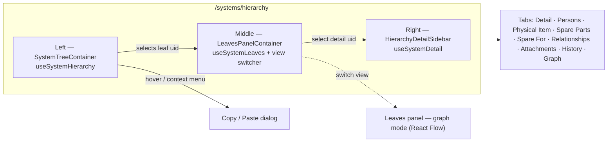

# System Hierarchy

The flagship surface of the systems family — `/systems/hierarchy` — a three-panel explorer that combines tree navigation, leaves panel (table or graph), and a tabbed detail view for the selected system.

> User-facing companion: [System Hierarchy user guide](../../user-guide/systemHierarchy/README.md).

## Module location

```
src/modules/systemHierarchy/
├── SystemHierarchyExplorer.cont.tsx     — top-level container
├── components/
│   ├── layout/                          — three-panel `HierarchyLayout`
│   ├── tree/                            — left tree (`SystemTree`)
│   ├── leaves/                          — middle panel (`LeavesPanel`, `LeavesTable`)
│   ├── filters/                         — leaves filter sheet
│   ├── sidebar/                         — right Quick-Info / Detail sidebar
│   ├── tabs/                            — Detail tabs (Detail, Persons, Physical Item, …)
│   ├── detail/                          — sub-views consumed by tabs
│   ├── history/                         — change-history timeline
│   ├── graph/                           — React Flow relationship graph
│   ├── copy/                            — Copy / Paste dialog
│   ├── relationships/                   — relationships tab visualisation
│   └── shared/                          — small reusables
├── hooks/
│   ├── queries/                         — TanStack Query read hooks
│   ├── mutations/                       — write hooks
│   └── useHierarchyNavigation.ts + many graph/leaves hooks
├── store/
│   ├── useHierarchyStore.ts             — tree + graph expansion, copy buffer
│   └── useDetailGraphStore.ts           — detail-graph view preferences
├── types/                               — schemas, constants, graph types
└── utils/                               — tree, graph, filter, colour helpers
```

Entry point (`SystemHierarchyExplorer.cont.tsx`):

```tsx
const SystemHierarchyExplorerContainer: FC = () => {
    const { selectedLeafUid } = useHierarchyNavigation()
    const { system } = useSystemDetail(selectedLeafUid)

    return (
        <HierarchyLayoutContainer
            tree={<SystemTreeContainer />}
            middle={<LeavesPanelContainer />}
            sidebar={selectedLeafUid ? <HierarchyDetailSidebar system={system} /> : undefined}
        />
    )
}
```

## Layout



The leaves panel toggles between **Tree View** (the default `LeavesTable`) and **Graph View** (`graph/` components using React Flow). The view choice is held in `useHierarchyStore.graphLayoutMode` and persisted.

## Query and mutation surface

### Queries (`hooks/queries/`)

| Hook | Endpoint key / GraphQL doc | Cache key (`HIERARCHY_QUERY_KEY` etc.) |
|---|---|---|
| `useSystemHierarchy` | `queryFetcher('systemsHierarchy')` (REST) | `HIERARCHY_QUERY_KEY`. 5-minute `staleTime`, no refetch on mount. |
| `useSystemLeaves` | `queryFetcher('systemSubsystems')` (REST) | parameterised by parent uid |
| `useSystemLeavesCount` | `queryFetcher('systemSubsystems')` count variant | optimised for tree badges |
| `useSystemDetail` | `graphql-request` `query SystemHierarchyDetail($where)` (`gql` document) | seeded by `primeSystemDetailCache` |
| `useSystemHistory` | REST endpoint per uid | tab consumer |
| `useSystemRelationships` | REST endpoint per uid | Relationships tab |
| `useRelationshipGraph` | REST endpoint, graph slice | Graph tab + leaves graph view |
| `useRelationshipItemUsage` | REST endpoint, item usage lookup | RelationshipGraph hover |

### Mutations (`hooks/mutations/`)

| Hook | Operation |
|---|---|
| `useSystemFieldUpdate` | PATCH a single field on a `System` — used by inline edit. Calls `updatedByResolver` for audit. |
| `useItemFieldUpdate` | PATCH a single field on the attached `Item` |
| `useSystemCopy` | Calls REST endpoint `system/<uid>/copy` — server orchestrates the recursive copy |
| `useSystemCodeGenerate` | Generate a code based on type + level + ancestry |
| `useSystemCodeClear` | Clear a previously generated code |
| `useDeleteRelationship` | Remove one of the 8 engineering edges |

`useSystemFieldUpdate` is the canonical hook for "inline-edit a system field" and is consumed by detail tabs, sidebar, and the Quick-Info panel.

### `primeSystemDetailCache`

`hooks/queries/useSystemDetail.ts:38-77` is worth a paragraph. The hook uses `refetchOnMount: false` so a leaf click feels instant, but that means *something* has to populate the cache before the first render — otherwise the breadcrumb and side panel render empty. The fix:

```ts
primeSystemDetailCache(queryClient, uid, hint)
  → seeds a partial SystemDetailFragment from the tree node's data
  → kicks off a background fetch (using the live cache key)
  → real fragment replaces the seed transparently
```

It is called from `SystemTree` selection handlers and `LeavesTable` row clicks. Treat it as part of the public surface of the hook — see the in-source comment for the rationale and the `primeSystemDetailCache.test.ts` for the contract.

## Stores

### `useHierarchyStore` (persisted)

State carried across page reloads:

| Field | Type | Purpose |
|---|---|---|
| `expandedNodes` | `string[]` | UIDs currently expanded in the tree |
| `graphLayoutMode` | `GraphLayoutMode` | `VERTICAL` / `HORIZONTAL` / `FORCE` for leaves graph |
| `graphExpandedNodes` / `graphExpandedEdges` | arrays | Cached graph state for the relationship view |
| `copiedSystemUid` | `string \| null` | Copy-paste buffer (one system at a time) |

Notable actions: `toggleNode`, `expandNodes`, `collapseAll`, `setCopiedSystemUid`, `addGraphExpanded` (merges into the persisted graph).

### `useDetailGraphStore` (persisted)

Per-system Graph tab preferences:

| Field | Notes |
|---|---|
| `relationshipTypes` | Visible relationship types; `null` means default (all except `HIDDEN_BY_DEFAULT = ['HAS_SUBSYSTEM']`). |
| `layoutMode` | Mirror of `graphLayoutMode` but local to the detail graph. |
| `expandedNodes` / `expandedEdges` | Persistable cache of graph expansion so coming back to the tab restores it. |

Two stores rather than one because the *leaves* graph (middle panel) and the *detail* graph (right tab) have independent UI state and should not collide.

## Tabs

The tabbed detail surface lives under `components/tabs/`:

| Tab | Container | Notes |
|---|---|---|
| Detail | `DetailTab.cont.tsx` | Inline-edit name / level / code / location / zone / description |
| Persons | `PersonsTab.cont.tsx` | Responsible person + team + operators + maintained by |
| Physical Item | `PhysicalItemTab.cont.tsx` | View/edit the `Item` attached via `CONTAINS_ITEM` |
| Spare Parts | `SparePartsTab.cont.tsx` (+ `.columns`, `.types`) | Read-only table of systems flagged spare *for* this system |
| Spare For | `SpareForTab.cont.tsx` | The inverse: where this system is registered as a spare |
| Relationships | `RelationshipsTab.cont.tsx` | List of all 9 relationship types, edit/delete |
| Attachments | `AttachmentsTab.cont.tsx` | File manager (MinIO-backed) |
| History | `HistoryTab.cont.tsx` | `WAS_UPDATED_BY` timeline + filters |
| Graph | `GraphTab.cont.tsx` | React Flow detail graph for this system |

## Copy / Paste

The copy-paste flow lives in `components/copy/`. Buffer: `useHierarchyStore.copiedSystemUid`. The right-click context menu on a tree node or graph node offers **Copy System** (sets the buffer) and **Paste System** (opens the dialog).

The dialog options table:

| *Copy only children* | *Copy recursively* | Effect |
|---|---|---|
| OFF | OFF | Source system only, no descendants |
| OFF | ON | Source + full subtree |
| ON | OFF | Direct children, source skipped |
| ON | ON | **Default** — direct children with their subtrees, source skipped |

Server-side the copy is a single REST call (`useSystemCopy` → `system/<uid>/copy`); the response triggers `useSystemHierarchy` + `useSystemLeaves` invalidation.

See the user-facing walkthrough → [Copying systems](../../user-guide/systemHierarchy/workflows/copying-systems.md).

## React Flow graph

Two surfaces use React Flow:

- **Leaves panel graph view** — `components/graph/`. Driven by `useLeavesGraphState` and the hierarchy store's `graphLayoutMode`.
- **Detail graph tab** — `components/relationships/` + `useRelationshipGraph*` hooks. Driven by `useDetailGraphStore`.

Both share node/edge types from `types/graph.ts` and colour helpers from `utils/graphColors.ts`. Layout helpers in `utils/graphLayout.ts` compute force-directed and orthogonal positions.

`useRelationshipGraphApiQuery` is the gate between React Flow node selection and TanStack Query — expanding a node fires a `useRelationshipGraph` query for that uid and merges the result into the persisted store via `addExpanded`.

## Filters

The leaves filter sheet (`components/filters/`) is a multi-field RHF form persisted via TanStack Query URL state (`?filter[…]=`). Filter values land in `useGraphFilters` which feeds both the table and the graph view.

`utils/graphFilters.ts` reproduces the filter logic client-side for the graph (which receives the *whole* relationship slice from the server, not a filtered one).

## Tests

Unit coverage under `__tests__/` is heaviest in:

- `types/__tests__/` — schema parsing.
- `utils/__tests__/` — tree search, graph layout, filter predicates, change-builder.
- `hooks/queries/__tests__/` — `primeSystemDetailCache.test.ts` (the contract above), `useSystemLeaves.test.ts`, `useSystemLeavesCount.test.ts`.
- `hooks/mutations/__tests__/` — `useSystemFieldUpdate.spec.ts`.
- `components/{tree,leaves,filters,graph,detail,copy,shared,tabs}/__tests__/`.

## Deprecated / legacy

- The persisted graph state in `useHierarchyStore` (`graphExpandedNodes`/`graphExpandedEdges`) can drift if the underlying graph data changes — stale nodes appear in subsequent loads. Consider TTL or versioning.
- `useSystemDetail` uses `graphql-request` directly; everything else in the family uses `queryFetcher`. See the family-level [Open questions](./README.md#open-questions).
- The Graph tab's relationship-type filter (`useDetailGraphStore.relationshipTypes`) initialises to `null` for "default visible types"; new relationship types added to `RELATIONSHIP_DEFINITIONS` will be visible by default unless added to `HIDDEN_BY_DEFAULT`.

## Maintenance recommendations

1. **Replace `graphql-request` with the existing `useGraphQL` helper** in `useSystemDetail.ts`. The seed/prime mechanism is independent of the transport.
2. **TTL the persisted graph state**. Two `persist`ed stores with arbitrary node arrays can outgrow `localStorage`'s 5 MB quota on large hierarchies. Add a soft cap (e.g. last 200 nodes) or invalidate on schema-version change.
3. **Document the two-graph split** (`useHierarchyStore` vs `useDetailGraphStore`) inline. A single sentence at the top of each store would prevent newcomers from collapsing them.
4. **Test `useSystemCopy`** — none of the existing specs cover the copy dialog combinatorics. The matrix in [Copy / Paste](#copy--paste) is a natural test parameterisation.

## Open questions

- Should the Copy / Paste buffer survive a hard reload? Today it does (persisted) — but the user has no UI indicator that something is buffered.
- The Graph tab's force-layout iteration count is hardcoded in `utils/graphLayout.ts`. Configurable per-system?
- The right sidebar (`HierarchyDetailSidebar`) and the `SystemForm.cont` (in `systemItem`) both edit the same `System` shape but with different UI affordances. Are both needed long-term, or is the sidebar the modern surface?

---

## Data model reference

> 🔧 *Engineer-only; stripped from the wiki.*
>
> Relevant schema: `System`, `SystemInterface`, `ParentPathItem` (`src/server/apollo/schema.graphql:266-369`). Relationship registry: `src/modules/systemHierarchy/types/graph.ts` (`RELATIONSHIP_DEFINITIONS`). Endpoint keys consumed: `systemsHierarchy`, `systemSubsystems`, `systemDetail`, `systemRelationships`, `system/<uid>/copy`.
