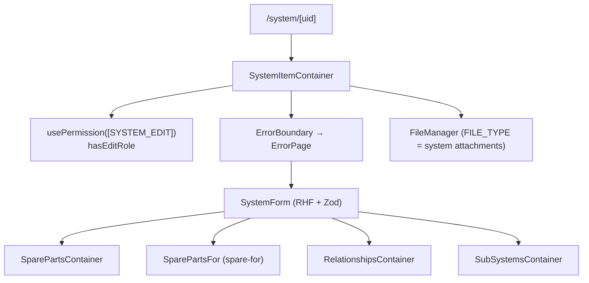

# System item (detail) — DEPRECATED

> ⚠️ **Deprecated (2026-06).** System detail now lives in [System Hierarchy](./system-hierarchy.md) — `/systems/hierarchy?leaf=<uid>` (built via `getSystemHierarchyDetailPath`). `/system/[uid]` is a thin client redirect to that deep link; `/system/alias/[alias]` and `/system/item/[itemUid]` still resolve alias/item → uid (via this module's `useSystemDetail`) and then redirect to the hierarchy. The module is **not deleted**: several utils/hooks are still consumed by active modules. See `src/modules/systemItem/DEPRECATED.md` for the allowed-imports list and removal criteria.

The former `/system/[uid]` route — the *detail page* for a single system. Hosted the edit form, sub-systems table, spare-parts widgets, and relationships. Also surfaced as `/system/alias/[alias]` (alias→uid lookup) and `/system/item/[itemUid]` (open from a physical item, e.g. QR codes).

## Module location

```
src/modules/systemItem/
├── SystemItem.cont.tsx        — top-level container, error boundary, permission gate
├── components/
│   ├── form/                  — SystemForm (RHF + Zod) — the inline edit surface
│   ├── subsystems/            — SubSystems table
│   ├── spare-parts/           — Spare Parts and SpareFor widgets
│   ├── relationships/         — Relationships viewer / editor
│   ├── spare-for/             — Inverse spare relationship
│   └── Breadcrumps.tsx        — parent-path breadcrumb
├── hooks/                     — read + mutate hooks (mix of REST and GraphQL)
├── store/                     — local state for the form and the router context
├── types/                     — Zod schemas, response shapes, form types
└── utils/                     — hook helpers + small utilities
```

## Container shape

`SystemItem.cont.tsx` mounts a permission gate, an error boundary, and the form, then renders four child containers stacked vertically:



The form wraps every child container because their queries depend on the current system uid — the form's RHF context provides it.

## Queries

| Hook | Source | Notes |
|---|---|---|
| `useSystemDetail` | REST | Used by alias/item alternative routes that need a uid lookup |
| `useSuspenseSystemDetail` | REST + suspense | Used inside `Suspense` boundaries for streaming |
| `useSubsystems` | REST | Differs from `systems/useSubsystems` in shape — see family-level [Open questions](./README.md#open-questions) |
| `useSystemParent` | REST | Resolve the parent system for breadcrumbs |
| `useItemProperties` | REST | Custom property bag for the attached `Item` |

## Mutations

The module owns the *write* surface for everything attached to a system:

| Hook | Effect |
|---|---|
| `useSystemCreate` | Create a new `System` under a chosen parent. Same form as edit, branched on `uid` presence. |
| `useSystemUpdate` | Whole-form update (POST body = full fragment). |
| `useSystemSheetUpdate` | Single-field PATCH for inline edits, with audit edge. |
| `useSystemCodeGenerate` / `useSystemCodeClear` | Generate / clear the system code (based on type + level + ancestry). |
| `useRecalculate` | Trigger server-side recompute of derived fields (e.g. coverage). |
| `useSystemsReload` | Invalidate the systems list query (used after structural mutations). |

`useSystemSheetUpdate` is the most-used mutation across the family — it is invoked by inline edits on the form, on the Hierarchy sidebar, and on the Relations table.

## Form

`components/form/SystemForm.cont.tsx` is built with React Hook Form and a Zod schema (`types/form.ts`, `SystemForm.fields.ts`). Fields are dynamic — system type drives which custom properties are visible — via `useItemProperties`.

The single form handles both **create** and **update** by branching on `uid`. The TODO at the top of `SystemForm.cont.tsx:49` (`// TODO: split to update and create form`) acknowledges the smell.

## System-code generation

`/system/<uid>` exposes generation controls in the form toolbar:

1. User picks a system type + level.
2. `useSystemCodeGenerate` calls `getEndpoints.systemCode` with type + level + parent path.
3. Server returns a generated code based on the type's `mask` (`SystemType.mask`).
4. `useSystemFieldUpdate` (or `useSystemSheetUpdate`) writes the value.

Clearing uses `useSystemCodeClear` — the field becomes `null`, allowing a different code to be generated later.

## Stores

`useSystemItemStore` (`store/useSystemItemStore.tsx`) carries non-persisted UI state for the form:

| Field | Purpose |
|---|---|
| `editMode` | Toggle inline-edit vs. view |
| `dirty` | Whether unsaved changes exist |

`useSystemContext` (`store/useSystemContext.ts`) holds router/uid context shared with child containers — avoids prop-drilling and `useRouter` calls in every component.

Both stores are local-only — they reset on navigation.

## Sub-systems + spares widgets

Each lives in its own subfolder:

- `components/subsystems/` — flat list of children for the current system, with quick navigation.
- `components/spare-parts/` — list of systems flagged as spares *for* this system, with coverage badges and per-row **Use** + **Remove** actions (the original home of the `useSpareDialog` + `SparePartsActionsCell` pattern that systemHierarchy now mirrors). The Use button is feature-flag-gated by `enableSparePartsAssignment`.
- `components/spare-for/` — the inverse: where this system is a spare.

All three reuse `PandaTableV2` and the shared cell renderers from `src/modules/shared/system/`.

## Relationships

`components/relationships/` is a React-Flow-driven view of the 8 engineering relationships, with create/delete affordances. It shares `RELATIONSHIP_DEFINITIONS` with [System Hierarchy](./system-hierarchy.md) (`src/modules/systemHierarchy/types/graph.ts`).

Cross-module ownership: the *graph* visualisation lives here, but the *editing* infrastructure (the relations create dialog) is shared with [Relations & spares](./relations-and-spares.md).

## File attachments

`SystemItem.cont.tsx` renders a `FileManager` with `FILE_TYPE = 'SYSTEM'` — the file metadata lives on a separate REST surface and is stored in MinIO. See [Deployment & runbook → MinIO](../deployment-runbook.md#environment-variables) for the bucket/keys story.

## Tests

`src/modules/systemItem/` has minimal local tests — coverage is mostly through end-to-end Playwright runs (`e2e/systemHierarchy/systemHierarchy.basic.e2e.ts`) and the shared form/table tests.

## Deprecated / legacy

- **The whole module is deprecated** — see the banner above. `SystemItemContainer` and the page-level detail hooks carry `@deprecated` JSDoc and must not gain new consumers. History/field-change types moved to `systemHierarchy/types/history.ts` (re-exported here for back-compat).
- `// TODO: split to update and create form` (`components/form/SystemForm.cont.tsx:49`) — single form for both modes is fragile.
- `// TODO: add itemConditionStatus` (`components/form/SystemForm.fields.ts:98`) — the physical-item edit on this form omits a field the catalogue surface includes.
- `useSubsystems` duplicates the `systems` module's hook of the same name with a different shape. Consolidate.
- `Breadcrumps.tsx` filename — typo, not a deprecation but worth a rename pass.

## Maintenance recommendations

1. **Split create from update.** Two containers, one Zod schema base, two thin entry points. Eliminates the `if (uid)` branches and clarifies validation.
2. **Reconcile `useSubsystems`.** Pick one home (probably `shared/system/`) and re-export.
3. **Type the audit-edge wiring.** `useSystemSheetUpdate` calls `updatedByResolver` by hand; a `useAuditedSheetUpdate` would prevent forgetting it.
4. **Surface the system-code generation cycle in tests.** Today no spec exercises `useSystemCodeGenerate` → `useSystemFieldUpdate`; regressions tend to be discovered manually.

## 🔮 Planned

- A unified system-edit surface that supersedes both the right-sidebar form in Hierarchy and the page form here. See family-level [Maintenance recommendations](./README.md#maintenance-recommendations).

## Open questions

- Should `useRecalculate` be wired into a save-flow side-effect, or remain a manual trigger?
- Why does the page mount its own `FileManager` rather than embedding the Attachments tab from Hierarchy? They share the underlying surface — duplication that may be intentional, may be drift.
- Is `useSystemsReload` still required after the move to per-query cache invalidation, or can it be replaced by targeted invalidations?

---

## Data model reference

> 🔧 *Engineer-only; stripped from the wiki.*
>
> Schema: `System`, `SystemType`, `SystemTypeGroup`, `Item`, `Link` (`src/server/apollo/schema.graphql`). REST endpoints heavily used: `systemDetail`, `system/<uid>/item`, `systemCode`. The audit edge is written by `updatedByResolver` — see [Permissions model → Audit trail](../permissions-model.md#audit-trail).
