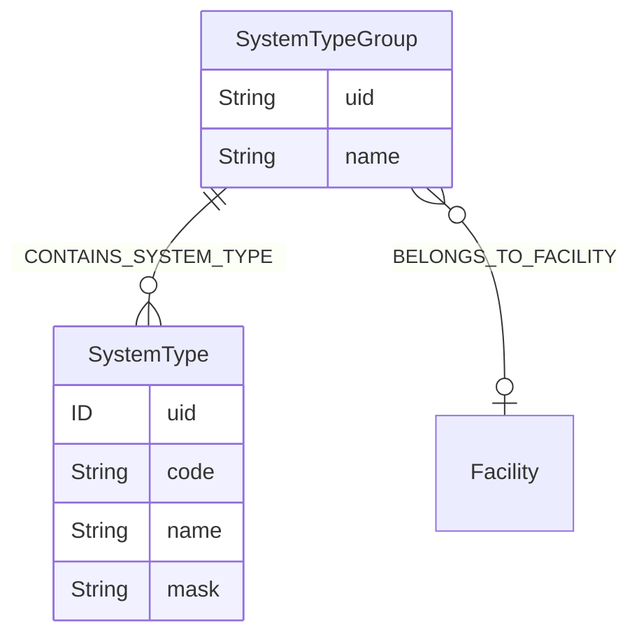
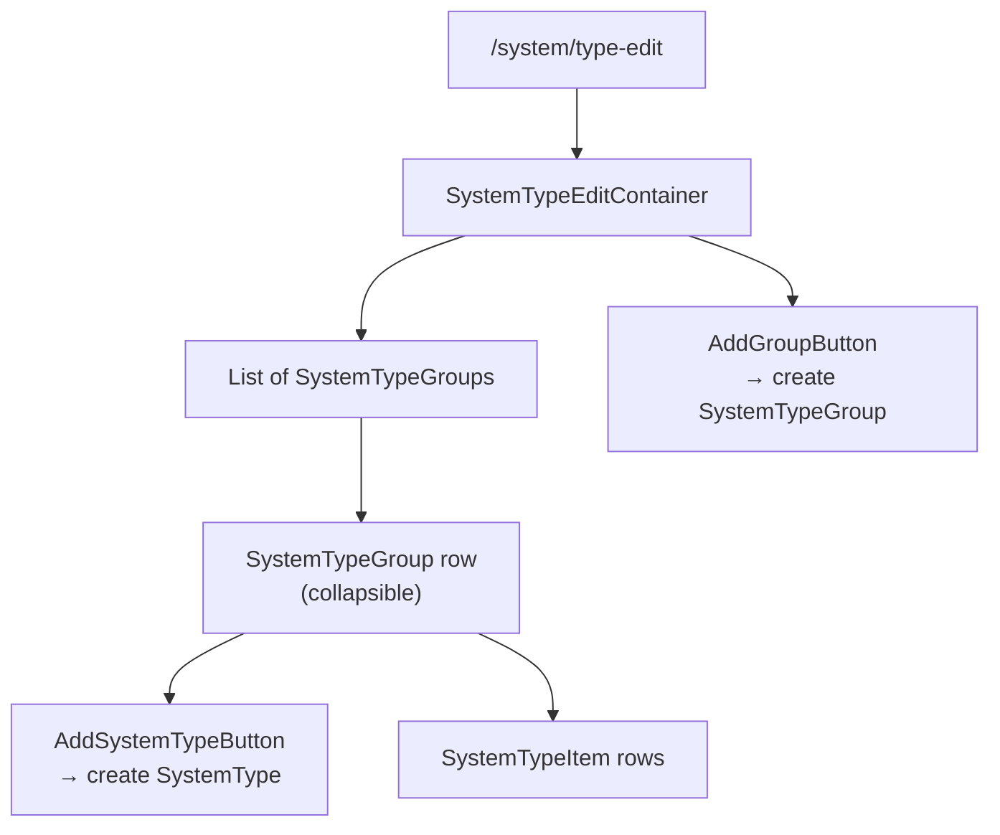

# System type editor

The `/system/type-edit` route — admin surface for managing the catalogue of system types and their grouping. Drives the dropdown lists used elsewhere in the family (`SystemForm` type pickers, system-code generator masks, etc.).

## Module location

```
src/modules/system-type-edit/
├── SystemTypeEdit.cont.tsx
├── types.ts
└── components/
    ├── SystemTypeGroup.tsx         — group row (collapsible)
    ├── SystemTypeItem.tsx          — leaf row (single type)
    ├── AddGroupButton.tsx
    └── AddSystemTypeButton.tsx
```

## Data model



`SystemType.mask` is the **code-generation template** consumed by `useSystemCodeGenerate` (see [System item](./system-item.md#system-code-generation)). Masks define how a system's auto-generated code is composed from its type, level, and ancestry.

## Permissions

The route is in `PATH_ROLES_CONFIG`:

```ts
[PATH.SYSTEM_TYPE_EDIT]: [ROLE.SYSTEM_TYPE_EDIT, ROLE.SYSTEM_TYPE_VIEW]
```

Either role grants access; only `SYSTEM_TYPE_EDIT` should be able to write. **Today the schema does not enforce this** — `SystemType` and `SystemTypeGroup` are `@authentication`-only (`schema.graphql:453`, `schema.graphql:483`). See [Permissions model → Maintenance](../permissions-model.md#maintenance-recommendations).

## UI flow



The container is mostly presentational — Apollo's auto-generated CRUD mutations drive the writes. Editing a type's `code`, `name`, or `mask` happens inline.

## Cross-module impact

Mutations on `SystemType` invalidate caches in:

- `systemItem` — type pickers in `SystemForm`
- `systemHierarchy` — leaf badges show the type code
- `systems` — overview table's "type" column

Code-generation runs (`useSystemCodeGenerate`) read the type's `mask` at call time, so renames take effect immediately without UI cache changes.

## Tests

No `__tests__` folder under the module. Coverage relies on the schema being stable.

## Deprecated / legacy

- `AddGroupButton.tsx` and `AddSystemTypeButton.tsx` still use HeadlessUI primitives (`@headlessui/react`) — see family-level [Open questions](./README.md). Targeted for shadcn migration.
- `types.ts` (singular) sits at the module root rather than the conventional `types/` folder.
- No `@authorization` on `SystemType` / `SystemTypeGroup` — written by `systems-edit`/`admin` only by route convention, not schema enforcement.

## Maintenance recommendations

1. **Add `@authorization` to `SystemType` and `SystemTypeGroup`.** Today a hand-crafted mutation can edit them with any authenticated JWT. Mirror the `System` directive (`systems-edit` for writes).
2. **Migrate the HeadlessUI consumers** to shadcn/ui. Small surface, low blast radius.
3. **Move `types.ts` into a `types/` folder** to align with the rest of the codebase.
4. **Document `mask` semantics.** The token grammar (placeholders for level / ancestry / index) lives only in the server-side code-generator today.

## 🔮 Planned

- Permissions Phase 1 — once the level-based split lands, the type-edit surface will become admin-only.
- A mask preview ("show me what code this would generate for level X under parent Y") would shorten the feedback loop. No concrete plan.

## Open questions

- Are `ROLE.SYSTEM_TYPE_VIEW` / `SYSTEM_TYPE_EDIT` consumed anywhere outside `PATH_ROLES_CONFIG`? They do not show up in `usePermission` calls elsewhere — confirm.
- Should `Unit` (`schema.graphql:490`) be edited from the same surface? Both are small catalogue-of-strings entities backed by reference data.

---

## Data model reference

> 🔧 *Engineer-only; stripped from the wiki.*
>
> Schema: `SystemType` (`src/server/apollo/schema.graphql:453`), `SystemTypeGroup` (`schema.graphql:483`). The mask is consumed by the server-side system-code generator, exposed to the frontend via the `systemCode` REST endpoint (`src/utils/getEndpoints.ts`).
