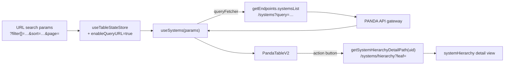

# Systems overview

The `/systems/overview` route — a flat, paged, filterable table of every system in the facility. Complements the hierarchical [System Hierarchy](./system-hierarchy.md) view: same data, different lens. Useful when the user knows the system code or wants to bulk-filter regardless of parent.

## Module location

```
src/modules/systems/
├── Systems.cont.tsx        — minimal container, configures the shared SystemsComponent
├── Systems.comp.tsx        — table + toolbar
├── components/
│   ├── SearchBarButtons.tsx        — toolbar actions
│   └── ExportCsvButton.tsx         — CSV export
├── hooks/
│   ├── useSystems.ts               — main list query (TanStack Query)
│   ├── useSubsystems.ts            — second list flavour (parent-scoped)
│   ├── useSystemDelete.ts          — soft-delete mutation
│   ├── useSystemCellActions.ts     — row-level menu
│   ├── useMinMaxPrice.ts           — slider bounds for the price filter
│   └── useCategoryProperties.ts / useCategoryItemProperties.ts — dynamic column hydration
├── types/constants.ts      — query/cache keys, default sort
└── utils/index.ts          — small helpers
```

## Container shape

`Systems.cont.tsx` is intentionally thin:

```tsx
const SystemsContainer: FC = () => (
    <>
        <SystemsComponent
            enableQueryURL={true}
            enableDragAndDrop={false}
            tableId={'systems'}
            hideButtons={false}
            isGlobalSearch={true}
            SecondRowElement={() => <FilterBadges tableId={'systems'} />}
        />
        <DeviceInfoOverlay />
    </>
)
```

The heavy lifting is in `SystemsComponent` — a shared component that hosts a `PandaTableV2`, the filter sheet, and toolbar. The same component is reused by:

- `/systems/relations` — see [Relations & spares](./relations-and-spares.md)
- `/systems/multi-move` — see [Moving systems](./moving.md)

…each passes different props to enable selection, drag-and-drop, or query-URL persistence.

## Data flow



The list comes from REST (`getEndpoints.systemsList`), **not** GraphQL. Filter, sort, and pagination are query-string round-trippable when `enableQueryURL={true}` — the URL is the source of truth.

## Dynamic columns

`useCategoryProperties` and `useCategoryItemProperties` fetch the per-system-type custom property metadata so the table can render extra columns for any matching property bag. The column list is computed lazily as the user expands the column-visibility control — see [`tables` skill prompt](../../../.claude/skills/tables/).

## Filters and global search

`isGlobalSearch={true}` lets the shared toolbar wire its search box into the global search store (`src/modules/shared/globalSearch/`). Result: searching `Systems overview` lands in the same backend handler as the sidebar search command bar.

The `FilterBadges` component in the second toolbar row reflects the active filters from `useTableStateStore` so the user can clear them individually.

## Mutations

The overview is mostly read-only; the only mutation in the module is `useSystemDelete`, used by the row-level menu (`useSystemCellActions`). Delete is a **soft delete** — sets `System.deleted: true` rather than removing the node. Cascade to sub-systems is server-side.

## Tests

There are no `__tests__` folders inside `src/modules/systems/`; coverage relies on the shared `SystemsComponent` and `PandaTableV2` tests under `src/modules/shared/table/__tests__/`.

## Deprecated / legacy

- `useSystems` is one of two list flavours; `useSubsystems` (`src/modules/systems/hooks/useSubsystems.ts`) does parent-scoped reads and overlaps with `systemHierarchy`'s `useSystemLeaves`. Consolidate.
- `src/modules/systems/components/SearchBarButtons.tsx:16` — `// TODO: refetch()???` — the toolbar action handler does not invalidate after a CSV export. Either commit to invalidating or document why not.
- `src/modules/systems/components/filters/SystemsFilterButton.cont.tsx:37` — supports both the new `side` prop and the legacy `panelSlide` prop. Plan removal.

## Maintenance recommendations

1. **Reconcile the two subsystem list hooks.** `systems/useSubsystems` (REST) and `systemHierarchy/useSystemLeaves` (REST count variant) return slightly different shapes. Pick the canonical one and re-export.
2. **Drop `panelSlide`.** Six months of dual support is enough; flip to a single `side` prop.
3. **Add unit coverage for `useSystems` parameter serialisation.** Filter encoding lives in `makeQuery` (`src/utils/formatters.tsx`) but is exercised only end-to-end today.

## 🔮 Planned

- Permissions Phase 1/2 will reduce what an editor can see/select here — see [Permissions model → 🔮 Planned](../permissions-model.md#-planned).
- The flat overview is a likely candidate for an alternative React-server-component implementation once the app-router migration is on the roadmap (no concrete plan today).

## Open questions

- Should the table support bulk delete? Today `useSystemDelete` is called per-row.
- Is the CSV export expected to honour the current filter or always export all systems? The behaviour is implicit in `ExportCsvButton.tsx`; users have asked.

---

## Data model reference

> 🔧 *Engineer-only; stripped from the wiki.*
>
> Schema: `System` (`src/server/apollo/schema.graphql:296`). REST endpoints: `systemsList`, `systemDelete`. Shared table component: `src/modules/shared/system/` (consumed by overview, relations, multi-move).
