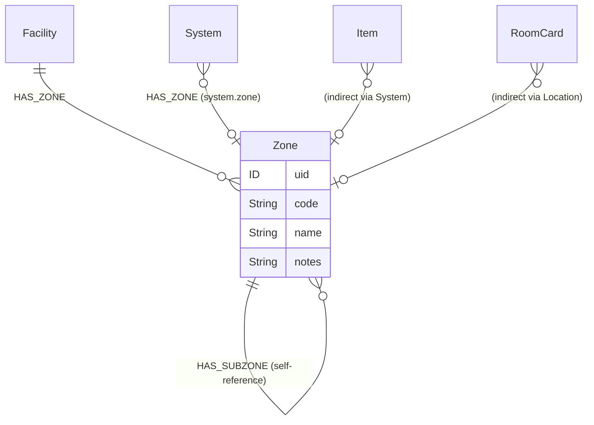
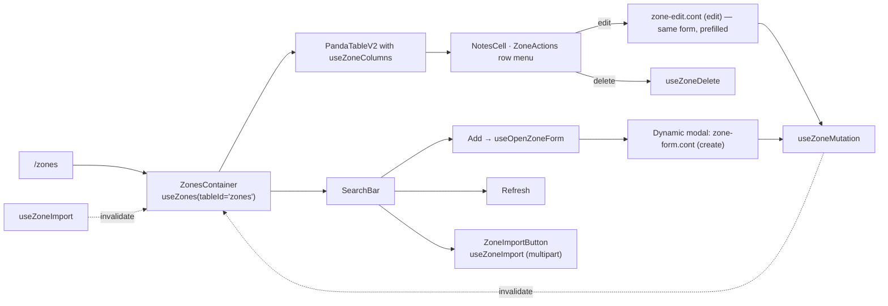

# Zones

Zones are the **abstract spatial taxonomy** of a facility — a self-referential hierarchy used to tag systems and rooms with a logical location independent of their physical address. A `Zone` has a `code`, a `name`, optional `notes`, an optional parent (via `HAS_SUBZONE`), and belongs to a facility (`HAS_ZONE` from `Facility`).

Zones are codebook-shaped but rich enough to deserve their own admin surface with a Zod-validated form, CSV import, and per-row delete.

## Module location

```
src/modules/zones/
├── zones.cont.tsx                — /zones page container
├── zones.columns.tsx             — column defs (`useZoneColumns`)
├── form/
│   ├── zone-form.schema.ts       — Zod schema (single source of truth)
│   ├── zone-form.cont.tsx        — create-mode container
│   ├── zone-edit.cont.tsx        — edit-mode container
│   └── zone-form.comp.tsx        — shared presentation
├── components/
│   ├── zone-actions.comp.tsx     — row-level menu (edit / delete)
│   ├── zone-import.comp.tsx      — CSV import button + dialog
│   └── notes-cell.comp.tsx       — clamped notes preview cell
├── hooks/
│   ├── useZones.ts               — list query
│   ├── useZone.ts                — single read
│   ├── useZoneMutation.ts        — create + update
│   ├── useZoneDelete.ts          — delete
│   ├── useZoneImport.ts          — bulk CSV import
│   └── useOpenZoneForm.ts        — orchestrates dynamic modal open + onSuccess wiring
├── types/zone.types.ts           — `Zone`, `ZonesResponse`, `ZoneImportResult`
└── __tests__/                    — broad coverage (10 spec files)
```

Routes:

```
src/pages/zones/index.tsx          — /zones → ZonesContainer
```

## Data model



Schema (`src/server/apollo/schema.graphql:473-481`):

```graphql
type Zone @authentication {
    code: String!
    facilitiesHasZone: [Facility!]! @relationship(type: "HAS_ZONE", direction: IN)
    hasSubzoneZones: [Zone!]! @relationship(type: "HAS_SUBZONE", direction: OUT)
    name: String!
    notes: String
    uid: ID! @id
    zonesHasSubzone: [Zone!]! @relationship(type: "HAS_SUBZONE", direction: IN)
}
```

Three notes on the shape:

- **`hasSubzoneZones`** is the *outbound* edge — the children. **`zonesHasSubzone`** is the inbound parent (read-only convenience). A zone has at most one parent in practice (1-to-1 enforced by the UI), but the schema does not declare a cardinality cap.
- **`code`** is the stable identifier used by all consumers (systems, room cards, control-systems batch create). Renames change `name` only; `code` is immutable in normal operation.
- **`facilitiesHasZone`** is inbound from `Facility` (`schema.graphql:227`). Facilities own the zone graph; zones are not cross-facility.

The frontend's `Zone` interface (`src/modules/zones/types/zone.types.ts`) tracks the *parent* explicitly rather than walking `zonesHasSubzone`:

```ts
export interface Zone {
    uid: string
    name: string
    code: string
    notes?: string | null
    parentZone?: CodebookType | null
}
```

`parentZone` is `CodebookType`-shaped (`{ uid, name }`) — the server flattens the inbound edge into a lightweight reference for table display. The form Zod schema uses `parentUid: string | null` instead — the form maps `parentZone?.uid → parentUid` on submit. See [Open questions](#open-questions).

## Two surfaces, one URL

The `/zones` route is the only public surface. It hosts:

- a `PandaTableV2` of zones with sticky header, sortable columns, URL-driven query state (`useQueryManager(tableId, undefined, true)`);
- a search bar with **Add new zone** (gated by `ROLE.ZONES_EDIT`) and **Refresh** buttons;
- a `ZoneImportButton` for CSV import (also gated);
- row-level edit / delete via `zone-actions.comp.tsx`.



`useOpenZoneForm` is the small piece of glue that opens the create dialog via [`useDynamicModalStore`](./local-development.md#canonical-patterns) and re-fetches the list on success.

## Fetcher surface

All four endpoints are REST. Keys from `src/utils/getEndpoints.ts`:

| Endpoint key | Path | Hook | Method(s) |
|---|---|---|---|
| `zones` | `/zones${query}` | `useZones` | GET (filter/sort/page via Query Manager) |
| `zone` | `/zones${uidPart}` | `useZone` / `useZoneMutation` / `useZoneDelete` | GET / POST / PUT / DELETE |
| `zonesImport` | `/zones/import` | `useZoneImport` | POST (multipart/form-data) |

Two patterns to note:

- **`useZoneImport`** bypasses `queryMutate` to handle `FormData` directly — `fetchRequestDetailed(BASE_URL + '/zones/import', { method: 'POST', body: formData })`. This is the canonical "file upload" pattern in the repo: avoid the JSON-serialising convenience layer when you need multipart.
- **`useZoneDelete`** uses `responseType: 'text'` on the mutate function — the delete endpoint returns a string acknowledgement, not JSON.

`Zone` is reachable as a GraphQL entity too (`Zone @authentication`), but no module today reads zones via GraphQL — every consumer goes through the REST endpoints or the generic codebook lookup (`useCodebook(CODEBOOK.ZONE)`).

## Form

`form/zone-form.schema.ts`:

```ts
export const zoneSchema = z.object({
    name: z.string().min(1, 'Name is required'),
    code: z.string().min(1, 'Code is required'),
    parentUid: z.string().nullable().optional(),
    notes: z.string().nullable().optional(),
})
export type ZoneFormData = z.infer<typeof zoneSchema>
```

Both modes (`zone-form.cont` for create, `zone-edit.cont` for update) share `zone-form.comp` and the same Zod schema. Edit mode prefills from `useZone(uid)`; create mode starts blank. `useZoneMutation` switches between PUT and POST based on `uid` presence (`queryMutate<Zone, ZoneFormData>('zone', uid ? 'put' : 'post', { uid })`).

`parentUid` lets the user nest a zone under another zone via a picker. The picker is a `Combobox` against `CODEBOOK.ZONE` (or `CODEBOOK.SUB_ZONE`) — see [Codebooks](./codebooks.md).

## CSV import

`zone-import.comp.tsx` opens a file picker, posts the file to `/zones/import`, and surfaces:

```ts
type ZoneImportResult = {
    created: number
    skipped: number
    errors: string[]
}
```

The dialog shows the three numbers as a summary toast, with `errors[]` listed for inspection. Skipped rows usually mean a `code` collision; errors usually mean malformed rows.

Coverage: `__tests__/useZoneImport.spec.ts` exercises the happy path and 4xx error mapping.

## Cross-module consumers

Zones are consumed in many places — they back the **zone column / filter** in systems-family tables and the **zone field** on system-edit forms:

- **Systems family** — `System.zone` (`schema.graphql:283`, `:338`). Surfaced in:
  - `src/modules/systemHierarchy/utils/fieldChangeBuilder.ts` — audit-edge payload builder.
  - `src/modules/systemHierarchy/types/schemas.ts` — leaves filter shape.
  - `src/modules/systemHierarchy/components/sidebar/QuickInfoSidebar.comp.tsx` — quick-info display.
  - `src/modules/systemHierarchy/components/tabs/DetailTab.cont.tsx` — inline zone edit.
  - `src/modules/systemHierarchy/components/filters/form/LeavesFilter.fields.ts` — leaves panel filter.
  - `src/modules/systemHierarchy/components/copy/__tests__/CopySystemDialog.test.tsx`.
- **Control Systems** — `zone` is one of the three required inputs to the system-code generator. The combobox there is filtered to **root zones only** via `ONLY_ROOT_ZONES = [{ key: 'onlyRootElements', value: true }]` (see [Control Systems → Form](./control-systems.md#zod-is-the-source-of-truth)).
- **Sidebar navigation** — `/zones` is a child of the *Systems* nav cluster (`src/lib/navigation/config.ts`).
- **Codebooks** — `CODEBOOK.ZONE` and `CODEBOOK.SUB_ZONE` provide the lookup shape for every combobox that picks a zone.

The room-cards module also has a `zone` concept (HVAC purity zones), but those are **`PurityClass` enums** on `RoomCard` (see [Room Cards](./room-cards.md)), not graph-side `Zone` references. The naming overlap is unfortunate.

## Permissions

Route-level (`src/lib/navigation/config.ts`):

```ts
[PATH.ZONES]: [ROLE.ZONES_VIEW, ROLE.ZONES_EDIT],
```

UI-level: `ROLE.ZONES_EDIT` is the only role checked by the module — it gates the add/edit/delete/import actions via `SearchBarButtonsComponent.editRole` and `useOpenZoneForm`. Read access is implied by route admission.

Schema-level: `Zone` is `@authentication`-only. The schema does not enforce the `ZONES_*` role split — the REST gateway is the only write gate.

## Tests

The zones module has the **densest local test coverage in this batch**, with 10 spec files under `__tests__/` — every hook, the schema, the container, the actions component, and column defs. This is the cleanest example in the codebase of "test the unit, not the integration".

| Spec | Tests |
|---|---|
| `useZones.spec.ts` | List query + Query Manager params |
| `useZone.spec.ts` | Single-read happy path + error |
| `useZoneMutation.spec.ts` | Create / update + invalidation |
| `useZoneDelete.spec.ts` | Delete + list invalidation |
| `useZoneImport.spec.ts` | Multipart POST + error mapping |
| `zone-form.schema.spec.ts` | Zod validation matrix |
| `zone-form.spec.tsx` | RHF + UI |
| `zone-columns.spec.ts` | Column definitions |
| `zone-actions.spec.tsx` | Row menu |
| `zones-container.spec.tsx` | Container integration |

## Deprecated / legacy

- **`Zone` ↔ `parentZone` ↔ `parentUid` triplet**. The schema exposes `zonesHasSubzone`, the response type uses `parentZone: CodebookType`, the form uses `parentUid: string`. Three names for the same concept; pick one and document the transforms.
- **No `@authorization` on `Zone`.** Same gap as Codebooks / Catalogue — the schema only enforces authentication.
- **No GraphQL read path.** All consumers go through REST. If the broader codebase migrates Zone reads to GraphQL (e.g. for selection-driven queries), the form's `parentUid` ↔ `parentZone` shape will need normalising.
- **No `@cypher parentPath` resolver** for `Zone`. `System` and `CatalogueCategory` both ship one (`parentPath: [ParentPathItem]` walking the hierarchy up to 50 levels); zones do not. Today the frontend doesn't need a deep walk — but if it ever does, the resolver pattern is already there.
- **Soft-delete is not exposed.** `Zone` has no `deleted: Boolean!` field. Delete is hard.
- **The "PurityClass zone" vs. "spatial Zone" naming collision** — unrelated entities, identical noun. Worth a glossary note.

## Maintenance recommendations

1. **Add `@authorization` to `Zone`** mirroring `ZONES_*` role split. Today a hand-crafted mutation can bypass the REST gateway.
2. **Unify `parentZone` / `parentUid`.** A `ZoneSummary { uid, name, code }` shape that both the response and the form schema agree on would remove the adapter hop.
3. **Document the CSV import contract.** `useZoneImport` returns `{ created, skipped, errors }` but the expected CSV format (headers, encoding, delimiter) is implicit. A `docs/technical/zones-csv-import.md` deep-dive or even a comment-block in `useZoneImport.ts` would help operators.
4. **Add a `parentPath` cypher resolver** if the UI ever shows zone breadcrumbs. The pattern from `System` / `CatalogueCategory` ports directly.
5. **Surface zone soft-delete.** Delete cascades to `HAS_ZONE` references — there is no recovery path today. Consider a `deleted` flag or an "archive" state for parity with `System`.

## 🔮 Planned

- Permissions Phase 1/2 do not affect zones directly. Phase 2's team-scoping could anchor on zones (rooms have responsible teams; zones could too).
- Migrating zone reads to GraphQL — no concrete plan. Would unblock zone breadcrumb resolvers.

## Open questions

- Is the 1-to-1 parent constraint enforced server-side? The schema permits `[Zone!]!` on both sides of `HAS_SUBZONE`, but the frontend treats `parentZone` as a single reference.
- The CSV import skips on `code` collision. Should it also skip on `(code, parentUid)` collision, or is `code` globally unique within a facility?
- Why does Control Systems force root-zones-only (`ONLY_ROOT_ZONES`) in its combobox? Is this domain rule or a UX simplification?
- The frontend uses `CODEBOOK.SUB_ZONE` for sub-zone pickers — but the backend serves it from the same `/codebook/SUB_ZONE` endpoint, not a parent-aware query. Are sub-zones filtered server-side, or does the UI receive every zone and filter client-side?

---

## Data model reference

> 🔧 *Engineer-only; stripped from the wiki.*
>
> Schema: `Zone` (`src/server/apollo/schema.graphql:473-481`), `Facility.zonesHasZone` and the `HAS_ZONE` / `HAS_SUBZONE` relationship types. Form schema: `src/modules/zones/form/zone-form.schema.ts`. Endpoint catalogue: `src/utils/getEndpoints.ts` (`zones`, `zone`, `zonesImport`). Codebook integration: `src/types/constants/codebook.ts` (`CODEBOOK.ZONE`, `CODEBOOK.SUB_ZONE`).
