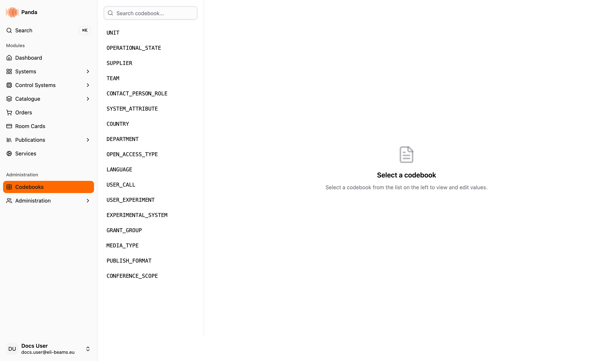
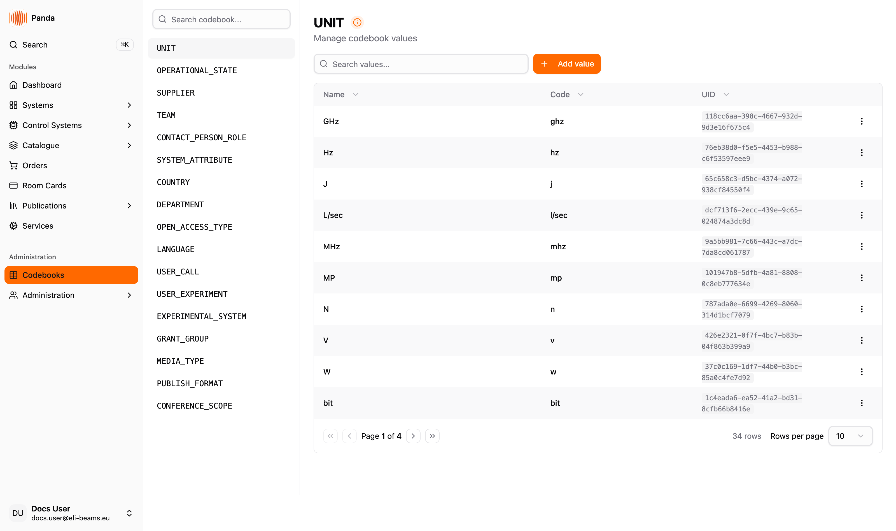

# Codebooks

The Codebooks module is where you **maintain the controlled vocabularies that PANDA's dropdowns, pickers and filters read from** — suppliers, teams, units, countries, languages, contact-person roles, operational states, and the publication/research reference lists. Keeping them clean keeps every form in the app coherent.

Not every codebook in the app is edited here: system types, catalogue categories and zones each have their own module, and a number of reference lists are seeded by the API and read-only. See [Codebooks managed here](#codebooks-managed-here) for the exact split.

Use this module to add a new value to an existing codebook (a new supplier, a new department), rename an existing value, fix a typo, or remove a value that is no longer used. Codebooks are administrative — they are not transactional records. Mutations here change the vocabulary the rest of the app uses; *they do not change* the records that already reference those values (those keep their connection by UID).

## Access & Responsibilities

**Today's reality:**
- The page route `/codebooks` is **gated by the `admin` role**. Users without `admin` are redirected to the *not found* page when they try to open it.
- ⚠️ The *Codebooks* sidebar entry is **not** hidden from non-admins — it is shown to anyone with `basics`, and clicking it lands on the *not found* page. Only `admin` can actually open the module.
- Server-side, each codebook carries its own edit role (`metadata.roleEdit` — e.g. `publications-edit`, `room-cards-edit`). The API enforces that role on every create / rename / delete, and the page lists only the codebooks whose edit role you hold.

**Personas (today):**

| Persona | Role(s) | Can do |
|---|---|---|
| 🛡️ **Admin** | `admin` | Open the module, see every codebook, browse and edit values: add, rename, change the code, delete |
| ✏️ **Domain Editor** | A codebook edit role (e.g. `publications-edit`, `room-cards-edit`, `codebooks-admin`) | Can edit the values of the codebooks scoped to that role — but only once they can open the page, which today still needs `admin` |
| 👁️ **Viewer** | Any non-admin role | Sees the *Codebooks* sidebar entry but cannot open the page — it redirects to *not found*. Codebook *consumption* (picker values, filter dropdowns elsewhere in the app) is read-only and available everywhere |

> 🔮 **Coming soon — opening the page to codebook stewards** — the `codebooks-admin` role already exists and is already the enforced edit role on several codebooks (`UNIT`, `SUPPLIER`, `TEAM`, `COUNTRY`, `LANGUAGE`, `OPERATIONAL_STATE`). What is still missing is the page itself: `/codebooks` requires full `admin`, so a steward holding only `codebooks-admin` cannot reach the codebooks they are authorised to edit.

## Key concepts

- **Codebook** — a named registry of values for one concept (e.g. *Supplier*, *Location*, *Department*). Identified by a short upper-case code (`SUPPLIER`, `LOCATION`, `DEPARTMENT`).
- **Codebook value** — an entry inside a codebook. Has a `name` (required, the user-facing label), an optional `code` (short identifier used for keys and downstream code generation), a system-generated `uid`, and (depending on the codebook) optional `additionalData` and `systemLevel` fields.
- **Editable codebooks** — the subset of codebooks the current user has rights to edit. The sidebar lists only these; codebooks the user cannot edit are not shown.
- **Inline edit** — name and code can be edited in place in the table by clicking the cell. Confirm with the checkmark or *Enter*, cancel with the X or *Escape*.
- **UID** — the system-generated identifier on each codebook value. The UID is the **link** from records elsewhere in the app to the codebook value. Renaming a value keeps the UID stable, so the connection is preserved.

### Codebooks managed here

A codebook appears in this module only if the server marks it with an **edit role** (`metadata.roleEdit`). That is a much smaller set than the list of codebooks the app *reads* — most pickers in PANDA are fed by codebooks that are maintained elsewhere or not editable at all.

**Exactly these 17 codebooks are manageable here**, and a user sees the subset whose edit role they hold. The right-hand column is the role that gates editing that codebook's values.

| Codebook code | Used in | Edit role |
|---|---|---|
| `UNIT` | [Catalogue](../catalogue/README.md) property units | `codebooks-admin` |
| `SUPPLIER` | [Catalogue](../catalogue/README.md), [Orders](../orders/README.md) | `codebooks-admin` |
| `TEAM` | System detail, [Room Cards](../roomCards/README.md) | `codebooks-admin` |
| `COUNTRY` | Profile, publications | `codebooks-admin` |
| `LANGUAGE` | Profile, publications | `codebooks-admin` |
| `OPERATIONAL_STATE` | [Room Cards](../roomCards/README.md) | `codebooks-admin` |
| `CONTACT_PERSON_ROLE` | [Room Cards](../roomCards/README.md) — roles for hall contacts | `room-cards-edit` |
| `SYSTEM_ATTRIBUTE` | System detail, Service Types | `system-attribute-edit` |
| `DEPARTMENT` | Publications — author departments | `publications-edit` |
| `OPEN_ACCESS_TYPE` | Publications | `publications-edit` |
| `MEDIA_TYPE` | Publications | `publications-edit` |
| `PUBLISH_FORMAT` | Publications | `publications-edit` |
| `CONFERENCE_SCOPE` | Publications | `publications-edit` |
| `USER_CALL` | Research programmes | `publications-edit` |
| `USER_EXPERIMENT` | Research programmes | `publications-edit` |
| `EXPERIMENTAL_SYSTEM` | Research programmes | `publications-edit` |
| `GRANT_GROUP` | [Publications](../publications/README.md) — grant grouping | `publications-edit` |

### Codebooks you cannot manage here

These are read by the app but are **not** offered in this module. Some have a dedicated module, some are derived data, and some are not exposed by the API at all:

| Codebook | Where it is actually maintained |
|---|---|
| `SYSTEM_TYPE` | [System Type Edit](../systemTypeEdit/README.md) |
| `CATALOGUE_CATEGORY` | [Catalogue](../catalogue/README.md) category tree |
| `ZONE` | [Zones](../zones/README.md) |
| `SYSTEM` | Derived from [System Hierarchy](../systemHierarchy/README.md) |
| `LOCATION` | Imported facility data — read-only in the app |
| `EMPLOYEE`, `USER`, `PROCUREMENTER` | User administration / HR import |
| `ITEM_USAGE`, `ITEM_CONDITION_STATUS`, `ORDER_STATUS` | Fixed reference data seeded by the API |
| `SYSTEM_IMPORTANCE`, `SYSTEM_CRITICALITY_CLASS` | Fixed reference data seeded by the API |
| `CATALOGUE_PROPERTY_TYPE` | Fixed reference data seeded by the API |

> ⚠️ **Codes the UI knows but the API does not serve.** `SUB_ZONE`, `MANUFACTURER`, `SYSTEM_LEVEL`, `PROCUREMENT_STATUS`, `PUBLICATION_CATEGORY`, `PUBLICATION_SUPPORT` and `GRANT` are listed in the front-end enum but have no codebook behind them — requesting them returns a server error. They are not reachable from this page; treat them as vestigial until the API grows them.

The front-end enumeration lives in `src/types/constants/codebook.ts`; the authoritative list of what is actually editable comes from `GET /codebooks?editable=true`.

## Layout

A two-pane layout: sidebar of codebook codes on the left, editor on the right.

- **Sidebar (280 px, left).** Title with a *Search codebook…* placeholder. Below: list of editable codebook codes (e.g. `UNIT`, `SUPPLIER`). Click a code to select it; the right pane loads.
- **Main pane — empty state.** Before a selection: a placeholder card titled *Select a codebook* with the description *Select a codebook from the list on the left to view and edit values.*
- **Main pane — codebook detail.** After a selection:
  - Header with the codebook code (e.g. `UNIT`) and an info-tooltip icon explaining the inline-edit gesture.
  - Subtitle *Manage codebook values*.
  - A search field (*Search values…*) that filters by name, code, or UID.
  - *Add value* button on the right.
  - Data table with columns: **Name** (editable), **Code** (editable), **UID** (read-only, monospace), **Actions** (delete affordance). 10 rows per page; pagination beneath.
  - Empty states: *Codebook is empty* (no values yet) or *No values match the search* (with an active query).

## Common workflows

- [Browsing codebooks](./workflows/browsing.md) — picking a codebook from the sidebar, searching values inside it.
- [Adding and renaming codebook values](./workflows/adding-and-renaming.md) — the *Add value* modal and the inline-edit gesture for name and code.
- [Deleting codebook values](./workflows/deleting.md) — the per-row delete, what it means for downstream records, when to retire instead.

For codebooks managed by their own module (System Type Edit, Catalogue Categories), follow the dedicated workflows in those modules.

## Coming soon

- 🔮 **Granular codebook role.** A `codebooks-admin` role is registered in the role list; the page route is currently gated by full `admin`. The granular role will let codebook stewards work without facility-wide admin.
- 🔮 **Soft-delete / retire.** Today delete is hard; values referenced from existing records become orphan labels on those records. A *retire* state will hide a value from pickers without removing it.
- 🔮 **Bulk import.** CSV-driven add for large codebooks (suppliers, manufacturers).
- 🔮 **Audit log.** Per-value history of name / code changes with timestamp and user.
- 🔮 **Reordering / sorting per codebook.** Today values render in server-side order; some pickers would benefit from a custom sort.

`[VIDEO PLACEHOLDER: 50s end-to-end — open Codebooks → search for SUPPLIER in the sidebar → select it → search values → click Add value → name a new supplier → Save → inline-edit an existing row's name and code → delete a stale row with the action menu]`

## Data model reference

> 🔧 *This section is for engineers reading the docs in the repo. The wiki generator strips it.*
>
> Endpoints: `GET /codebooks?editable=true` (sidebar list, key `codebooks`), `GET /codebook/<TYPE>` (values, key `codebook`), `POST /codebook/<TYPE>` (create, body `{ name }`), `PUT /codebook/<TYPE>/<uid>` (update, body `{ uid, name, code? }`), `DELETE /codebook/<TYPE>/<uid>`. Enum of types in `src/types/constants/codebook.ts`. Value shape (`CodebookType`): `{ uid, name, code?, additionalData?, systemLevel? }`. Edit role is read from `metadata.roleEdit` on the codebook response and overrides the page-level `admin` gate where present.

## Language

This documentation reflects the English UI. The app currently ships English translations only; Hungarian is planned for ELI ALPS but not on the immediate roadmap.
