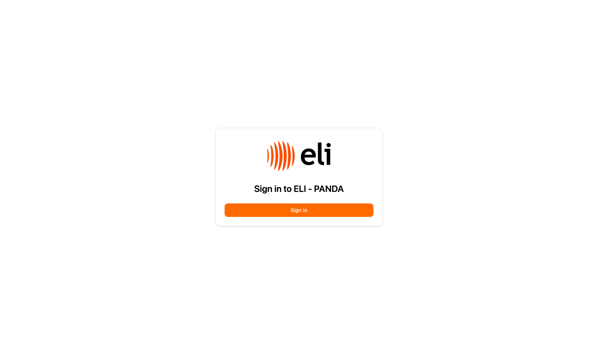
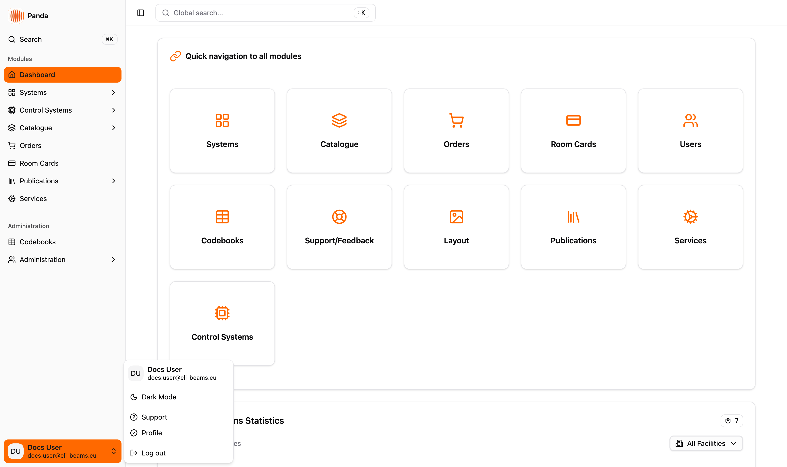
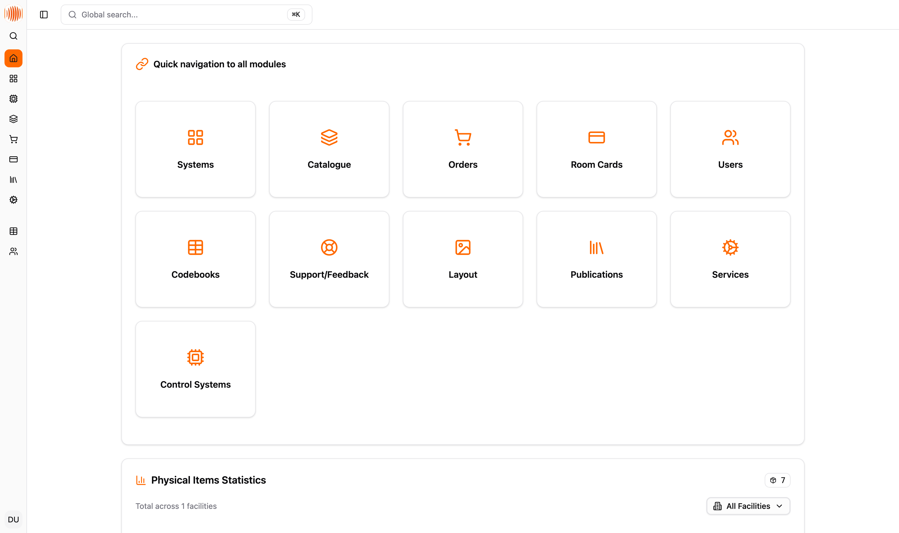
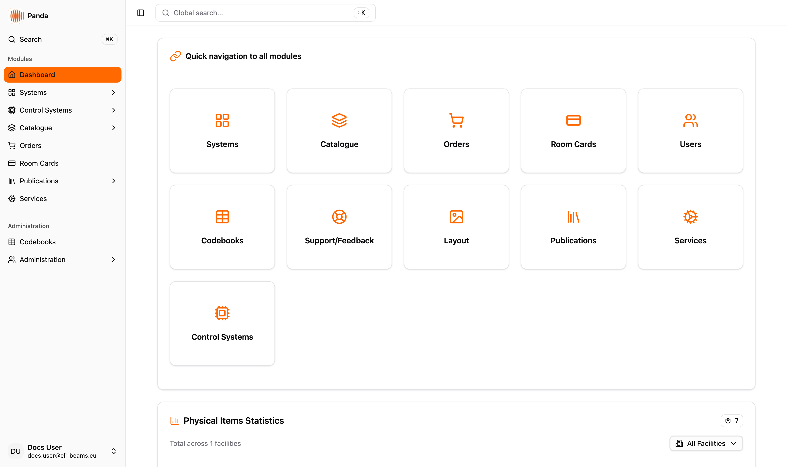
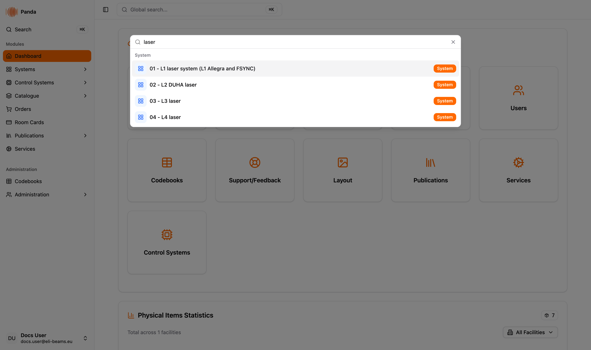
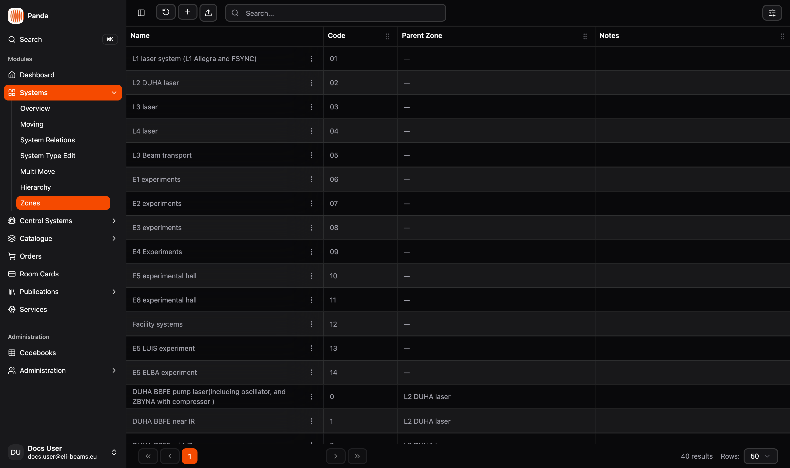

# Getting around the app

Layout, login, keyboard shortcuts, dark mode, and other generic chrome of ELI PANDA. Read this once before using any specific feature module.

## Audience

Everyone using PANDA. No specific role required to read this.

## Logging in and out

### Sign in

PANDA authenticates against **Microsoft Entra ID** (formerly Azure AD).

1. Open the app. The landing page shows the **ELI PANDA** logo and a single **Sign in** button.
2. Click *Sign in.* You are redirected to the Microsoft login page.
3. After successful Microsoft login you land on the dashboard. Your account is enriched on first login with name, email, facility, and roles from the internal user database.

There is no separate "PANDA password" — credentials are managed by Microsoft Entra ID. **Forgotten passwords are reset via Microsoft**, not in PANDA.

### Sign out

1. Click your profile in the bottom of the left sidebar (avatar + name + email). If the sidebar is in icon-only mode you will see just the avatar.
2. In the dropdown, click **Log out** (bottom option).
3. The session ends and you are taken back to the sign-in screen.

## Layout

### The sidebar (left)

The sidebar is the main navigation surface. Top to bottom:

- **Logo** — the PANDA mark and the word *Panda*. Click to return to the dashboard.
- **Search bar** — opens the global search. Equivalent to pressing *Cmd / Ctrl + K* anywhere in the app.
- **Modules** — the feature modules visible to you (filtered by your roles): for example *Systems*, *Catalogue*, *Orders*, etc.
- **Administration** — the *Codebooks* and *Administration* entries.
- **User profile** — your avatar, name, and email at the bottom; click for the user dropdown.

The sidebar can be collapsed to icon-only mode to free up screen space (see *Keyboard shortcuts* below). On mobile it becomes a sheet drawer hidden behind a menu button.

> ⚠️ **The sidebar starts collapsed.** Every page load begins in icon-only mode — expand it with *Cmd / Ctrl + B* or the toggle button in the page header. The expanded/collapsed choice is **not** remembered across a page reload, so a hard refresh puts it back to icons.

### Page area

To the right of the sidebar is the main page area. There is **no global top bar** — every module owns its own header (e.g., the breadcrumb in System Hierarchy is a module-specific feature, not a global breadcrumb).

### Toasts

Loading / success / error feedback for actions appears as toast pop-ups in a corner (powered by Sonner). They auto-dismiss; the typical pattern is *Saving…* → *Saved successfully* (or *Failed to save*).

## Keyboard shortcuts

| Shortcut (Mac) | Shortcut (Win/Linux) | Action |
|---|---|---|
| **⌘ + K** | **Ctrl + K** | Open global search (command palette). |
| **⌘ + B** | **Ctrl + B** | Toggle the sidebar (full / icon-only on desktop, open / closed drawer on mobile). |
| **Esc** | **Esc** | Close the active modal, sheet, or dropdown. |

> 💡 **About the sidebar shortcut.** *Cmd / Ctrl + B* comes for free from the shadcn/ui sidebar component the app is built on — it is a standard shadcn convention, not a PANDA-specific feature. *Cmd / Ctrl + K* for the global search is wired explicitly in PANDA.

### Global search (⌘ / Ctrl + K)

- Press the shortcut anywhere in the app to open the command palette.
- Type **at least 2 characters** to search across systems, items, orders, and other entities. Results are grouped by entity type with a colored type badge.
- With fewer than 2 characters, the palette shows quick-navigation entries (recent / pinned views) instead of search results.
- *Enter* navigates to the selected result; *Esc* closes the palette.

## Light mode and dark mode

PANDA supports both color themes. The choice is stored in your browser (`localStorage`), so it is per-browser rather than per-account, and it survives closing the tab.

1. Click your profile at the bottom of the sidebar.
2. In the dropdown, click **Dark Mode** (or **Light Mode** if you are already in dark).
3. The theme switches instantly and is remembered the next time you open the app.

Switching browsers or clearing site data resets it to the default (light).

## User profile and other dropdown items

The profile dropdown at the bottom of the sidebar contains, in this order:

- **Dark Mode / Light Mode** — theme toggle (see above). The label always names the theme you would switch *to*.
- **Support** — opens a pre-addressed support email to `panda@eli-laser.eu` with the subject already filled in. It is a `mailto:` link, not a documentation page — leave the subject as it is so the request routes correctly.
- **Profile** — opens your user profile settings page.
- **Log out** — ends the session.

## Sessions and timeouts

Sessions are managed by NextAuth with JWT tokens. There is no aggressive idle timeout — the session is durable across browser restarts as long as the underlying Microsoft tokens are valid. If a server-side action returns an authentication error, you'll be redirected back to the sign-in screen and can sign in again.

## Language

The app currently ships **English-only** translations. Hungarian is planned for ELI ALPS but not on the immediate roadmap. There is no in-app language switcher today.

## Tips & gotchas

- **The sidebar is your navigation.** PANDA does not use a global top-bar menu — if you can't find a module, expand the sidebar and look in *Modules* or *Administration*.
- **Use ⌘ / Ctrl + K liberally.** Faster than navigating to the relevant module and searching there. The palette can find systems, catalogue items, orders, and more in one place.
- **Toggle the sidebar on a small screen** with ⌘ / Ctrl + B — handy when reading wide tables.
- **Theme is per browser, not per account.** If you sign in on a different machine, you'll get the default theme until you flip it again.
- **No notifications center.** PANDA does not have a notifications bell. Transient feedback comes via toasts; persistent state is reflected in the data on the relevant module page.
- **No global page breadcrumb.** Some modules (notably System Hierarchy) have their own internal breadcrumbs for moving around their data structure — that is module-specific, not an app-wide feature.

## Related

- See the per-module pages in this guide for feature-specific workflows.
