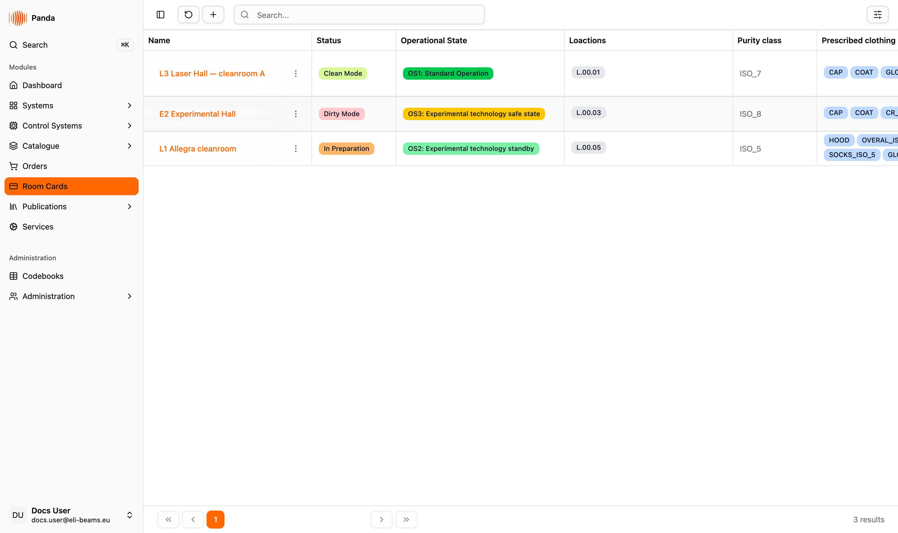
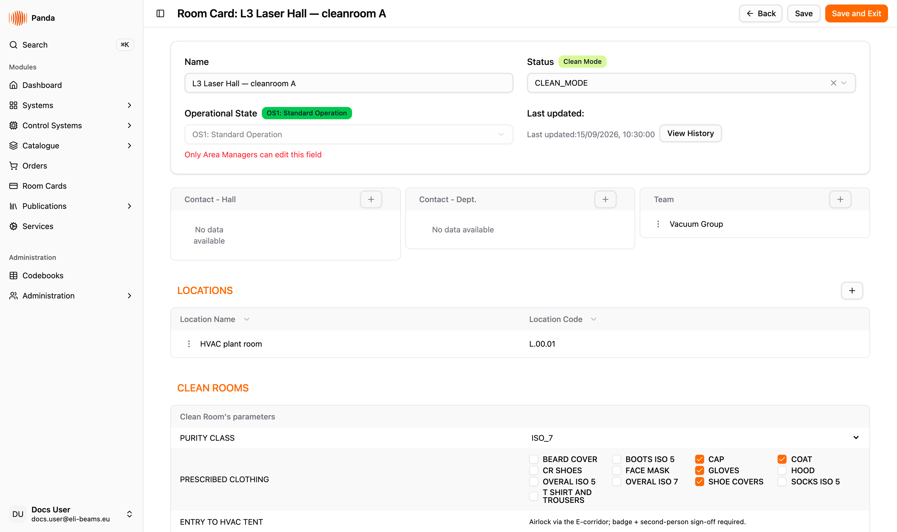

# Room Cards

The Room Cards module is the **operational record of cleanroom and technical-hall spaces** at the facility. Each room card captures a single space's identity (name, status, linked physical locations), its current operational state, the cleanroom purity requirements (ISO class, prescribed clothing, cleaning schedule), the utilities it is provisioned with (cooling water, indoor environment, compressed air, nitrogen, max pressure — both *facility-side* and *client-side*), and the people responsible for it (hall contacts, department contacts, assigned teams).

Use this module when a space's operational state changes (e.g. transitioning from *OS1: Standard Operation* to *OS2: Experimental technology standby*), when commissioning a new cleanroom area, when documenting the utility envelope for an experimental team, or when checking who is on-call for a specific hall.

## Access & Responsibilities

**Today's reality:**
- `room-cards-view` — read-only access to the list and detail pages. Inspect all fields, contacts, schedules, and utility values; cannot edit anything.
- `room-cards-edit` — full edit on all sections *except* the **Operational State** field, which has an additional Area-Manager check.
- **Area Manager** (per-card check via `useCanEditOperationalState`) — required to *change* the Operational State value. Editors without this check can read it but the field is disabled with a hint.
- `admin` — same as Editor, plus the Area-Manager check still applies (the operational state field is governance-sensitive).

**Personas (today):**

| Persona | Role(s) | Can do |
|---|---|---|
| 👁️ **Viewer** | `room-cards-view` | Browse the list, open any room card detail page, read every field — including operational-state history |
| ✏️ **Room-Card Editor** | `room-cards-edit` | Everything in Viewer + create a new room card, edit name / status / purity class / clothing / utilities / cleaning schedule / contacts / locations / teams. Cannot change Operational State without Area-Manager permission |
| 🛡️ **Area Manager** | `room-cards-edit` + per-card area scope | Change the Operational State, which writes an audit record visible in the history modal |

> 🔮 **Coming soon — per-location scoping of edits** — a planned enhancement will restrict editor permissions by the locations the user is responsible for, so a cleanroom operator only edits their own halls.

## Key concepts

- **Room card** — the record for a single space. Has *Name*, *Status*, *Operational State*, *Purity Class*, *Prescribed Clothing*, utilities, cleaning schedule, and links to locations, contacts, and teams.
- **Status** — high-level mode of the space: `CLEAN_MODE`, `DIRTY_MODE`, `IN_PREPARATION_MODE`. Drives row colour in the list.
- **Operational State** — finer-grained operational stage of the space. **Five** values, in increasing severity:

  | Code | Name |
  |---|---|
  | `OS1` | OS1: Standard Operation |
  | `OS2` | OS2: Experimental technology standby |
  | `OS3` | OS3: Experimental technology safe state |
  | `OS4` | OS4: All technology Shutdown |
  | `OS5` | OS5: Power shutdown |

  Editable only by Area Managers; every change is captured with timestamp + user in the Operational State History.

  > ⚠️ **Known defect — the history view mislabels states.** The list column and the detail badge read the name straight from the database and are correct. The *Operational State History* modal instead resolves the code through a stale front-end label table that still carries a six-state scheme, so it renders each state **one step too mild** — a change to `OS3` (*safe state*) is shown as *Experimental technology standby*, and `OS5` (*Power shutdown*) is shown as *All technology Shutdown*. Until this is fixed, read operational state from the detail page or the list, not from the history modal.
- **Purity Class** — cleanroom ISO classification: `ISO_5`, `ISO_6`, `ISO_7`, `ISO_8`.
- **Prescribed Clothing** — a multi-select of garment requirements. The full set of thirteen: *Beard cover*, *Boots ISO 5*, *Cap*, *Coat*, *CR shoes*, *Face mask*, *Gloves*, *Hood*, *Overal ISO 5*, *Overal ISO 7*, *Shoe covers*, *Socks ISO 5*, *T shirt and trousers*. (There is a single *Gloves* option, not a per-ISO-class one, and the coverall options are *Overal ISO 5 / ISO 7* rather than a "gown".)
- **Utilities (facility-side / client-side)** — the room's provisioning envelope. Five utility families — *Cooling Water*, *Indoor Environment Quality*, *Compressed Air Distribution*, *Nitrogen Central Distribution*, *Max Pressure In Cold Distribution* — each captured with what the building provides (*facility-side*) and what the experimental client consumes (*client-side*).
- **Cleaning schedule** — a set of recurring days (Mon–Sun) plus a next-cleaning date.
- **Entry to HVAC tent** — free-text note describing entry procedure to the HVAC tent.
- **Additional requirements** — free-text catch-all for room-specific operational notes.
- **Hall contact / Dept contact / Team** — three independently-managed contact tables on the card.
- **Linked locations** — a room card can cover one or more *Locations* from the location codebook. The same location may not appear on two room cards.

## Layout

The module has a **list page** at `/room-cards` and a **detail page** at `/room-card/<uid>`.

### List page (`/room-cards`)

- **Top bar.** Title *Room Cards*, *Add Room Card* (gated by `room-cards-edit`), *Refresh*, and search/filter affordances.
- **Table.** Columns: *Name* (sticky, link), *Status* (badge), *Operational State* (badge with OS code), *Locations* (chip stack of location codes), *Purity Class* (badge), *Prescribed Clothing* (badge stack). 50 rows per page; row hover surfaces *Delete* (gated).

### Detail page (`/room-card/<uid>`)

A single long form composed of six stacked cards:

1. **Info card.** *Name*, *Status* picker, *Operational State* picker (OS1–OS5, gated by Area Manager) with *Last updated:* timestamp and *View History* button. Both pickers currently show the **raw enum value** (`CLEAN_MODE`, `ISO_7`) rather than the friendly label — the badge next to the field shows the readable form.
2. **Contacts card.** Three sub-tables side by side:
   - *Contact - Hall* (role + employee + phones)
   - *Contact - Dept.* (employee + phones)
   - *Team* (team name).
3. **Locations card.** List of linked location codes / names with *Add Location* and per-row delete.
4. **CleanRooms card.** *Purity Class*, *Prescribed Clothing* multi-select, *Cleaning Schedule* (day checkboxes + date), *Entry to HVAC tent* text, *Additional Requirements* text.
5. **Building Maintenance card.** Two columns:
   - *Facility-side parameters* — cooling water, indoor environment, compressed air, nitrogen, max pressure (as provided by the building).
   - *Client-side requirements* — the equivalent five fields the experimental team requires.
6. **File manager.** Attachments (drawings, SOPs, photos) — drag-drop upload, link mode for external URLs, tagging.

## Common workflows

- [Creating and editing a room card](./workflows/creating-and-editing.md) — name, status, purity, clothing, utilities, cleaning schedule, additional requirements.
- [Managing operational state](./workflows/managing-operational-state.md) — the Area-Manager-gated state change, the history view, what each OS value means.
- [Managing contacts and teams](./workflows/managing-contacts.md) — hall contacts (role-based), department contacts, assigned teams.
- [Managing linked locations](./workflows/managing-locations.md) — add or remove the physical locations the room card covers.
- [Browsing room cards](./workflows/browsing.md) — list page, search, badge legend.

## Coming soon

- 🔮 **Per-location editor scoping** — restrict `room-cards-edit` by the locations the user is responsible for.
- 🔮 **Maintenance schedule** — a separate scheduling block for periodic technical maintenance, similar to the cleaning schedule.
- 🔮 **Alarms / handoff page** — when operational state changes to OS4 / OS5 / OS6, surface a handoff checklist to the next shift.
- 🔮 **Linked systems view** — show the systems located in this room card's locations as a read-only embedded list.
- 🔮 **Bulk operational-state change** — change OS on multiple cards at once during a planned shutdown.

`[VIDEO PLACEHOLDER: 80s end-to-end — open Room Cards → see list → open one card → review Info / Operational State badge → scroll through Contacts → Locations → CleanRooms → Building Maintenance → File manager → click View History on Operational State → see the change log]`

## Data model reference

> 🔧 *This section is for engineers reading the docs in the repo. The wiki generator strips it.*
>
> Room cards have **no REST surface** — the only room-card route on the API is `GET /v1/room-card/layout/location/{code}`. Everything else goes through Neo4j GraphQL at `/api/graphql`. Queries: `RoomCardsQuery` (list), `RoomCardQuery` (detail by uid), `RoomCardContactsHallQuery` / `RoomCardContactsDeptQuery` / `RoomCardTeamsQuery` / `RoomCardLocationsQuery` (per-section subqueries). Mutations: `CreateRoomCards`, `UpdateRoomCardMutation`, `UpdateOperationalStateMutation` (separate so the audit log captures previous/new state), `DeleteRoomCards`, plus connect/disconnect on contacts, teams and locations. Enums in the schema: `RoomCardStatus`, `PurityClass`, `PrescribedClothing`, `CleaningScheduleDay`. `OperationalState` is **not** an enum — it is a node type (`{ uid, name, code }`) linked by `HAS_OPERATIONAL_STATE`, seeded by the API migration `20251205083909_add_new_cb_operation_state`. See `src/server/apollo/schema.graphql`.

## Language

This documentation reflects the English UI. The app currently ships English translations only; Hungarian is planned for ELI ALPS but not on the immediate roadmap.
